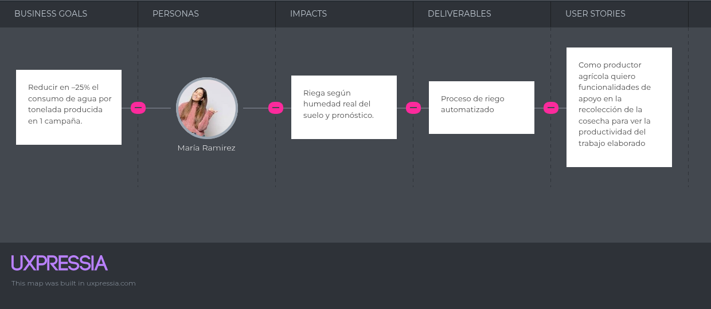
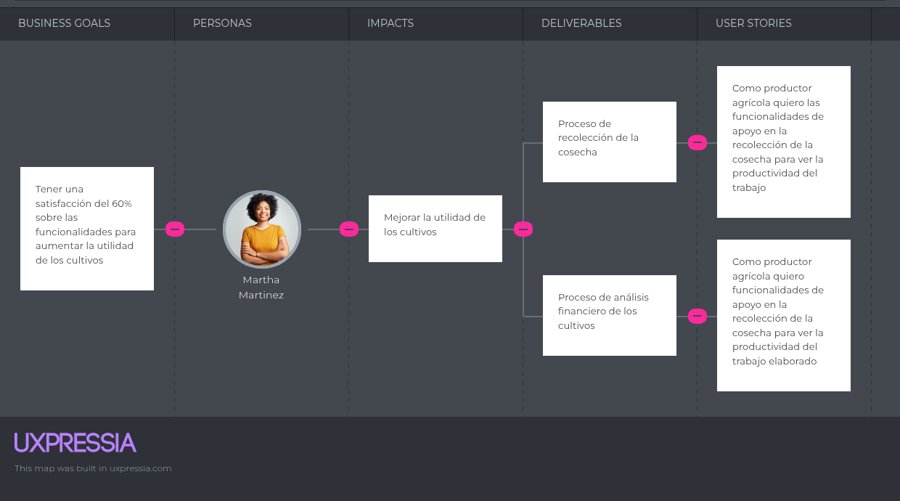
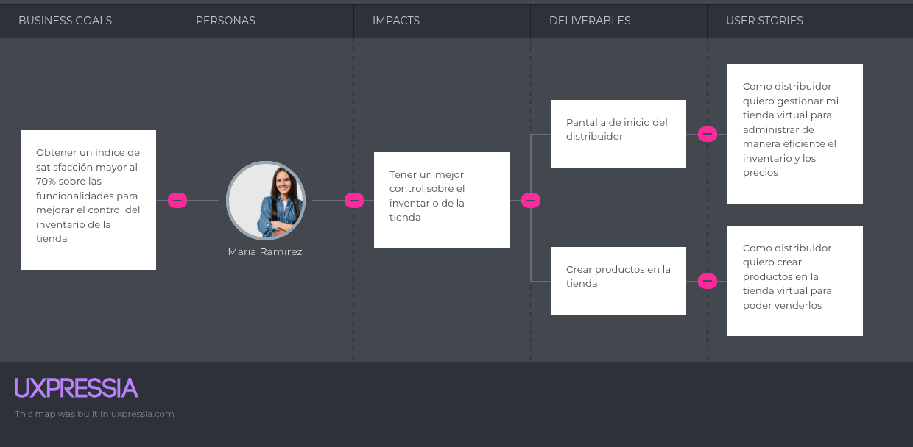
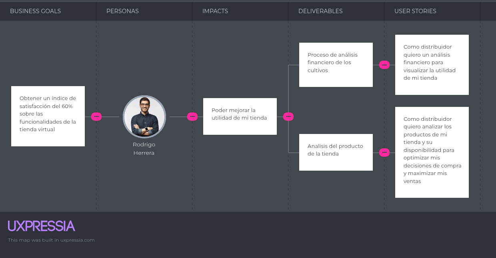
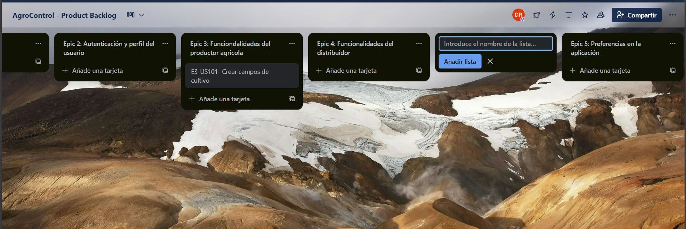

Universidad Peruana de Ciencias Aplicadas

Carrera: Ingeniería de Software

Ciclo: 2025-20

Desarrollo de Soluciones IOT - 3475

Profesor: Marco Antonio Leon Baca

Informe del Trabajo Final  - TB1

Startup: **No definido**

Producto: AgroControl

### Team Members:

| Member                             | Code        |
|------------------------------------|-------------|
| Barrionuevo Reto, Jean Franco Joel | U202219284  |
| Barrutia Vaez, Ricardo Andree      | U201714765  |
| Espinoza Inoñan, Fabiola Ximena    | U202214784  |
| Mayta Lopez, Harold Jaime          | U202114851  |
| Rodriguez Santos, David Bryan      | U202212236  |

**Septimebre del 2025**

---  
# Registro de Versiones del Informe

| Versión | Fecha | Autor   | Descripción de modificaciones         |
|-------|------|---------|---------------------------------------|
|      |  |       |
|     |  | |      |

---  
# Project Report Collaboration Insights

---  
# Student Outcome
El curso contribuye al cumplimiento del Student Outcome ABET: **ABET – EAC - Student Outcome 5**   Criterio: *La capacidad de funcionar efectivamente en un equipo cuyos miembros juntos proporcionan liderazgo, crean un entorno de colaboración e inclusivo, establecen objetivos, planifican tareas y cumplen objetivos.*

En el siguiente cuadro se describe las acciones realizadas y enunciados de conclusiones por parte del grupo, que permiten sustentar el haber alcanzado el logro del ABET – EAC - Student Outcome 5.

| Criterio específico                                                                            | Acciones realizadas                                                                                                                                                                                                                                                                                                                                                                                                                                                                                                                                                                                                                                                                                                                                                                                                                                                                                                                                                                                                                                                                                                                                                                                                                                                                                                                                                                                                                                                                                                                                                                                                                                                                                                                                                                                                                                                                                                                                                                                                                                                                                                                                                                                                                                                                                                                                                                                                                                                                                                                                                                                                                                                                                                                                                                                                                                                                                                                                                                                                                                                                                                                                                                                                                                                                                                                                                                                                                                                                                                                                                                                                                               | Conclusiones |  
|------------------------------------------------------------------------------------------------|---------------------------------------------------------------------------------------------------------------------------------------------------------------------------------------------------------------------------------------------------------------------------------------------------------------------------------------------------------------------------------------------------------------------------------------------------------------------------------------------------------------------------------------------------------------------------------------------------------------------------------------------------------------------------------------------------------------------------------------------------------------------------------------------------------------------------------------------------------------------------------------------------------------------------------------------------------------------------------------------------------------------------------------------------------------------------------------------------------------------------------------------------------------------------------------------------------------------------------------------------------------------------------------------------------------------------------------------------------------------------------------------------------------------------------------------------------------------------------------------------------------------------------------------------------------------------------------------------------------------------------------------------------------------------------------------------------------------------------------------------------------------------------------------------------------------------------------------------------------------------------------------------------------------------------------------------------------------------------------------------------------------------------------------------------------------------------------------------------------------------------------------------------------------------------------------------------------------------------------------------------------------------------------------------------------------------------------------------------------------------------------------------------------------------------------------------------------------------------------------------------------------------------------------------------------------------------------------------------------------------------------------------------------------------------------------------------------------------------------------------------------------------------------------------------------------------------------------------------------------------------------------------------------------------------------------------------------------------------------------------------------------------------------------------------------------------------------------------------------------------------------------------------------------------------------------------------------------------------------------------------------------------------------------------------------------------------------------------------------------------------------------------------------------------------------------------------------------------------------------------------------------------------------------------------------------------------------------------------------------------------------------------| - |  
| Trabaja en equipo para proporcionar liderazgo en forma conjunta                                | |
| Crea un entorno colaborativo e inclusivo, establece metas, planifica tareas y cumple objetivos | |
---  
# Contenido
## Tabla de contenidos

### [Capítulo I: Introducción](https://github.com/G2-UPC-PRE-202402-SI730-WX53-DevDynasty/GastroGo-Report#cap%C3%ADtulo-i-introducci%C3%B3n-1)
- [1.1. Startup Profile](https://github.com/G2-UPC-PRE-202402-SI730-WX53-DevDynasty/GastroGo-Report#11-startup-profile)
    - [1.1.1 Descripción de la Startup](https://github.com/G2-UPC-PRE-202402-SI730-WX53-DevDynasty/GastroGo-Report#111-descripci%C3%B3n-de-la-startup)
    - [1.1.2 Perfiles de integrantes del equipo](https://github.com/G2-UPC-PRE-202402-SI730-WX53-DevDynasty/GastroGo-Report#112-perfiles-de-integrantes-del-equipo)
- [1.2 Solution Profile](https://github.com/G2-UPC-PRE-202402-SI730-WX53-DevDynasty/GastroGo-Report#12-solution-profile)
    - [1.2.1 Antecedentes y problemática](https://github.com/G2-UPC-PRE-202402-SI730-WX53-DevDynasty/GastroGo-Report#121-antecedentes-y-problem%C3%A1tica)
    - [1.2.2 Lean UX Process](https://github.com/G2-UPC-PRE-202402-SI730-WX53-DevDynasty/GastroGo-Report#122-lean-ux-process)
        - [1.2.2.1. Lean UX Problem Statements](https://github.com/G2-UPC-PRE-202402-SI730-WX53-DevDynasty/GastroGo-Report#1221-lean-ux-problem-statements)
        - [1.2.2.2. Lean UX Assumptions](https://github.com/G2-UPC-PRE-202402-SI730-WX53-DevDynasty/GastroGo-Report#1222-lean-ux-assumptions)
        - [1.2.2.3. Lean UX Hypothesis Statements](https://github.com/G2-UPC-PRE-202402-SI730-WX53-DevDynasty/GastroGo-Report#1223-lean-ux-hypothesis-statements)
        - [1.2.2.4. Lean UX Canvas](https://github.com/G2-UPC-PRE-202402-SI730-WX53-DevDynasty/GastroGo-Report#1224-lean-ux-canvas)
- [1.3. Segmentos objetivo](https://github.com/G2-UPC-PRE-202402-SI730-WX53-DevDynasty/GastroGo-Report#13-segmentos-objetivo)

### [Capítulo II: Requirements Elicitation & Analysis]()
- [2.1. Competidores]()
    - [2.1.1. Análisis competitivo]()
    - [2.1.2. Estrategias y tácticas frente a competidores]()
- [2.2. Entrevistas]()
    - [2.2.1. Diseño de entrevistas]()
    - [2.2.2. Registro de entrevistas]()
    - [2.2.3. Análisis de entrevistas]()
- [2.3. Needfinding]()
    - [2.3.1. User Personas]()
    - [2.3.2. User Task Matrix]()
    - [2.3.3. User Journey Mapping]()
    - [2.3.4. Empathy Mapping]()
    - [2.3.5. As-is Scenario Mapping]()
- [2.4. Big Picture EventStorming]()
- [2.5. Ubiquitous Language]()

### [Capítulo III: Requirements Specification]()
- [3.1. User Stories]()
- [3.2. Impact Mapping]()
- [3.3. Product Backlog]()

### [Capítulo IV: Solution Software Design]()
- [4.1. Strategic-Level Domain-Driven Design]()
  - [4.1.1. Design-Level EventStorming]()
    - [4.1.1.1. Candidate Context Discovery]()
    - [4.1.1.2. Domain Message Flows Modeling]()
    - [4.1.1.3. Bounded Context Canvases]()
  - [4.1.2. Context Mapping]()
  - [4.1.3. Software Architecture]()
    - [4.1.3.1. Software Architecture System Landscape Diagram]()
    - [4.1.3.2. Software Architecture Context Level Diagrams]()
    - [4.1.3.3. Software Architecture Container Level Diagrams]()
    - [4.1.3.4. Software Architecture Deployment Diagrams]()
- [4.2. Tactical-Level Domain-Driven Design]()
  - [4.2.1. Bounded Context: <Bounded Context Name>]()
    - [4.2.1.1. Domain Layer]()
    - [4.2.1.2. Interface Layer]()
    - [4.2.1.3. Application Layer]()
    - [4.2.1.4. Infrastructure Layer]()
    - [4.2.1.5. Bounded Context Software Architecture Component Level Diagrams]()
    - [4.2.1.6. Bounded Context Software Architecture Code Level Diagrams]()
      - [4.2.1.6.1. Bounded Context Domain Layer Class Diagrams]()
      - [4.2.1.6.2. Bounded Context Database Design Diagram]()

---

# Capítulo I: Introducción
## 1.1. Startup Profile
### 1.1.1 Descripción de la Startup
### 1.1.2 Perfiles de integrantes del equipo
## 1.2 Solution Profile
### 1.2.1 Antecedentes y problemática
### 1.2.2 Lean UX Process
#### 1.2.2.1. Lean UX Problem Statements
#### 1.2.2.2. Lean UX Assumptions
#### 1.2.2.3. Lean UX Hypothesis Statements
#### 1.2.2.4. Lean UX Canvas
## 1.3. Segmentos objetivo
# Capítulo II: Requirements Elicitation & Analysis
## 2.1 Competidores
## 2.2. Entrevistas
### 2.2.1. Diseño de entrevistas
### 2.2.2. Registro de entrevistas
### 2.2.3. Análisis de entrevistas
## 2.3. NeedfindinSg
### 2.3.1. User Personas
### 2.3.2. User Task Matrix
### 2.3.3. User Journey Mapping
### 2.3.4. Empathy Mapping
## 2.4. Big Picture EventStorming
## 2.5. Ubiquitous Language
# Capítulo III: Requirements Specification

## 3.1. User Stories

Se redactó historias de usuarios que nos ayuden a crear funcionalidades del software que estamos desarrollando para los usuarios finales.

|              Epic / Story ID              | Titulo | Descripción | Relacionado con (EpicID) |
|-------------------------------------------|--------|-------------|--------------------------|
|**Epic 1: Landing page** **Como** visitante **Quiero** visualizar una página **Para** saber acerca de la aplicación e ingresar a la aplicación|||                                                                                                                
|E1-US101|Barra de navegación en landing page|**Como** visitante **quiero** una barra de navegación de landing page **para** tener accesos directos a la información de la aplicación | 
**Escenario 1: Acceso a la sección inicio del producto**

**Dado que** el visitante está en el landing page

**Y** utiliza la barra de navegación

**Cuando** selecciona “Inicio”

**Entonces** accede a la sección hero del producto.

**Escenario 2: Acceso a la sección de características del producto**

**Dado que** el visitante está en el landing page

**Y** utiliza la barra de navegación

**Cuando** selecciona “Características”

**Entonces** accede a la sección que muestra las características del producto.

**Escenario 3: Acceso a la sección de beneficios del producto**

**Dado que** el visitante está en el landing page

**Y** utiliza la barra de navegación

**Cuando** selecciona “Beneficios”

**Entonces** accede a la sección que muestra los beneficios del producto.

**Escenario 4: Acceso a la sección de planes del producto**

**Dado que** el visitante está en el landing page

**Y** utiliza la barra de navegación

**Cuando** selecciona “Planes”

**Entonces** accede a la sección de planes del producto.

**Escenario 5: Acceso a la sección de testimonios**
**Dado que** el visitante está en el landing page

**Y** utiliza la barra de navegación

**Cuando** selecciona "Testimonios"

**Entonces** accede a la sección que muestra los testimonios de los usuarios.

**Escenario 6: Acceso a la sección de contacto**
**Dado que** el visitante está en el landing page

**Y** utiliza la barra de navegación

**Cuando** selecciona "Contacto"

**Entonces** accede a la sección de contacto del producto.
                                                                                                               |1|
|E1-US102|Sección hero de landing page	|**Como** visitante **quiero** visualizar una sección hero en el landing page **para** tener una idea sobre lo que ofrece la aplicación| 
**Escenario 1: Visualización de la presentación de la aplicación**

**Dado que** el visitante está en el landing page

**Cuando** se encuentra en la sección de hero

**Entonces** observa una presentación clara de la aplicación.
                                                                                                                                                                                                                                                                                                                                                                                                                                                                                                                                                                                                                                                                                                                                                                                                                                                                                                                                                                                                                                                                                                                                                                                                                                                                                                                                                                                                                                                                                                                                                                          |1|
|E1-US103|Sección de caracteristicas del producto de landing page|**Como** visitante **quiero** visualizar características de la aplicación en el landing page **para** saber sobre las características que ofrece la aplicación

| 
**Escenario 1: Visualización de características del producto**

**Dado que** el visitante está en el landing page

**Cuando** se encuentra en la sección de características del producto

**Entonces** observa la información detallada de las características de la aplicación.
                                                                                                                                                                                                                                                                                                                                                                                                                                                                                                                                                                                                                                                                                                                                                                                                                                                                                                                                                                                                                                                                                                                                                                                                                                                                                                                                                                                                                                                                                                                             |1|
|E1-US104|Sección de testimonios en landing page|**Como** visitante **quiero** visualizar testimonios de usuarios que utilizaron la aplicación **para** saber sobre experiencias reales de usuarios

| 
**Escenario 1: Visualización de testimonios**

**Dado que** el visitante está en el landing page

**Cuando** se encuentra en la sección de testimonios

**Entonces** observa experiencias compartidas por otros usuarios.
                                                                                                                                                                                                                                                                                                                                                                                                                                                                                                                                                                                                                                                                                                                                                                                                                                                                                                                                                                                                                                                                                                                                                                                                                                                                                                                                                                                                                                                                                                                                                                                    |1|
|E1-US105|Sección de planes en landing page|**Como** visitante **quiero** visualizar los planes que ofrece la aplicación **para** considerar adquirir la membresía
| 
**Escenario 1: Visualización de los planes disponibles**

**Dado que** el visitante está en el landing page

**Cuando** se encuentra en la sección de planes

**Entonces** observa las opciones y detalles de los planes ofrecidos por la aplicación.
                                                                                                                                                                                                                                                                                                                                                                                                                                                                                                                                                                                                                                                                                                                                                                                                                                                                                                                                                                                                                                                                                                                                                                                                                                                                                                                                                                                                                                                                                                                                                        |1|
|E1-US106|Sección de footer a la aplicación en landing page|**Como** visitante **quiero** visualizar la sección de footer **para** acceder a links de la página
| 
**Escenario 1: Visualización de enlaces en el footer**

**Dado que** el visitante está en el landing page

**Cuando** se encuentra en la sección de footer

**Entonces** observa los enlaces de navegación disponibles.
                                                                                                                                                                                                                                                                                                                                                                                                                                                                                                                                                                                                                                                                                                                                                                                                                                                                                                                                                                                                                                                                                                                                                                                                                                                                                                                                                                                                                                                                                                                                                                                      |1|
|E1-US107|Sección para conocer al equipo de trabajo|**Como** visitante **quiero** conocer más sobre el equipo que desarrolla la aplicación **para** adquirir confianza de dicho equipo de trabajo.| 
**Escenario 1: Acceso a la información del equipo de trabajo**

**Dado que** el visitante está en el landing page

**Cuando** selecciona "Sobre Nosotros" en el footer

**Entonces** observa información detallada sobre el equipo de trabajo.
                                                                                                                                                                       
|**Epic 2: Autenticación y perfil del usuario** **Como** productor agricola o distribuidor **Quiero** autenticar y configurar mi perfil del usuario **Para** ingresar a la aplicación|||                                                                                                                                                                                                                                                                                                                                                                                                                                                                                                                                                                                                                                                                                                                                                                                                                                                                                                                                                                                                                                                                                                                                                                                                                                                                                                                                                                                                                                                                                                                                                                                                                                                                                                                                                                                                                                    ||
|E2-US101|Registro e inicio de sesión|**Como** usuario **quiero** tener en la app un apartado de inicio de sesión **para** que se guarde mi información| 
**Escenario 1: Usuario ingresa a la aplicación, y se encuentra con el inicio de sesión**

**Dado que** el usuario ya está en el inicio de sesión 

**Cuando** el usuario haga click en registrarse 

**Entonces** el sistema le mostrará un apartado donde podrá llenar su información

**Escenario 2: Usuario se registra** 

**Dado que** el usuario ya se encuentra en el apartado de registro 

**Cuando** el usuario complete todo el formulario de registro

**Entonces** el sistema guardará todos sus datos
                                                                                                                                                                                                                                                                                                                                                                                                                                                                                                                                                                                                                                                                                                                                                                                                                                                                                                                                                                                                                                                                                                                                                                                                                                                                      |2|
|E2-US102|Formulario de login|**Como** usuario de la página web **quiero** ingresar con mi cuenta con la cual me registre **para** usar las herramientas a mi disposición.| 
**Escenario 1: Iniciar sesión**

**Dado que** el usuario se encuentra en el formulario “Login”

**Cuando** ingrese el correo electrónico y contraseña

**Entonces** puede ingresar a la app de manera exitosa
                                                                                                                                                                                                                                                                                                                                                                                                                                                                                                                                                                                                                                                                                                                                                                                                                                                                                                                                                                                                                                                                                                                                                                                                                                                                                                                                                                                                                                                                                                                                                                                                |2|
|E2-US103|Recuperación de contraseñas |**Como** usuario **quiero** que la aplicación tenga un apartado que me permita recuperar mi contraseña en caso me olvide **para** ingresar a mi cuenta de usuario| 
**Escenario 1: Usuario recupera su contraseña** 

**Dado que** el usuario está en la parte de inicio en el log in 

**Cuando** coloque una contraseña errónea más de 4 veces 

**Entonces** la aplicación mostrará un aviso de recuperación de contraseña con el correo brindado anteriormente 

**Escenario 2: Usuario olvidó su contraseña y no puede entrar a su cuenta**

**Dado que** el usuario olvida su contraseña y no puede entrar a su cuenta

**Cuando** el usuario entre a su correo y no logre cambiar su contraseña 

**Entonces** la aplicación mostrará un mensaje para que se contacte con soporte técnico  
                                                                                                                                                                                                                                                                                                                                                                                                                                                                                                                                                                                                                                                                                                                                                                                                                                                                                                                                                                                                                                                                                                                                                           |2|
|**Epic 3: Funcionalidades del productor agricola** **Como** productor agricola  **Quiero** funcionalidades de apoyo en la gestión del ciclo agrícola **Para** mejorar el rendimiento de los cultivos       |||                                                                                                                                                                                                                                                                                                                                                                                                                                                                                                                                                                                                                                                                                                                                                                                                                                                                                                                                                                                                                                                                                                                                                                                                                                                                                                                                                                                                                                                                                                                                                                                                                                                                                                                                                                                                                                    ||
|E3-US101|Crear campos de cultivo|**Como** productor agricola **quiero** crear campos de cultivo **para** poder monitorear facilmente el proceso agricola del campo| 
**Escenario 1: Creación de un nuevo campo de cultivo**

**Dado que**el productor agrícola inicia sesión en la aplicación

**Cuando** selecciona la opción para agregar un nuevo campo
**Entonces** registra información como nombre del campo, tamaño de area, y ubicacion del campo, y puede visualizar el campo creado.

**Escenario 2: Edición del campo de cultivo**

**Dado que** el productor agrícola inicia sesión en la aplicación

**Cuando** accede a un campo previamente creado y selecciona la opción de edición

**Entonces** actualiza la información del campo con nuevos datos y los cambios son reflejados.

**Escenario 3: Eliminación de un campo de cultivo**

**Dado que** el productor agrícola inicia sesión en la aplicación

**Cuando** accede a un campo previamente creado y accede a la opción para eliminarlo

**Entonces** el campo es removido del sistema y ya no está disponible en la lista de campos.
                                                                                                                                                                                                                                                                                                                                                                                                                                                                                                                                                                                                                                                                                                                                                                                                                              |3|
|E3-US102|Barra de navegación del productor agricola |**Como** productor agricola **quiero** una barra de navegación **para** poder tener acceso directos a la informacion de la web app| 
**Escenario 1: Acceso a la sección de actividades agricolas**

**Dado que** el productor agrícola ingresa a la aplicación **Y** se dirige a la barra de navegación

**Cuando** selecciona "Inicio"

**Entonces** accede a la seccion de actividades agricolas

**Escenario 2: Acceso a la tienda de productos agrícolas**
**Dado que** el productor agrícola ingresa a la aplicación **Y** se dirige a la barra de navegación

**Cuando** selecciona "Tienda"

**Entonces** accede a la sección de la tienda.

**Escenario 3: Gestión del sistema de riego**

**Dado que** el productor agrícola ingresa a la aplicación **Y** se dirige en la barra de navegación

**Cuando** selecciona "Riego"

**Entonces** accede a la sección de riego.

**Escenario 4: Gestión de tratamientos**

**Dado que** el productor agrícola ingresa a la aplicación **Y** se dirige en la barra de navegación

**Cuando** selecciona "Tratamiento"

**Entonces** accede a la sección de tratamientos.

**Escenario 5: Gestión de la cosecha**

**Dado que** el productor agrícola ingresa a la aplicación **Y** se dirige en la barra de navegación

**Cuando** selecciona "Cosecha"

**Entonces** accede a la sección de cosecha.

**Escenario 6: Gestión financiera**

**Dado que** el productor agrícola ingresa a la aplicación **Y** se dirige en la barra de navegación

**Cuando** selecciona "Finanzas"

**Entonces** accede a la sección de finanzas.

**Escenario 7: Salida de la aplicación**

**Dado que** el productor agrícola ingresa a la aplicación **Y** se dirige en la barra de navegación

**Cuando** selecciona "Cerrar sesion"

**Entonces** cierra su sesión en la aplicación.
 |3|
|E3-US103|Pantalla de inicio del proceso agricola |**Como** productor agricola  **quiero** visualizar todos los registros de los cultivos que he creado **para** poder ver fácilmente el progreso de los mismos| 
**Escenario 1: Creación de la semilla**

**Dado que** el productor agricola inicia sesion en la aplicación

**Cuando** accede a la pantalla de inicio por primera vez y registra información como el nombre de la semilla, la cantidad sembrada y la fecha de siembra

**Entonces** puede visualizar los detalles de la semilla registrada.

**Escenario 2: Visualización de las actividades agricolas creadas**

**Dado que** el productor agricola inicia sesion en la aplicación

**Cuando** accede a la pantalla de inicio

**Entonces** observa una lista con las actividades agrícolas previamente registradas.
                                                                                                                                                                                                                                                                                                                                                                                                                                                                                                                                                                                                                                                                                                                                                                                                                                                                                                                                                                                                                                                                                                                                                                    |3|
|E3-US104|Programacion de fecha de riego de cultivos|**Como** productor agricola **quiero** funcionalidades de apoyo en el riego de cultivos **para** mejorar el cuidado de los cultivos| 

**Escenario 1: Creación de fechas de riego de cultivo**

**Dado que** el productor agricola inicia sesion en la aplicación

**Cuando** accede a la sección de riego y registra información como fecha de riego y horas de riego

**Entonces** observa la nueva programación en una lista.
                                                                                                                                                                                                                                                                                                                                                                                                                                                                                                                                                                                                                                                                                                                                                                                                                                                                                                                                                                                                                                                                                                                                                                                                                                                                                                                                                                                                                                                                                                                |3|
|E3-US105|Compra de productos para cultivos|**Como** productor agricola **quiero** realizar compras de manera online **para** usarlos en mis cultivos| 

**Escenario 1: Compra exitosa**

**Dado que** el productor agricola inicia sesion en la aplicación

**Cuando** accede a la tienda y tiene suficiente saldo para realizar una compra

**Entonces** la compra se completa y el producto se añade a su inventario.

**Escenario 2: Compra no exitosa del producto**

**Dado que** el productor agricola inicia sesion en la aplicación

**Cuando** intenta realizar una compra sin saldo suficiente

**Entonces** recibe una notificación de que la compra no puede completarse.
                                                                                                                                                                                                                                                                                                                                                                                                                                                                                                                                                                                                                                                                                                                                                                                                                                                                                                                                                                                                                                                                                                                                                                                                                                                    |3|
|E3-US106|Programacion de fechas de tratamiento|**Como** productor agricola **quiero** funcionalidades de apoyo en el proceso de tratamiento **para** mejorar el cuidado de los cultivos| 
**Escenario 1: Creación de fechas de fumigación**

**Dado que** el productor agrícola inicia sesión en la aplicación

**Cuando** accede a la sección de Tratamiento y registra información como fecha de fumigación y tipo de tratamiento

**Entonces** observa el registro reflejado en la lista de tratamientos.

**Escenario 2: Creación de fechas de fertilización**

**Dado que** el productor agricola inicia sesion en la aplicación

**Cuando** accede a la sección de Tratamiento y registra información como fecha de fertilización y tipo de tratamiento

**Entonces** observa el registro reflejado en la lista de tratamientos.
                                                                                                                                                                                                                                                                                                                                                                                                                                                                                                                                                                                                                                                                                                                                                                                                                                                                                                                                                                                                                                                                                                                                             |3|
|E3-US107|Proceso de recolección de la cosecha|**Como** productor agricola  **quiero** funcionalidades de apoyo en la recolección de la cosecha **para** ver la productividad del trabajo elaborado| 
**Escenario 1: Registro de recolección de cosecha**

**Dado que** el productor agricola inicia sesion en la aplicación

**Cuando** accede a la sección de Cosecha y registra información como fecha de recolección, peso de la caja y precio por kg

**Entonces** observa estos datos reflejados en una lista.
                                                                                                                                                                                                                                                                                                                                                                                                                                                                                                                                                                                                                                                                                                                                                                                                                                                                                                                                                                                                                                                                                                                                                                                                                                                                                                                                                                                                                                                                                               |3|
|E3-US108|Proceso de análisis financiero de los cultivos|**Como** productor agricola **quiero** un análisis financiero **para** visualizar la utilidad del trabajo elaborado| 
**Escenario 1: Visualización de ganancias de un producto**

**Dado que** el productor agricola inicia sesion en la aplicación

**Cuando** acceda a la sección de “Finanzas”

**Entonces** observa un cálculo de la utilidad obtenida.
                                                                                                                                                                                                                                                                                                                                                                                                                                                                                                                                                                                                                                                                                                                                                                                                                                                                                                                                                                                                                                                                                                                                                                                                                                                                                                                                                                                                                                                                                                                                                                        |3|
|**Epic 4: Funcionalidades del distribuidor** **Como** distribuidor **Quiero** funcionalidades que me ayuden a gestionar mi tienda **Para** mejorar las ventas de los productos de mi tienda|||                                                                                                                                                                                                                                                                                                                                                                                                                                                                                                                                                                                                                                                                                                                                                                                                                                                                                                                                                                                                                                                                                                                                                                                                                                                                                                                                                                                                                                                                                                                                                                                                                                                                                                                                                                                                                                    ||
|E4-US101|Pantalla de inicio del distribuidor|**Como** distribuidor **quiero** gestionar mi tienda virtual **para** administrar de manera eficiente el inventario y los precios.| 
**Escenario 1: Visualización de los productos de la tienda**

**Dado que** el distribuidor inicia sesion en la aplicación

**Cuando** esta en la pantalla de inicio

**Entonces** puede revisar una lista con todos los productos registrados en la tienda.
                                                                                                                                                                                                                                                                                                                                                                                                                                                                                                                                                                                                                                                                                                                                                                                                                                                                                                                                                                                                                                                                                                                                                                                                                                                                                                                                                                                                                                                                                                                                                  |4|
|E4-US102|Crear productos en la tienda|**Como** distribuidor **quiero** crear productos en la tienda virtual **para** poder venderlos| 
**Escenario 1: Creación de productos en la tienda**

**Dado que** el distribuidor inicia sesion en la aplicación

**Cuando** registra información como nombre del producto, cantidad por unidad, costo por unidad, cantidad total y imagen del producto

**Entonces** el nuevo producto queda disponible en el inventario de la tienda.

**Escenario 2: Edición de los productos**

**Dado que** el distribuidor inicia sesion en la aplicación

**Cuando** actualiza la información de un producto existente

**Entonces** los cambios quedan reflejados en el inventario.
                                                                                                                                                                                                                                                                                                                                                                                                                                                                                                                                                                                                                                                                                                                                                                                                                                                                                                                                                                                                                                                                                                                                                                                                              |4|
|E4-US103|Análisis de producto de la tienda|**Como** distribuidor **quiero** analizar los productos de mi tienda y su disponibilidad **para** optimizar mis decisiones de compra y maximizar mis ventas| 
**Escenario 1: Visualización de los productos más vendidos**

**Dado que** el distribuidor inicia sesion en la aplicación

**Cuando** acceda a la opción “Productos más vendidos”

**Entonces** puede revisar el orden de productos desde el más vendido al menos vendido.

**Escenario 2: Visualización de disponibilidad del producto**

**Dado que** el distribuidor inicia sesion en la aplicación

**Cuando** acceda a la opción “Baja disponibilidad”

**Entonces** observa los productos ordenados por menor cantidad a mayor cantidad.
                                                                                                                                                                                                                                                                                                                                                                                                                                                                                                                                                                                                                                                                                                                                                                                                                                                                                                                                                                                                                                                                                                                                                                                                                                           |4|
|E4-US104|Proceso de análisis financiero de la tienda|**Como** distribuidor **quiero** un análisis financiero **para** visualizar la utilidad de mi tienda| 
**Escenario 1: Visualización de la utilidad**

**Dado que** el distribuidor inicia sesion en la aplicación

**Cuando** acceda a la sección “Análisis financiero”

**Entonces** puede revisar la utilidad generada en la tienda
                                                                                                                                                                                                                                                                                                                                                                                                                                                                                                                                                                                                                                                                                                                                                                                                                                                                                                                                                                                                                                                                                                                                                                                                                                                                                                                                                                                                                                                                                                                                                                               |4|
|E4-US105|Ofertas de la tienda de distribuidores|**Como** distribuidor **quiero** crear ofertas **para** captar el interés de mi público| 
**Escenario 1: Creación de oferta**

**Dado que** el distribuidor inicia sesion en la aplicación

**Cuando** acceda a la opción “Crear ofertas” y registra información como productos incluidos, cantidad disponible y el nuevo precio

**Entonces** la oferta queda disponible en la tienda.

**Escenario 2: Análisis de ofertas**

**Dado que** el distribuidor inicia sesión en la aplicación

**Cuando** accede a la opción “Análisis de ofertas”

**Entonces** puede revisar cuáles han generado más ventas y cuántas unidades se han vendido.
                                                                                                                                                                                                                                                                                                                                                                                                                                                                                                                                                                                                                                                                                                                                                                                                                                                                                                                                                                                                                                                                                                                                                                                                                                      |4|
|**Epic 5: Preferencias en la aplicación** **Como** usuario **Quiero** configurar preferencias en la aplicación **Para** tener una mejor experiencia en la aplicación según mis preferencias|||                                                                                                                                                                                                                                                                                                                                                                                                                                                                                                                                                                                                                                                                                                                                                                                                                                                                                                                                                                                                                                                                                                                                                                                                                                                                                                                                                                                                                                                                                                                                                                                                                                                                                                                                                                                                                                    ||
|E5-US101|Preferencia de idioma|**Como** usuario **quiero** configurar preferencias de idioma **para** utilizar la aplicación según mi preferencia de idioma| 
**Escenario 1: Modo predeterminado de preferencia de idioma**

**Dado que** el usuario no haya realizado cambios de preferencias de idioma a la aplicación

**Cuando** ingrese a la aplicación 

**Entonces** el idioma predeterminado es inglés

**Escenario 2: Cambio de preferencias de idioma en la aplicación**

**Dado que** el usuario se encuentra en la sección de configuraciones de idioma

**Cuando** selecciona un idioma

**Entonces** la idioma de la aplicación se cambia al idioma seleccionado.
                                                                                                                                                                                                                                                                                                                                                                                                                                                                                                                                                                                                                                                                                                                                                                                                                                                                                                                                                                                                                                                                                                                                                                                                                                                                        |5|
|E5-US102|Página no encontrada|**Como** usuario **quiero** ser informado de una página no encontrada en la aplicación **para** darme cuenta que estoy en una pagina errónea y volver al inicio. | 
**Escenario 1: Error 404**

**Dado que** el usuario se encuentre en la aplicación

**Cuando** ingrese a una ruta que no existe

**Entonces** aparece una página que informa al usuario que la página no ha sido encontrada

**Y** aparece una opción para ser redirigido a la página principal.
                                                                                                                                                                                                                                                                                                                                                                                                                                                                                                                                                                                                                                                                                                                                                                                                                                                                                                                                                                                                                                                                                                                                                                                                                                                                                                                                                                                                                                                                                                         |5|
|**Epic 6: Backend API** **Como** desarrollador **Quiero** utilizar un backend api **Para** que los usuarios puedan interactuar con la aplicación |||                                                                                                                                                                                                                                                                                                                                                                                                                                                                                                                                                                                                                                                                                                                                                                                                                                                                                                                                                                                                                                                                                                                                                                                                                                                                                                                                                                                                                                                                                                                                                                                                                                                                                                                                                                                                                                    ||
|E6-TS101|Crear API Fake|**Como** desarrollador **quiero** crear una API fake **para** poder avanzar el desarrollo de la web app| 
**Escenario 1: Creación de la API Fake**

**Dado que** desarrollador crea una API Fake

**Cuando** realice el consumo del API Fake

**Entonces** recibe datos simulados correctamente desde la API Fake y puede usarlos para desarrollar la web app 
                                                                                                                                                                                                                                                                                                                                                                                                                                                                                                                                                                                                                                                                                                                                                                                                                                                                                                                                                                                                                                                                                                                                                                                                                                                                                                                                                                                                                                                                                                                                                         |6|
|E6-TS102|Registrar usuario atraves de la APIRESTful|**Como** desarrollador **quiero** registrar al usuario atraves de la API **para** persistir su informacion en la base de datos| 
**Escenario 1: Registrar Productor Agricola**

**Dado que** el endpoint "/api/v1/sing-up/agricultural-producer esta disponible

**Cuando** envia la solicitud POST con los siguientes datos:nombre completo, correo, contraseña, ciudad, pais, numero celular, rol y dni 

**Entonces** recibe una respuesta con estado 201 con el mensaje "El productor agricola ha sido registrado exitosamente"

**Escenario 2: Registrar Distribuidor**

**Dado que** el endpoint "/api/v1/sing-up/distributor esta disponible

**Cuando** envia la solicitud POST con los siguientes datos:nombre completo, correo, contraseña, ciudad, pais, numero celular, rol, nombre de la compañia y numero RUC 

**Entonces** recibe una respuesta con estado 201 con el mensaje "El distribuidor ha sido registrado exitosamente"
                                                                                                                                                                                                                                                                                                                                                                                                                                                                                                                                                                                                                                                                                                                                                                                                                                                                                                                                                                           |6|
|E6-TS103|Iniciar sesion del usuario atraves de la APIRESTful|**Como** desarrollador **quiero** logear al usuario atraves de la API **para** brindarle acceso a la aplicación| 
**Escenario 1: Logear Usuario**

**Dado que** el endpoint "api/v1/sign-in esta disponible

**Cuando** envia la solicitud POST con los siguientes datos: correo y contraseña

**Entonces** recibe una respuesta con estado 201 y recibe un recurso con los sigueintes datos: id, correo, rol y json web token 
                                                                                                                                                                                                                                                                                                                                                                                                                                                                                                                                                                                                                                                                                                                                                                                                                                                                                                                                                                                                                                                                                                                                                                                                                                                                                                                                                                                                                                                                                                |6|
|E6-TS104|Obtener informacion del usuario atraves de la APIRESTful|**Como** desarrollador **quiero** obtener informacion del usuario atraves de la API **para** mostrar los datos en la aplicación| 
**Escenario 1: Obtener informacion del Productor agricola**

**Dado que** el endpoint "api/v1/profile/agricultural-producer/{userId} esta disponible

**Cuando** envia la solicitud GET con los siguientes datos: userId

**Entonces** recibe una respuesta con estado 200 y recibe un recurso productor agricola con los sigueintes datos: nombre completo, correo, ciudad, pais, numero celular y dni

**Escenario 1: Obtener informacion del Distribuidor**

**Dado que** el endpoint "api/v1/profile/distributor/{userId} esta disponible

**Cuando** envia la solicitud GET con los siguientes datos: userId

**Entonces** recibe una respuesta con estado 200 y recibe un recurso distribuidor con los sigueintes datos: nombre completo, ciudad, pais, numero celular, nombre de la compañia y numero RUC
                                                                                                                                                                                                                                                                                                                                                                                                                                                                                                                                                                                                                                                                                                                                                                                                                                                                                                                                                                         |6|
|E6-TS105|Crear campo atraves de la APIRESTful|**Como** desarrollador **quiero** crear campo atraves de la API **para** registrarlo en la base de datos | 
**Escenario 1: Crear Campo**

**Dado que** el endpoint "api/v1/field" esta disponible

**Cuando** envia la solicitud POST con los siguientes atributos: producerId, fieldName, location, size

**Entonces** recibe una respuesta con estado 201 y recibe un recurso field con los siguientes atributos: producerId, fieldName, location, size 
                                                                                                                                                                                                                                                                                                                                                                                                                                                                                                                                                                                                                                                                                                                                                                                                                                                                                                                                                                                                                                                                                                                                                                                                                                                                                                                                                                                                                                                               |6|
|E6-TS106|Obtener informacion del campo atraves de la APIRESTful|**Como** desarrollador **quiero** obtener la informacion del campo atraves de la API **para** mostrar los datos en la aplicación | 
**Escenario 1: Obtener Lista de campos**

**Dado que** el endpoint "api/v1/field/{producerId}" esta disponible

**Cuando** envia la solicitud GET con los siguientes parametros: producerId

**Entonces** recibe una respuesta con estado 200 y recibe un recurso field con los siguientes atributos: producerId, fieldName, location, size 
                                                                                                                                                                                                                                                                                                                                                                                                                                                                                                                                                                                                                                                                                                                                                                                                                                                                                                                                                                                                                                                                                                                                                                                                                                                                                                                                                                                                                                                                 |6|
|E6-TS107|Eliminar informacion del campo atraves de la APIRESTful|**Como** desarrollador **quiero** eliminar la informacion del campo atraves de la API **para** eliminar los datos en la aplicación | 
**Escenario 1: Obtener Lista de campos**

**Dado que** el endpoint "api/v1/field/{producerId}" esta disponible

**Cuando** envia la solicitud GET con los siguientes parametros: producerId

**Entonces** recibe una respuesta con estado 200 y recibe un recurso field con los siguientes atributos: producerId, fieldName, location, size 
                                                                                                                                                                                                                                                                                                                                                                                                                                                                                                                                                                                                                                                                                                                                                                                                                                                                                                                                                                                                                                                                                                                                                                                                                                                                                                                                                                                                                                                                 |6|
|E6-TS108|Editar informacion del campo atraves de la APIRESTful|**Como** desarrollador **quiero** editar la informacion del campo atraves de la API **para** editar los datos en la aplicación | 
**Escenario 1: Editar campos**

**Dado que** el endpoint "api/v1/field/{id}" esta disponible

**Cuando** envia la solicitud PUT con los siguientes parametros: id

**Entonces** recibe una respuesta con estado 200 y recibe un recurso field con los siguientes atributos: id, producerId, fieldName, location, size 
                                                                                                                                                                                                                                                                                                                                                                                                                                                                                                                                                                                                                                                                                                                                                                                                                                                                                                                                                                                                                                                                                                                                                                                                                                                                                                                                                                                                                                                                                       |6|
|E6-TS109|Crear proceso agricola atraves de la APIRESTful|**Como** desarrollador **quiero** crear el proceso agricola atraves de la API **para** registrarlo en la base de datos| 
**Escenario 1: Crear Proceso Agricola**

**Dado que** el endpoint "api/v1/agricultural-processes" esta disponible

**Cuando** envia la solicitud POST con los siguientes atributos: fieldId

**Entonces** recibe una respuesta con estado 201 y recibe un recurso agricultural activity 
                                                                                                                                                                                                                                                                                                                                                                                                                                                                                                                                                                                                                                                                                                                                                                                                                                                                                                                                                                                                                                                                                                                                                                                                                                                                                                                                                                                                                                                                                                                     |6|
|E6-TS110|Crear actividad en el proceso agricola|**Como** desarrollador **quiero** crear actividades agricolas atraves de las API **para** registrarlo en la base de datos| 
**Escenario 1: Agregar actividad de  Irrigation**

**Dado que** el endpoint "api/v1/agricultural-process/add-activty" esta disponible

**Cuando** envia la solicitud POST con los siguientes parametros: agriculturalProcessId, date, hoursIrrigated

**Entonces** recibe una respuesta con estado 201 y devuelve un recurso agricultural activty

**Escenario 2: Agregar actividad de seeding**

**Dado que** el endpoint "api/v1/agricultural-process/add-activty" esta disponible

**Cuando** envia la solicitud POST con los siguientes parametros: agriculturalProcessId, date, plantType

**Entonces** recibe una respuesta con estado 201 y devuelve un recurso agricultural activity

**Escenario 3: Agregar actividad de Crop Treatment**

**Dado que** el endpoint "api/v1/agricultural-process/add-activty" esta disponible

**Cuando** envia la solicitud POST con los siguientes parametros: agriculturalProcessId, date, treatmentType

**Entonces** recibe una respuesta con estado 201 y devuelve un recurso agricultural activity

**Escenario 4: Agregar actividad de Harvest**

**Dado que** el endpoint "api/v1/agricultural-process/add-activty" esta disponible

**Cuando** envia la solicitud POST con los siguientes parametros: agriculturalProcessId, date, quantityInKg, pricePerKg

**Entonces** recibe una respuesta con estado 201 y devuelve un recurso agricultural activity
                                                                                                                                                                                                                                                                                                                                     |6|
|E6-TS111|Crear recurso en la actividad atraves de la APIRESTful|**Como** desarrollador **quiero** crear recurso en la actividad atraves de la API **para** registrarlo en la base de datos| 
**Escenario 1: Agregar recurso a la actividad**

**Dado que** el endpoint "api/v1/agricultural-process/activty/add-resource" esta disponible

**Cuando** envia la solicitud POST con los siguientes atributos: resourceId, cost, quantity, activityId, agriculturalProcessId

**Entonces** recibe una respuesta con estado 201 y devuelve un recurso agricultural activty
                                                                                                                                                                                                                                                                                                                                                                                                                                                                                                                                                                                                                                                                                                                                                                                                                                                                                                                                                                                                                                                                                                                                                                                                                                                                                                                                                                                                                                    |6|
|E6-TS112|Obtener informacion del proceso agricola por campo atraves de la APIRESTful|**Como** desarrollador **quiero** obtener la informacion del proceso agricola por campo atraves de la API **para** mostrar los datos en la aplicación | 
**Escenario 1: Obtener informacion la actividad agricola por campo**

**Dado que** el endpoint "api/v1/agricultural-process/field/{fieldId}" esta disponible

**Cuando** envia la solicitud GET con los siguientes parametros:fieldId

**Entonces** recibe una respuesta con estado 200 y recibe un recurso agricultural activity
                                                                                                                                                                                                                                                                                                                                                                                                                                                                                                                                                                                                                                                                                                                                                                                                                                                                                                                                                                                                                                                                                                                                                                                                                                                                                                                                                                                                                                                                            |6|
|E6-TS113|Obtener informacion del proceso agricola por identificador del proceso agricola atraves de la APIRESTful|**Como** desarrollador **quiero** obtener la informacion del proceso agricola por identificador del proceso agricola atraves de la API **para** mostrar los datos en la aplicación | 
**Escenario 1: Obtener informacion la actividad agricola por identificador del proceso agricola**

**Dado que** el endpoint "api/v1/agricultural-process/{agriculturalProcessId}" esta disponible

**Cuando** envia la solicitud GET con los siguientes parametros: agriculturalProcessId

**Entonces** recibe una respuesta con estado 200 y recibe un recurso agricultural activity
                                                                                                                                                                                                                                                                                                                                                                                                                                                                                                                                                                                                                                                                                                                                                                                                                                                                                                                                                                                                                                                                                                                                                                                                                                                                                                                                                                                                                        |6|
|E6-TS114|Obtener informacion de la actividad agricola atraves de la APIRESTful|**Como** desarrollador **quiero** obtener la informacion de la actividad agricola atraves de la API **para** mostrar los datos en la aplicación | 
**Escenario 1: Obtener informacion la actividad agricola**

**Dado que** el endpoint "api/v1/agricultural-process/{agriculturalProcessId}/activities/{activityType}" esta disponible

**Cuando** envia la solicitud GET con los siguientes parametros: activityType y agriculturalProcessId

**Entonces** recibe una respuesta con estado 200 y recibe un recurso agricultural activity
                                                                                                                                                                                                                                                                                                                                                                                                                                                                                                                                                                                                                                                                                                                                                                                                                                                                                                                                                                                                                                                                                                                                                                                                                                                                                                                                                                                                                      |6|
|E6-TS115|Obtener informacion de la ultima actividad agricola atraves de la APIRESTful|**Como** desarrollador **quiero** obtener la informacion de la ultima actividad agricola atraves de la API **para** mostrar los datos en la aplicación | 
**Escenario 1: Obtener informacion de la utlima actividad agricola**

**Dado que** el endpoint "api/v1/agricultural-process/{agriculturalProcessId}/last-activity/{activityType}" esta disponible

**Cuando** envia la solicitud GET con los siguientes parametros:activityType, agriculturalProcessId

**Entonces** recibe una respuesta con estado 200 y recibe un recurso agricultural activity
                                                                                                                                                                                                                                                                                                                                                                                                                                                                                                                                                                                                                                                                                                                                                                                                                                                                                                                                                                                                                                                                                                                                                                                                                                                                                                                                                                                                           |6|
|E6-TS116|Terminar la plantación atraves de la APIRESTful|**Como** desarrollador **quiero** terminar la plantacion atraves de la API **para** mostrar los datos en la aplicación | 
**Escenario 1: Terminiar Plantación**

**Dado que** el endpoint "api/v1/agricultural-process/finish" esta disponible

**Cuando** envia la solicitud PUT con los siguientes datos: seedingId, finishDate

**Entonces** recibe una respuesta con estado 200 y recibe un recurso seeding con los sigueintes datos: seedingId, finishDate
                                                                                                                                                                                                                                                                                                                                                                                                                                                                                                                                                                                                                                                                                                                                                                                                                                                                                                                                                                                                                                                                                                                                                                                                                                                                                                                                                                                                                                                                        |6|
|E6-TS117|Editar la informacion de la actividad del proceso agricola atraves de la APIRESTful|**Como** desarrollador **quiero** editar la informacion de la actividad atraves de la API **para** mostrar los datos en la aplicación | 
**Escenario 1: Editar informacion de la actividad del proceso agricola**

**Dado que** el endpoint "api/v1/agricultural-process/activity/{activityId}/execute" esta disponible

**Cuando** envia la solicitud PUT con los siguientes atributos: agriculturalProcessId, activityId, action

**Entonces** recibe una respuesta con estado 200 y recibe un recurso agricultural activity
                                                                                                                                                                                                                                                                                                                                                                                                                                                                                                                                                                                                                                                                                                                                                                                                                                                                                                                                                                                                                                                                                                                                                                                                                                                                                                                                                                                                                        |6|
|E6-TS118|Agregar trabajador atraves de la APIRESTful|**Como** desarrollador **quiero** agregar trabajador atraves de la API **para** registrarlo en la base de datos| 
**Escenario 1: Agregar Trabajadores**

**Dado que** el endpoint "api/v1/workers esta disponible

**Cuando** envia la solicitud POST con los siguientes datos: producerId, fullName, documentNumber

**Entonces** recibe una respuesta con estado 201 y recibe un recurso worker con los siguientes datos: producerId, fullName, documentNumber
                                                                                                                                                                                                                                                                                                                                                                                                                                                                                                                                                                                                                                                                                                                                                                                                                                                                                                                                                                                                                                                                                                                                                                                                                                                                                                                                                                                                                                                               |6|
|E6-TS119|Obtener trabajadores atraves de la APIRESTful|**Como** desarrollador **quiero** obtener información de los trabajadores atraves de la API **para** registrarlo en la base de datos| 
**Escenario 1: Obtener Lista de informacion de los trabajadores**

**Dado que** el endpoint "api/v1/workers/{producerId} esta disponible

**Cuando** envia la solicitud GET con los siguientes datos: producerId

**Entonces** recibe una respuesta con estado 200 y recibe un recurso worker con los siguientes datos: producerId, fullName, documentNumber
                                                                                                                                                                                                                                                                                                                                                                                                                                                                                                                                                                                                                                                                                                                                                                                                                                                                                                                                                                                                                                                                                                                                                                                                                                                                                                                                                                                                                                                 |6|
|E6-TS120|Eliminar Trabajador atraves de la APIRESTful|**Como** desarrollador **quiero** eliminar trabajador atraves de la API **para** eliminar los datos en la aplicación| 
**Escenario 1: Eliminar trabajador**

**Dado que** el endpoint "api/v1/workers/{id} esta disponible

**Cuando** envia la solicitud DELETE con los siguientes datos: id, producerId

**Entonces** recibe una respuesta con estado 200 y recibi el recurso worker con los siguientes datos: producerId, fullName, documentNumber 
                                                                                                                                                                                                                                                                                                                                                                                                                                                                                                                                                                                                                                                                                                                                                                                                                                                                                                                                                                                                                                                                                                                                                                                                                                                                                                                                                                                                                                                                              |6|
|E6-TS121|Agregar payment atraves de la APIRESTful|**Como** desarrollador **quiero** agregar payment atraves de la API **para** registrarlo en la base de datos| 
**Escenario 1: Agregar Trabajadores**

**Dado que** el endpoint "api/v1/payments esta disponible

**Cuando** envia la solicitud POST con los siguientes datos: subscriptionId, date, state, cardHolderName, cardNumber, ExpireDate, cvv

**Entonces** recibe una respuesta con estado 201 y recibe un recurso payment con los siguientes datos: subscriptionId, date, state, cardHolderName, cardNumber, ExpireDate, cvv
                                                                                                                                                                                                                                                                                                                                                                                                                                                                                                                                                                                                                                                                                                                                                                                                                                                                                                                                                                                                                                                                                                                                                                                                                                                                                                                                                                                     |6|
|E6-TS122|Obtener payment atraves de la APIRESTful|**Como** desarrollador **quiero** obtener información de los payment atraves de la API **para** registrarlo en la base de datos| 
**Escenario 1: Obtener informacion del payment por id**

**Dado que** el endpoint "api/v1/payemnts/{id} esta disponible

**Cuando** envia la solicitud GET con el siguiente parametro: id

**Entonces** recibe una respuesta con estado 200 y recibe un recurso payment con los siguientes datos: id,subscriptionId, date, state, cardHolderName, cardNumber, ExpireDate, cvv

**Escenario 2: Obtener informacion del payment por suscriptionId**

**Dado que** el endpoint "api/v1/payments/subscription/{subscriptionId} esta disponible

**Cuando** envia la solicitud GET con el siguiente parametro: subscriptionId

**Entonces** recibe una respuesta con estado 200 y recibe un recurso payment con los siguientes datos: id, subscriptionId, date, state, cardHolderName, cardNumber, ExpireDate, cvv
                                                                                                                                                                                                                                                                                                                                                                                                                                                                                                                                                                                                                                                                                                                                                                                                                                                                                                                                                                            |6|
|E6-TS123|Crear financiamiento atraves de la APIRESTful|**Como** desarrollador **quiero** crear dato de financiamiento atraves de la API **para** registrarlo en la base de datos| 
**Escenario 1: Crear dato de financiamiento**

**Dado que** el endpoint "api/v1/finances esta disponible

**Cuando** envia la solicitud POST con los siguientes datos: userId, type, value

**Entonces** recibe una respuesta con estado 201 y recibi un recurso finance con los siguientes datos: id, userId, date, type, value
                                                                                                                                                                                                                                                                                                                                                                                                                                                                                                                                                                                                                                                                                                                                                                                                                                                                                                                                                                                                                                                                                                                                                                                                                                                                                                                                                                                                                                                                             |6|
|E6-TS124|Obtener datos de financiamiento atraves de la APIRESTful|**Como** desarrollador **quiero** obtener datos de financiamiento atraves de la API **para** mostrar los datos en la aplicación| 
**Escenario 1: Obtener lista de informacion de financiamiento**

**Dado que** el endpoint "api/v1/finances/{userId} esta disponible

**Cuando** envia la solicitud GET con los siguientes datos: userId

**Entonces** recibe una respuesta con estado 200 y recibe un recurso finance con los siguientes datos: id, userId, date, type, value
                                                                                                                                                                                                                                                                                                                                                                                                                                                                                                                                                                                                                                                                                                                                                                                                                                                                                                                                                                                                                                                                                                                                                                                                                                                                                                                                                                                                                                                                |6|
|E6-TS125|Crear producto atraves de la APIRESTful|**Como** desarrollador **quiero** crear productos atraves de la API **para** registrarlo en la base de datos| 
**Escenario 1: Crear productos**

**Dado que** el endpoint "api/v1/products esta disponible

**Cuando** envia la solicitud POST con los siguientes atributos: userId, name, quantityPerUnit, unitPrice, quantity, photoUrl

**Entonces** recibe una respuesta con estado 201 con el mensaje "La fecha de financiamiento ha sido creada exitosamente"
                                                                                                                                                                                                                                                                                                                                                                                                                                                                                                                                                                                                                                                                                                                                                                                                                                                                                                                                                                                                                                                                                                                                                                                                                                                                                                                                                                                                                                                         |6|
|E6-TS126|Obtener productos atraves de la APIRESTful|**Como** desarrollador **quiero** obtener productos atraves de la API **para** mostrar los datos en la aplicación| 
**Escenario 1: Obtener informacion de los productos**

**Dado que** el endpoint "api/v1/products/user/{userId}" esta disponible

**Cuando** envia la solicitud GET con el siguiente parametro: userId

**Entonces** recibe una respuesta con estado 200 y recibe un recurso product con los siguientes datos: id,userId, name, quantityPerUni, unitPrice, quantity, photoUrl 
                                                                                                                                                                                                                                                                                                                                                                                                                                                                                                                                                                                                                                                                                                                                                                                                                                                                                                                                                                                                                                                                                                                                                                                                                                                                                                                                                                                                                                |6|
|E6-TS127|Obtener producto por nombre atraves de la APIRESTful|**Como** desarrollador **quiero** obtener productos por nombre atraves de la API **para** mostrar los datos en la aplicación| 
**Escenario 1: Obtener informacion del producto por nombre**

**Dado que** el endpoint "api/v1/products/name/{name}" esta disponible

**Cuando** envia la solicitud GET con el siguiente parametro: name

**Entonces** recibe una respuesta con estado 200 y recibe un recurso product con los siguientes datos: id,userId, name, quantityPerUni, unitPrice, quantity, photoUrl 
                                                                                                                                                                                                                                                                                                                                                                                                                                                                                                                                                                                                                                                                                                                                                                                                                                                                                                                                                                                                                                                                                                                                                                                                                                                                                                                                                                                                                             |6|
|E6-TS128|Editar producto atraves de la APIRESTful|**Como** desarrollador **quiero** editar la informacion del producto atraves de la API **para** mostrar la modificación de datos en la aplicación| 
**Escenario 1: Editar informacion del producto**

**Dado que** el endpoint "api/v1/products/{id}" esta disponible

**Cuando** envia la solicitud PUT con los siguientes atributos: id, userId, name, quantityPerUni, unitPrice, quantity, photoUrl

**Entonces** recibe una respuesta con estado 200 y recibe el recurso product con los siguientes datos: id,userId, name, quantityPerUni, unitPrice, quantity, photoUrl
                                                                                                                                                                                                                                                                                                                                                                                                                                                                                                                                                                                                                                                                                                                                                                                                                                                                                                                                                                                                                                                                                                                                                                                                                                                                                                                                                                                    |6|
|E6-TS129|Editar cantidad del producto atraves de la APIRESTful|**Como** desarrollador **quiero** editar la cantidad del producto atraves de la API **para** mostrar la modificación de datos en la aplicación| 
**Escenario 1: Editar cantidad del producto**

**Dado que** el endpoint "api/v1/products/{id}/update-quantity" esta disponible

**Cuando** envia la solicitud PUT con los siguientes atributos: action, quantity

**Entonces** recibe una respuesta con estado 200 y recibe el recurso product con los siguientes datos: id,userId, name, quantityPerUni, unitPrice, quantity, photoUrl
                                                                                                                                                                                                                                                                                                                                                                                                                                                                                                                                                                                                                                                                                                                                                                                                                                                                                                                                                                                                                                                                                                                                                                                                                                                                                                                                                                                                                      |6|
|E6-TS130|Actualizar la información de un producto para el propietario atraves de la APIRESTful|**Como** desarrollador **quiero** actualizar la información de un producto para el propietario atraves de la API **para** mostrar la modificación de datos en la aplicación| 
**Escenario 1: Actualizar informacion del producto para el propietario**

**Dado que** el endpoint "api/v1/products/update-product-owner" esta disponible

**Cuando** envia la solicitud PUT con los siguientes atributos: userId, productId

**Entonces** recibe una respuesta con estado 200 y recibe el recurso product con los siguientes datos: id,userId, name, quantityPerUni, unitPrice, quantity, photoUrl
                                                                                                                                                                                                                                                                                                                                                                                                                                                                                                                                                                                                                                                                                                                                                                                                                                                                                                                                                                                                                                                                                                                                                                                                                                                                                                                                                                                          |6|
|E6-TS131|Crear subscripcion atraves de la APIRESTful|**Como** desarrollador **quiero** crear subscripcion atraves de la API **para** registrarlo en la base de datos| 
**Escenario 1: Crear subscripcion**

**Dado que** el endpoint "api/v1/subscriptions esta disponible

**Cuando** envia la solicitud POST con los siguientes atributos: planType, userId, status, cost

**Entonces** recibe una respuesta con estado 201 y recibe un recurso subscription con los siguientes datos: id, planType, userId, startDate, renewalDate, status, cost
                                                                                                                                                                                                                                                                                                                                                                                                                                                                                                                                                                                                                                                                                                                                                                                                                                                                                                                                                                                                                                                                                                                                                                                                                                                                                                                                                                                                                                 |6|
|E6-TS132|Obtener subscripción atraves de la APIRESTful|**Como** desarrollador **quiero** obtener información de la subscripcion atraves de la API **para** registrarlo en la base de datos| 
**Escenario 1: Obtener informacion de la subscipcion por id**

**Dado que** el endpoint "api/v1/subscriptions/{id} esta disponible

**Cuando** envia la solicitud GET con el siguiente parametro: id

**Entonces** recibe una respuesta con estado 200 y recibe un recurso subscription con los siguientes datos: id, planType, userId, startDate, renewalDate, status, cost

**Escenario 2: Obtener informacion del payment por userId**

**Dado que** el endpoint "api/v1/subscriptions/user/{userId} esta disponible

**Cuando** envia la solicitud GET con el siguiente parametro: userId

**Entonces** recibe una respuesta con estado 200 y recibe un recurso subscription con los siguientes datos: id, planType, userId, startDate, renewalDate, status, cost
                                                                                                                                                                                                                                                                                                                                                                                                                                                                                                                                                                                                                                                                                                                                                                                                                                                                                                                                                                                                                    |6|
|E6-TS133|Renovar suscripción atraves de la APIRESTful|**Como** desarrollador **quiero** renovar la suscripcion atraves de la API **para** mostrar la modificación de datos en la aplicación| 
**Escenario 1: Renovar la subcripción**

**Dado que** el endpoint "api/v1/subscriptions/{id}/renew" esta disponible

**Cuando** envia la solicitud PUT con el siguiente parametro: id y el atributo renewalDate

**Entonces** recibe una respuesta con estado 200 y recibe el recurso subscription con los siguientes datos: id, planType, userId, startDate, renewalDate, status, cost
                                                                                                                                                                                                                                                                                                                                                                                                                                                                                                                                                                                                                                                                                                                                                                                                                                                                                                                                                                                                                                                                                                                                                                                                                                                                                                                                                                                                                      |6|
|E6-TS134|Actualizar plan de susbcripcion atraves de la APIRESTful|**Como** desarrollador **quiero** actaulizar el plan de suscripcion atraves de la API **para** mostrar la modificación de datos en la aplicación| 
**Escenario 1: Actualizar plan de subcripción**

**Dado que** el endpoint "api/v1/subscriptions/{id}/update-plan-type" esta disponible

**Cuando** envia la solicitud PUT con el siguiente parametro: id y el atributo plantType

**Entonces** recibe una respuesta con estado 200 y recibe el recurso subscription con los siguientes datos: id, planType, userId, startDate, renewalDate, status, cost
                                                                                                                                                                                                                                                                                                                                                                                                                                                                                                                                                                                                                                                                                                                                                                                                                                                                                                                                                                                                                                                                                                                                                                                                                                                                                                                                                                                                     |6|

## 3.2. Impact Mapping

A continuación, toca analizar cómo se relacionan nuestras metas de negocios con los principales entregables de nuestro proyecto. Se eligieron las user stories de mayor importancia para el proceso de nuestro aplicativo y su impacto a futuro.

### Segmento Objetivo: Productor Agricola

### Segmento Objetivo: Distribuidores

## 3.3. Product Backlog

Link del trello: https://trello.com/b/Y9ghYWuc/agrocontrol-product-backlog

| **Título**                                                                                | **Descripción**                                                                                                                                          | **Story Points (1 / 2 / 3 / 5 / 8)** | **Sprint #** |
| :---------------------------------------------------------------------------------------- | :------------------------------------------------------------------------------------------------------------------------------------------------------- | :----------------------------------- | :----------- |
| **Crear campos de cultivo**                                                               | Como productor agrícola, quiero crear campos de cultivo para poder monitorear fácilmente el proceso agrícola del campo.                                  | 3                                    | Sprint 1     |
| **Crear campo a través de la API RESTful**                                                | Como desarrollador, quiero crear un campo a través de la API para registrarlo en la base de datos.                                                       | 3                                    | Sprint 1     |
| **Obtener información del campo a través de la API RESTful**                              | Como desarrollador, quiero obtener la información del campo a través de la API para mostrar los datos en la aplicación.                                  | 2                                    | Sprint 1     |
| **Crear proceso agrícola a través de la API RESTful**                                     | Como desarrollador, quiero crear el proceso agrícola a través de la API para registrarlo en la base de datos.                                            | 2                                    | Sprint 1     |
| **Crear actividad en el proceso agrícola**                                                | Como desarrollador, quiero crear actividades agrícolas a través de la API para registrarlas en la base de datos.                                         | 5                                    | Sprint 1     |

# Capítulo IV: Solution Software Design
## 4.1. Strategic-Level Domain-Driven Design
### 4.1.1. Design-Level EventStorming
#### 4.1.1.1. Candidate Context Discovery
#### 4.1.1.2. Domain Message Flows Modeling
#### 4.1.1.3. Bounded Context Canvases
### 4.1.2. Context Mapping
### 4.1.3. Software Architecture
#### 4.1.3.1. Software Architecture System Landscape Diagram
#### 4.1.3.2. Software Architecture Context Level Diagrams
#### 4.1.3.3. Software Architecture Container Level Diagrams
#### 4.1.3.4. Software Architecture Deployment Diagrams
## 4.2. Tactical-Level Domain-Driven Design
### 4.2.X. Bounded Context: <Bounded Context Name>
#### 4.2.X.1. Domain Layer
#### 4.2.X.2. Interface Layer
#### 4.2.X.3. Application Layer
#### 4.2.X.4. Infrastructure Layer
#### 4.2.X.5. Bounded Context Software Architecture Component Level Diagrams
#### 4.2.X.6. Bounded Context Software Architecture Code Level Diagrams
##### 4.2.X.6.1. Bounded Context Domain Layer Class Diagrams
##### 4.2.X.6.2. Bounded Context Database Design Diagram

# Conclusiones
### Conclusiones y recomendaciones
### Video About-the-Team
  
---  