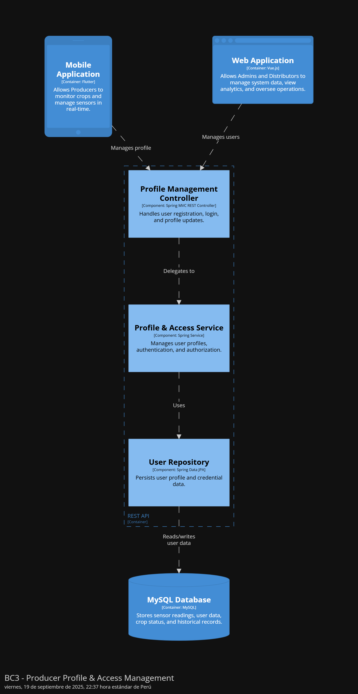
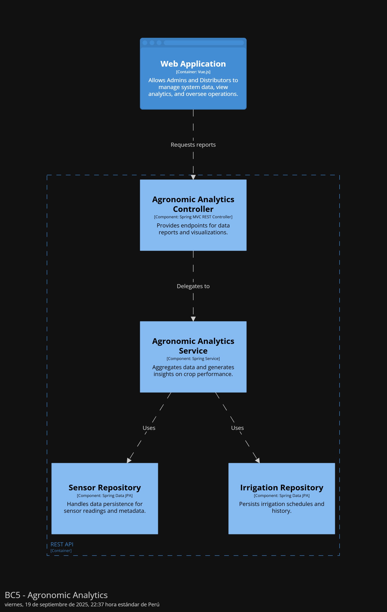

Universidad Peruana de Ciencias Aplicadas

Carrera: Ingeniería de Software

Ciclo: 2025-20

Desarrollo de Soluciones IOT - 3475

Profesor: Marco Antonio Leon Baca

Informe del Trabajo Final  - TB1

Startup: AgroControl

Producto: AgroControl

### Team Members:

| Member                             | Code        |
|------------------------------------|-------------|
| Barrionuevo Reto, Jean Franco Joel | U202219284  |
| Barrutia Vaez, Ricardo Andree      | U201714765  |
| Espinoza Inoñan, Fabiola Ximena    | U202214784  |
| Mayta Lopez, Harold Jaime          | U202114851  |
| Rodriguez Santos, David Bryan      | U202212236  |

**Septiembre del 2025**

---  
# Registro de Versiones del Informe

| Versión | Fecha           | Autor                                                                                                                                              | Descripción de modificaciones                  |
|---------|-----------------|----------------------------------------------------------------------------------------------------------------------------------------------------|------------------------------------------------|
| 1.0     | 20 - 09 - 2025  | Rodriguez Santos, David Bryan      Mayta Lopez, Harold Jaime        Espinoza Inoñan, Fabiola Ximena,        Barrutia Vaez, Ricardo Andree   Barrionuevo Reto, Jean Franco Joel     | Capitulo 1, Capitulo 2, Capitulo 3, Capitulo 4 |

---  
# Project Report Collaboration Insights

URL del repositorio de GitHub de la organización: [https://github.com/IoT](https://github.com/CourseIoT)

_TB1_

Para el desarrollo de la entrega TB1, se opto por dividir el trabajo de la siguiente forma:

| Integrante                          | Actvidades Asignadas                                                                                                                                                |
|-------------------------------------|---------------------------------------------------------------------------------------------------------------------------------------------------------------------|
| Barrutia Vaez, Ricardo Andree       | - Capitulo 1   - Ppt de exposición  |
| Espinoza Inoñan, Fabiola Ximena     | - Capitulo 2   - Ppt de exposición                                                                                                             |
| Mayta López, Harold                 | - Capitulo 4   - Ppt de exposición                                                                                                         |
| Rodriguez Santos, David Bryan       | - Capitulo 3   - Ppt de exposición                                                                                                                                    |
| Barrionuevo Reto,  Jean Franco Joel | - Capitulo 4   - Ppt de exposición                                                                                                             |

**Evidencia**:

---  
# Student Outcome
El curso contribuye al cumplimiento del Student Outcome ABET: **ABET – EAC - Student Outcome 5**   Criterio: *La capacidad de funcionar efectivamente en un equipo cuyos miembros juntos proporcionan liderazgo, crean un entorno de colaboración e inclusivo, establecen objetivos, planifican tareas y cumplen objetivos.*

En el siguiente cuadro se describe las acciones realizadas y enunciados de conclusiones por parte del grupo, que permiten sustentar el haber alcanzado el logro del ABET – EAC - Student Outcome 5.

| Criterio específico                                                                            | Acciones realizadas                                                                                                                                                                                                                                                                                                                                                                                                                                                                                                                                                                                                                                                                                                                                                                                                                                                                                                                                                                                                                                                                                                               | Conclusiones                                                                                                                                                                                                                                                                                                                                                                                                                  |  
|------------------------------------------------------------------------------------------------|-----------------------------------------------------------------------------------------------------------------------------------------------------------------------------------------------------------------------------------------------------------------------------------------------------------------------------------------------------------------------------------------------------------------------------------------------------------------------------------------------------------------------------------------------------------------------------------------------------------------------------------------------------------------------------------------------------------------------------------------------------------------------------------------------------------------------------------------------------------------------------------------------------------------------------------------------------------------------------------------------------------------------------------------------------------------------------------------------------------------------------------|-------------------------------------------------------------------------------------------------------------------------------------------------------------------------------------------------------------------------------------------------------------------------------------------------------------------------------------------------------------------------------------------------------------------------------|  
| Trabaja en equipo para proporcionar liderazgo en forma conjunta                                | **Rodriguez Santos, David Bryan** :  Apoyé en la planificación de las actividades y en definir prioridades, lo que ayudó a que el equipo trabajara de manera más organizada.    **Mayta Lopez, Harold Jaime**:  Contribuimos proponiendo alternativas técnicas y participando en las discusiones del grupo, ayudando a tomar decisiones de manera conjunta.      **Espinoza Inoñan, Fabiola Ximena**:,  Colaboré en la toma de decisiones del grupo y en la coordinación de actividades, aportando ideas que ayudaron a mantener el trabajo ordenado.       **Barrutia Vaez, Ricardo Andree**:   Participé en la organización del trabajo del equipo, proponiendo cómo repartir las tareas y apoyando en la coordinación para que todos avanzáramos en la misma dirección.  **Barrionuevo Reto, Jean Franco Joel**:  Contribuimos proponiendo alternativas técnicas y participando en las discusiones del grupo, ayudando a tomar decisiones de manera conjunta.                                                                                                                                                                                                                                                                               | Como equipo demostramos la capacidad de organizarnos y asumir el liderazgo de manera compartida, distribuyendo las tareas según las fortalezas de cada integrante y apoyándonos mutuamente en el proceso. La coordinación y la comunicación constante nos permitieron mantener un rumbo claro y tomar decisiones conjuntas en cada etapa del proyecto.                                                                        |
| Crea un entorno colaborativo e inclusivo, establece metas, planifica tareas y cumple objetivos | **Rodriguez Santos, David Bryan**:  Organicé mis entregables respetando los plazos y coordinando con mis compañeros, ayudando a que el proyecto se complete en orden y a tiempo.   **Mayta Lopez, Harold Jaime**:   Colaboré con mis compañeros para que las tareas técnicas se completaran de acuerdo con los objetivos planteados. Me mantuve en comunicación constante con el equipo para resolver dudas y asegurar que todos estuviéramos alineados en la planificación.      **Espinoza Inoñan, Fabiola Ximena**:,   Trabajé de forma colaborativa compartiendo mis avances y escuchando a mis compañeros, lo que permitió integrar mejor cada parte del proyecto.      **Barrutia Vaez, Ricardo Andree**:   Cumplí con mis tareas de manera coordinada con el equipo y me aseguré de que mi trabajo encajara con el de los demás, contribuyendo a cumplir con las metas del proyecto.  **Barrionuevo Reto, Jean Franco Joel**:   Nos aseguramos de que las decisiones técnicas fueran entendidas por el grupo y alineadas con los objetivos, fomentando un trabajo inclusivo y colaborativo.  | Logramos crear un entorno inclusivo y colaborativo donde todas las opiniones fueron tomadas en cuenta, lo que favoreció la integración de diferentes perspectivas y el cumplimiento de los objetivos planteados. Gracias a esta dinámica, pudimos planificar adecuadamente nuestras actividades, cumplir con los plazos establecidos y garantizar que el resultado final reflejara el esfuerzo y compromiso de todo el grupo. |

---  
# Contenido
## Tabla de contenidos

### [Capítulo I: Introducción](https://github.com/G2-UPC-PRE-202402-SI730-WX53-DevDynasty/GastroGo-Report#cap%C3%ADtulo-i-introducci%C3%B3n-1)
- [1.1. Startup Profile](https://github.com/G2-UPC-PRE-202402-SI730-WX53-DevDynasty/GastroGo-Report#11-startup-profile)
    - [1.1.1 Descripción de la Startup](https://github.com/G2-UPC-PRE-202402-SI730-WX53-DevDynasty/GastroGo-Report#111-descripci%C3%B3n-de-la-startup)
    - [1.1.2 Perfiles de integrantes del equipo](https://github.com/G2-UPC-PRE-202402-SI730-WX53-DevDynasty/GastroGo-Report#112-perfiles-de-integrantes-del-equipo)
- [1.2 Solution Profile](https://github.com/G2-UPC-PRE-202402-SI730-WX53-DevDynasty/GastroGo-Report#12-solution-profile)
    - [1.2.1 Antecedentes y problemática](https://github.com/G2-UPC-PRE-202402-SI730-WX53-DevDynasty/GastroGo-Report#121-antecedentes-y-problem%C3%A1tica)
    - [1.2.2 Lean UX Process](https://github.com/G2-UPC-PRE-202402-SI730-WX53-DevDynasty/GastroGo-Report#122-lean-ux-process)
        - [1.2.2.1. Lean UX Problem Statements](https://github.com/G2-UPC-PRE-202402-SI730-WX53-DevDynasty/GastroGo-Report#1221-lean-ux-problem-statements)
        - [1.2.2.2. Lean UX Assumptions](https://github.com/G2-UPC-PRE-202402-SI730-WX53-DevDynasty/GastroGo-Report#1222-lean-ux-assumptions)
        - [1.2.2.3. Lean UX Hypothesis Statements](https://github.com/G2-UPC-PRE-202402-SI730-WX53-DevDynasty/GastroGo-Report#1223-lean-ux-hypothesis-statements)
        - [1.2.2.4. Lean UX Canvas](https://github.com/G2-UPC-PRE-202402-SI730-WX53-DevDynasty/GastroGo-Report#1224-lean-ux-canvas)
- [1.3. Segmentos objetivo](https://github.com/G2-UPC-PRE-202402-SI730-WX53-DevDynasty/GastroGo-Report#13-segmentos-objetivo)

### [Capítulo II: Requirements Elicitation & Analysis]()
- [2.1. Competidores]()
    - [2.1.1. Análisis competitivo]()
    - [2.1.2. Estrategias y tácticas frente a competidores]()
- [2.2. Entrevistas]()
    - [2.2.1. Diseño de entrevistas]()
    - [2.2.2. Registro de entrevistas]()
    - [2.2.3. Análisis de entrevistas]()
- [2.3. Needfinding]()
    - [2.3.1. User Personas]()
    - [2.3.2. User Task Matrix]()
    - [2.3.3. User Journey Mapping]()
    - [2.3.4. Empathy Mapping]()
    - [2.3.5. As-is Scenario Mapping]()
- [2.4. Big Picture EventStorming]()
- [2.5. Ubiquitous Language]()

### [Capítulo III: Requirements Specification]()
- [3.1. User Stories]()
- [3.2. Impact Mapping]()
- [3.3. Product Backlog]()

### [Capítulo IV: Solution Software Design]()
- [4.1. Strategic-Level Domain-Driven Design]()
  - [4.1.1. Design-Level EventStorming]()
    - [4.1.1.1. Candidate Context Discovery]()
    - [4.1.1.2. Domain Message Flows Modeling]()
    - [4.1.1.3. Bounded Context Canvases]()
  - [4.1.2. Context Mapping]()
  - [4.1.3. Software Architecture]()
    - [4.1.3.1. Software Architecture System Landscape Diagram]()
    - [4.1.3.2. Software Architecture Context Level Diagrams]()
    - [4.1.3.3. Software Architecture Container Level Diagrams]()
    - [4.1.3.4. Software Architecture Deployment Diagrams]()
- [4.2. Tactical-Level Domain-Driven Design]()
  - [4.2.1. Bounded Context: <Bounded Context Name>]()
    - [4.2.1.1. Domain Layer]()
    - [4.2.1.2. Interface Layer]()
    - [4.2.1.3. Application Layer]()
    - [4.2.1.4. Infrastructure Layer]()
    - [4.2.1.5. Bounded Context Software Architecture Component Level Diagrams]()
    - [4.2.1.6. Bounded Context Software Architecture Code Level Diagrams]()
      - [4.2.1.6.1. Bounded Context Domain Layer Class Diagrams]()
      - [4.2.1.6.2. Bounded Context Database Design Diagram]()

---

# Capítulo I: Introducción
## 1.1. Startup Profile
### 1.1.1 Descripción de la Startup
Nuestra startup está enfocada en transformar el ciclo agrícola mediante el uso de tecnologías IoT, con el objetivo de facilitar y optimizar el trabajo de productores agrícolas y distribuidores. A través de una plataforma digital conectada a sensores y dispositivos inteligentes, ofrecemos información en tiempo real sobre el estado de los cultivos y las condiciones del campo, permitiendo automatizar procesos como el riego y generar alertas tempranas.

Este sistema busca mejorar la comunicación y coordinación entre productores y distribuidores, brindando datos confiables y actualizados que apoyen la planificación, reduzcan imprevistos y aumenten la eficiencia en la producción y distribución agrícola. El enfoque de la startup es proporcionar una solución práctica y accesible que impulse la productividad, la sostenibilidad y la toma de decisiones informadas dentro de la cadena agrícola.

**Misión**:

Nuestra misión es transformar el sector agrícola mediante soluciones tecnológicas basadas en IoT que sean accesibles y fáciles de usar. Buscamos empoderar a productores y distribuidores con datos en tiempo real y herramientas de automatización, ayudándoles a tomar mejores decisiones, optimizar recursos como el agua y mejorar la sostenibilidad y rentabilidad de sus operaciones.

**Visión**:

Ser la plataforma líder en innovación agrícola con IoT, reconocida por conectar a productores y distribuidores a través de información confiable y procesos automatizados. Aspiramos a fomentar una agricultura más eficiente, productiva y sostenible, accesible para todos los actores de la cadena agrícola, sin importar su escala.

### 1.1.2 Perfiles de integrantes del equipo

| Información                                                                                                                                                                                                                                                                                                                                                                                                                                                                                       | Foto                                                               |
|:--------------------------------------------------------------------------------------------------------------------------------------------------------------------------------------------------------------------------------------------------------------------------------------------------------------------------------------------------------------------------------------------------------------------------------------------------------------------------------------------------|:-------------------------------------------------------------------|
| **Ricardo Andree Barrutia**  Código: U201714765  Conocimientos y Habilidades:    Como estudiante de ingeniería de software he adquirido conocimientos de C++, Java y de Ionic. Con respecto a las habilidades más destacables de mi persona, considero que el trabajo en equipo es una de ellas. Además de la capacidad resolutiva a la par que adaptativa ante diversas situaciones.                                                                                        |   |
| **Jean Franco Joel Barrionuevo Reto**  Código: U202219284  Conocimientos y Habilidades: Soy Franco Barrionuevo, estudiante de la carrera de Ingeniería de Software en la Universidad Peruana de Ciencias Aplicadas. Me considero una persona proactiva, responsable y con muchas ganas de aprender. Me gusta trabajar en equipo y aportar ideas para el desarrollo de proyectos.                                                                                                                                                                                                                                                                                                                                                                                   |  |
| **Fabiola Ximena Espinoza Inoñan**  Código: u202214784  Conocimientos y Habilidades:   Mi nombre es Fabiola Espinoza, tengo 21 años y estudio Ingeniería de Software en la Universidad Peruana de Ciencias Aplicadas. Me considero una persona responsable, creativa y empática, con habilidades destacadas en el trabajo en equipo y la convivencia con otras personas. He participado en el programa Coder Bloom, 28h y más. Y actualmente soy coordinadora de ACM Women UPC. |   |
| **Harold Jaime Mayta Lopez**  Código: U202114851  Conocimientos y Habilidades:    Hola, soy Harold Mayta, actualmente estudio Ingeniería de Software en la Univerisidad Peruana de Ciencias Aplicadas. Considero que soy una persona que es capaz de trabajar bajo presión, además de ser responsable y perseverante.Asi mismo, considero que puedo aportar al grupo con soluciones optimas a futuros porblemas.                                                                                                                                                                                                                                                                                                                                                                                    |        |
| **David Bryan Rodriguez Santos**  Código: U202212236  Conocimientos y Habilidades:   Soy estudiante de cuarto ciclo de Ingeniería de Software con dominio en Java y Python. Apasionado por la programación y los videojuegos, me destaco por ser entusiasta y responsable, buscando constantemente oportunidades para crecer en el ámbito tecnológico                                                                                                                           |     |

## 1.2 Solution Profile
### 1.2.1 Antecedentes y problemática
La agricultura sigue siendo una de las principales actividades económicas a nivel global, desempeñando un papel clave en la seguridad alimentaria, el desarrollo rural y la economía de numerosos países. Sin embargo, muchos productores agrícolas, especialmente pequeños y medianos, enfrentan grandes desafíos para gestionar de forma eficiente sus cultivos y coordinar su producción con los distribuidores.

La mayoría cuenta con recursos limitados y escaso acceso a tecnologías que permitan monitorear sus cultivos en tiempo real, automatizar procesos como el riego o recibir alertas tempranas sobre condiciones climáticas adversas. Esto los obliga a depender de métodos manuales e intuitivos que no siempre son precisos, lo que genera pérdidas de agua, insumos y productividad.

Por otro lado, los distribuidores se ven afectados por la falta de visibilidad sobre el estado de los cultivos y la disponibilidad real de los productos. La ausencia de información actualizada genera retrasos, baja trazabilidad y dificultades para planificar pedidos y entregas. Esto afecta tanto la eficiencia de la cadena de suministro como la calidad de los productos que llegan al consumidor final.

Ante este panorama, surge la necesidad de soluciones tecnológicas accesibles y adaptadas al contexto agrícola, que permitan a productores y distribuidores obtener datos confiables en tiempo real, optimizar recursos y fortalecer la sostenibilidad del sistema agrícola en su conjunto.

**What**

¿Cuál es el problema?

Los productores agrícolas y distribuidores enfrentan dificultades para acceder a información confiable y oportuna sobre el estado de los cultivos. Esto provoca decisiones poco eficientes en el riego, la planificación de cosechas y la coordinación de entregas, generando pérdidas económicas y de productividad.

**Where**

¿Dónde surge el problema?

El problema surge en los campos de cultivo y en la cadena de distribución agrícola, donde, si bien existen tecnologías de monitoreo y automatización, estas no siempre son accesibles para pequeños y medianos productores debido a sus altos costos, complejidad de uso o falta de adaptación al contexto local. Esta brecha tecnológica se traduce en falta de información oportuna para productores y baja visibilidad para distribuidores.

Para la elaboración de la descripción de los antecedentes y problemática, hemos aplicado la técnica de The 5 ’W’s y 2 ’H’s:

Problemática (5Ws y 2Hs)

**Why**

**¿Cuál es la causa del problema?**

Aunque hay soluciones tecnológicas disponibles en el mercado, su acceso es limitado. La mayoría de los productores carece de herramientas asequibles y fáciles de usar que les permitan monitorear sus cultivos en tiempo real y compartir esa información con distribuidores. Esta falta de accesibilidad genera ineficiencias en el uso de recursos (agua, insumos, tiempo), poca trazabilidad en la cadena y dificultades para planificar de manera coordinada la producción y distribución.

**When**

**¿Cuándo sucede el problema?**

Durante todas las etapas del ciclo agrícola: desde el riego y crecimiento de los cultivos hasta la cosecha y distribución, impactando de forma continua la producción y la cadena de suministro.

**Who**

**¿Quiénes están involucrados?**

Productores agrícolas que necesitan optimizar sus recursos y automatizar procesos.

Distribuidores que requieren información confiable sobre disponibilidad y estado de los productos para planificar sus operaciones.

**How**

**¿Cómo nos conocieron los usuarios?**

Principalmente a través de recomendaciones de agricultores y distribuidores que han visto mejoras en eficiencia gracias al uso de sensores y automatización, además de estrategias de difusión en redes sociales mostrando casos de éxito en el uso de IoT agrícola.

**¿Cómo prefieren los usuarios acceder a nuestro servicio?**

A través de una aplicación móvil y web sencilla, que permita consultar datos en tiempo real desde cualquier dispositivo y recibir notificaciones automáticas sobre el estado de los cultivos.

**How much**

La falta de adopción de tecnologías modernas de riego limita el rendimiento y los ingresos de los agricultores. Estudios del IFC en Burkina Faso y Zambia demuestran que la implementación de sistemas de riego por goteo con bombas puede aumentar los márgenes brutos hasta en un 395 % anual, lo que se traduce en un incremento de USD 9,158/año para pequeños agricultores (IFC, 2019).

### 1.2.2 Lean UX Process
Los procesos Lean UX son fundamentales para definir con precisión nuestras ideas y establecer un plan de acción enfocado en responder preguntas clave a través del **Needfinding**.

#### 1.2.2.1. Lean UX Problem Statements
Los productores agrícolas y distribuidores carecen de información confiable y accesible en tiempo real sobre el estado de los cultivos. Aunque existen tecnologías IoT en el mercado, estas no siempre son asequibles ni fáciles de usar para pequeños y medianos productores, lo que genera brechas tecnológicas y afecta la coordinación con los distribuidores.

Pregunta clave:
¿Cómo podemos ofrecer una solución accesible basada en IoT que permita a los productores optimizar recursos como el agua y a los distribuidores mejorar la planificación de entregas, reduciendo pérdidas y aumentando la sostenibilidad?

#### 1.2.2.2. Lean UX Assumptions

**Business Assumptions**

**Creo que mis usuarios necesitan** una plataforma que les permita monitorear cultivos en tiempo real y coordinar entregas con distribuidores de manera eficiente, optimizando recursos como el agua y reduciendo pérdidas en la producción.

**Estas necesidades se pueden resolver** mediante el desarrollo de una plataforma IoT especializada en agricultura, que conecte sensores de humedad, temperatura y clima con una aplicación móvil y web. Para los agricultores, esta plataforma debe automatizar procesos críticos como el riego y emitir alertas tempranas; para los distribuidores, debe proveer información confiable sobre disponibilidad de productos.

**Mis clientes iniciales son** pequeños y medianos productores agrícolas del Perú, así como distribuidores locales y regionales que dependen de datos precisos para planificar la cadena de suministro. Estos clientes valorarán la simplicidad, accesibilidad económica y confiabilidad de la solución.

**El valor #1 que un cliente requiere de mi servicio** es la eficiencia en el uso de recursos (agua, insumos, tiempo) y la reducción de incertidumbre en la planificación agrícola.

**El cliente también puede obtener estos beneficios adicionales:**

- Mayor sostenibilidad y productividad agrícola.

- Mejor relación comercial entre agricultores y distribuidores gracias a la trazabilidad de datos.

- Reducción de pérdidas económicas por sobreuso de agua, retrasos o falta de información.

**Voy a adquirir a mis clientes a través de** una estrategia combinada:

- Marketing digital segmentado en redes sociales dirigidas al sector agro.

- Alianzas con cooperativas agrícolas y distribuidores que permitan pruebas piloto.

- Ferias y eventos agrícolas para mostrar la solución en campo con casos de éxito.

**Haré dinero a través de** un modelo de suscripción mensual o anual, con planes escalables según el número de sensores y usuarios por cuenta.

**Mi competencia de mercado seran** sistemas de monitoreo agrícola tradicionales, así como aplicaciones de gestión de cultivos ofrecidas por grandes proveedores internacionales.

**Los venceremos debido que** nuestra propuesta ofrece una solución más asequible, sencilla y adaptada al contexto local, donde la mayoría de competidores no logra penetrar debido a la complejidad técnica o los costos elevados.

**Mis mayores riesgos de producto son** la resistencia de los agricultores a adoptar tecnologías nuevas, el alto costo inicial de los sensores IoT y la posible preferencia por métodos manuales o tradicionales.

**Resolveremos esto mediante** un proceso de diseño participativo, incluyendo entrevistas y pruebas piloto en campo, para asegurar que la solución sea realmente útil, simple y adaptable a la rutina agrícola.

**Sabremos que hemos tenido éxito cuando:**

- Observemos un aumento en la productividad agrícola (ej. más toneladas por hectárea con menor gasto de agua).

- Notemos una reducción en retrasos logísticos y mayor trazabilidad en la distribución.

- Los agricultores y distribuidores usen la plataforma de manera recurrente para tomar decisiones clave en la producción.

**Qué otras suposiciones tenemos que, de probarse falsas, pueden causar que nuestro proyecto fracase:**

- Que los agricultores y distribuidores estén dispuestos a pagar una suscripción.

- Que exista confianza suficiente para adoptar soluciones IoT en contextos rurales.

- Que el mercado esté listo para migrar de prácticas tradicionales a herramientas tecnológicas accesibles.

**User Assumptions**

**¿Quiénes serán nuestros usuarios?**

Productores agrícolas pequeños y medianos que necesitan optimizar el riego y mejorar la sostenibilidad de sus cultivos.

Distribuidores que buscan información confiable y en tiempo real sobre disponibilidad y calidad de los productos.

**¿Dónde encaja nuestro producto en su vida o trabajo?**

Para los productores: la plataforma encaja en sus rutinas diarias de supervisión del campo, ayudándoles a regar de manera precisa y recibir alertas que eviten pérdidas.

Para los distribuidores: encaja en la planificación de pedidos y coordinación logística, permitiendo tomar decisiones con base en datos en lugar de suposiciones.

**¿Qué problemas tiene nuestro producto y cómo se pueden resolver?**

Agricultores podrían percibir la tecnología como costosa o difícil de usar → solución: interfaz intuitiva + pruebas gratuitas en campo.

Distribuidores podrían dudar de la confiabilidad de los datos → solución: reportes automatizados y certificación de calidad de la información.

Usuarios podrían no ver valor inmediato → solución: mostrar métricas claras de ahorro de agua, tiempo y reducción de retrasos.

**¿Cómo y cuándo es usado nuestro producto?**

Agricultores lo usan diariamente para monitorear humedad, temperatura y activar riego.

Distribuidores lo usan semanalmente para planificar entregas y verificar disponibilidad de productos.

**¿Qué características son importantes?**

- Interfaz intuitiva (app móvil + web).

- Alertas en tiempo real sobre condiciones críticas.

- Visualización clara de datos de cultivos y disponibilidad.

- Escalabilidad para integrar más sensores y usuarios.

**¿Cómo debe verse y comportarse nuestro producto?**

Diseño simple, visual y accesible, adaptable a usuarios con bajo nivel tecnológico.

Experiencia de usuario fluida: consultar datos y recibir alertas en segundos.

Comportamiento confiable y estable en zonas rurales con conectividad limitada.

**Features:**

Rol Productor: gestión de sensores, visualización de datos, alertas y control de riego.

Rol Distribuidor: acceso a reportes de disponibilidad, planificación de entregas y comunicación directa con productores.

Notificaciones en tiempo real sobre cambios críticos (ej. sequía, exceso de riego, disponibilidad de cosecha).

#### 1.2.2.3. Lean UX Hypothesis Statements

**Creemos que** al implementar sensores de humedad conectados a riego automático, los agricultores reducirán desperdicio de agua.

**Sabremos que** estamos en lo correcto cuando observemos una reducción del 30% en consumo hídrico en tres meses.

**Creemos que** al recibir notificaciones sobre sequías o exceso de riego, los productores reaccionarán más rápido.

**Sabremos que** estamos en lo correcto cuando al menos el 50% de los agricultores actúe ante las alertas recibidas.

**Creemos que** al ofrecer reportes de disponibilidad de cultivos en tiempo real, los distribuidores mejorarán su logística.

**Sabremos que** estamos en lo correcto cuando se reduzcan en un 20% los retrasos en entregas en seis meses.

**Creemos que** al diseñar una app simple, intuitiva y en español, agricultores y distribuidores estarán dispuestos a usarla regularmente.

**Sabremos que** estamos en lo correcto cuando al menos el 40% de los registrados accedan semanalmente en el primer trimestre.

**Creemos que** al mostrar métricas de ahorro (agua, costos, tiempo), los usuarios valorarán más la solución.

**Sabremos que** estamos en lo correcto cuando el 60% de usuarios consulten estas métricas al menos una vez por semana.

**Creemos que** al permitir planes escalables (más sensores, más usuarios por cuenta), aumentaremos ingresos.

**Sabremos que** estamos en lo correcto cuando al menos el 10% de usuarios cambien a un plan superior en seis meses.

---

**Lo más importante que debemos aprender**

Para el éxito de nuestro proyecto, es fundamental identificar si los productores y distribuidores realmente valoran la propuesta de contar con una plataforma IoT accesible y fácil de usar.

Aunque existen soluciones similares en el mercado, necesitamos confirmar si nuestra propuesta:

- Es viable en el contexto de pequeños y medianos agricultores.

- Responde a las necesidades de información en tiempo real y coordinación con distribuidores.

- Ofrece beneficios tangibles como ahorro de agua, reducción de retrasos y mejor planificación.

**Minimum Viable Product (MVP):**

Nuestro MVP estará enfocado en obtener aprendizajes rápidos. La pregunta clave será:

**¿Qué es lo más importante que necesitamos aprender primero?**

- Validar si existe demanda real por parte de agricultores y distribuidores.

- Confirmar que el producto resuelve una necesidad concreta y no un “nice to have”.

**Acciones para validar el MVP:**

- Realizar entrevistas con agricultores y distribuidores para conocer su disposición a pagar y adoptar la tecnología.

- Desarrollar una landing page con la propuesta de valor y formulario de interés para captar potenciales clientes.

- Implementar un piloto con sensores IoT en campos pequeños para medir el impacto en ahorro de agua y planificación.

- Usar métricas iniciales (ej. % de agricultores que activan alertas, frecuencia de uso de la app, intención de pago) para validar hipótesis.

#### 1.2.2.4. Lean UX Canvas

## 1.3. Segmentos objetivo

Productores agrícolas (pequeños y medianos):

Son agricultores que necesitan optimizar sus recursos y mejorar la productividad de sus cultivos. Requieren soluciones accesibles que les permitan monitorear en tiempo real el estado del campo, automatizar procesos como el riego y recibir alertas tempranas frente a condiciones climáticas adversas. Este segmento busca reducir pérdidas de agua e insumos, tomar decisiones más informadas y asegurar una mayor rentabilidad y sostenibilidad en sus operaciones.

Distribuidores agrícolas:

Son los encargados de conectar la producción con el mercado. Necesitan mayor visibilidad sobre la disponibilidad y calidad de los cultivos para planificar sus compras y entregas con eficiencia. Requieren información confiable y actualizada que les permita anticipar retrasos o variaciones en la producción, mejorar la coordinación con los productores y garantizar la trazabilidad y puntualidad en la cadena de suministro.

# Capítulo II: Requirements Elicitation & Analysis
## 2.1 Competidores

Después de realizar una investigación de mercado, hemos identificado tres plataformas que integran **IoT y aplicaciones móviles/web** para la gestión agrícola, con funcionalidades similares a las que busca ofrecer **AgroControl IoT**:

---

1. **Blynk IoT**  
Blynk es una plataforma IoT que permite crear aplicaciones móviles y web personalizadas para conectar y controlar sensores, dispositivos y sistemas en tiempo real. En agricultura, es utilizada para implementar soluciones de **riego automatizado**, monitoreo de humedad del suelo, clima y control de energía. Su fortaleza está en la facilidad para crear dashboards intuitivos y accesibles sin necesidad de desarrollar todo desde cero.  

    

---

2. **CropX**  
CropX es una plataforma agrícola basada en IoT que combina sensores de suelo con análisis avanzados en la nube. Ofrece información en tiempo real sobre humedad, temperatura y nutrientes del suelo, optimizando el riego y la fertilización. Su aplicación móvil permite a los agricultores recibir alertas y recomendaciones para mejorar la **eficiencia en el uso de recursos** y aumentar la productividad.  

    

---

3. **Netafim – Digital Farming**  
Netafim, líder en riego por goteo, ha desarrollado una plataforma digital de agricultura inteligente que conecta sensores IoT, válvulas automatizadas y estaciones meteorológicas. Su aplicación móvil y web permite controlar riego en tiempo real, recibir **alertas tempranas sobre sequías o exceso de riego**, y generar reportes de sostenibilidad. Está enfocada en la **eficiencia hídrica** y es utilizada globalmente por productores de distintas escalas.  

    

---

### Conclusión Comparativa
Las tres plataformas analizadas muestran cómo la **agricultura con IoT** está transformando la gestión de cultivos y recursos. Sin embargo, presentan limitaciones:  
- **Blynk**: Flexible y accesible, pero requiere configuración técnica por parte del usuario.  
- **CropX**: Potente en análisis de suelo, aunque más costosa y orientada a grandes productores.  
- **Netafim**: Enfocada en riego de precisión, pero menos adaptable a productores pequeños que buscan una solución integral.  

**AgroControl IoT** se posiciona como una alternativa **accesible y adaptada al contexto local**, ofreciendo integración de sensores, alertas en tiempo real y comunicación entre productores y distribuidores en una plataforma simple y económica.

### 2.1.1. Análisis competitivo

<table>
  <tr>
    <th colspan="7" valign="top"><b>Competitive Analysis Landscape</b></th>
  </tr>
  <tr>
    <td colspan="2" rowspan="2">¿Por qué llevar a cabo este análisis?</td>
    <td colspan="5">Identificar a nuestros competidores en el ámbito de la agricultura con IoT y establecer estrategias para diferenciarnos, enfocándonos en accesibilidad y adaptación al contexto local.</td>
  </tr>
  <tr>
    <td colspan="5">Este análisis se realizó con la finalidad de evaluar las fortalezas de plataformas IoT existentes y resaltar cómo AgroControl IoT puede posicionarse como una alternativa accesible para pequeños y medianos productores agrícolas.</td>
  </tr>
  <tr>
    <td colspan="3">(En la cabecera colocar por cada competidor nombre y logo)</td>
    <td colspan="1" valign="top" style="font-weight: bold;">
        AgroControl
         
        

          
        

    </td>
    <td colspan="1" valign="top" style="font-weight: bold;">
        Blynk IoT
        

          
        

    </td>
    <td colspan="1" valign="top" style="font-weight: bold;">
        CropX
        

          
        

    </td>
    <td colspan="1" valign="top" style="font-weight: bold;">
        Netafim Digital Farming
        

          
        

    </td>
  </tr>
  <tr>
    <td colspan="1" rowspan="2">
Perfil
</td>
    <td colspan="2">Overview</td>
    <td colspan="1" valign="top">Plataforma IoT agrícola integral que conecta sensores para monitoreo de cultivos, automatización de riego, alertas tempranas y coordinación con distribuidores.</td>
    <td colspan="1" valign="top">Plataforma IoT flexible que permite crear dashboards y apps para monitorear y controlar sensores en tiempo real, aplicable en agricultura para riego y clima.</td>
    <td colspan="1" valign="top">Plataforma agrícola basada en sensores de suelo conectados a la nube, que ofrece datos de humedad, temperatura y nutrientes para optimizar cultivos.</td>
    <td colspan="1" valign="top">Plataforma de agricultura digital enfocada en riego de precisión, conectando válvulas, estaciones meteorológicas y sensores IoT.</td>
  </tr>
  <tr>
    <td colspan="2">Ventaja competitiva</td>
    <td colspan="1" valign="top">Accesibilidad económica y simplicidad de uso para pequeños y medianos productores. Integra productor y distribuidor en una misma plataforma.</td>
    <td colspan="1" valign="top">Alta flexibilidad para personalizar dashboards y soluciones IoT sin necesidad de desarrollo complejo.</td>
    <td colspan="1" valign="top">Analítica avanzada de suelos y recomendaciones basadas en datos precisos para maximizar la productividad.</td>
    <td colspan="1" valign="top">Liderazgo global en riego inteligente y eficiencia hídrica, con soporte a gran escala.</td>
  </tr>
  <tr>
    <td colspan="1" rowspan="2">
Perfil de Marketing
</td>
    <td colspan="2">Mercado objetivo</td>
    <td colspan="1" valign="top">Productores pequeños y medianos, y distribuidores agrícolas que requieren trazabilidad y optimización de recursos.</td>
    <td colspan="1" valign="top">Usuarios técnicos y agricultores que buscan crear soluciones IoT personalizadas para monitoreo agrícola.</td>
    <td colspan="1" valign="top">Grandes productores y agroindustrias con capacidad de inversión en IoT avanzado.</td>
    <td colspan="1" valign="top">Productores medianos y grandes interesados en maximizar la eficiencia en el uso del agua.</td>
  </tr>
  <tr>
    <td colspan="2">Estrategias de marketing</td>
    <td colspan="1" valign="top">Campañas digitales segmentadas, pilotos con cooperativas agrícolas y ferias agro-tecnológicas.</td>
    <td colspan="1" valign="top">Enfoque en comunidad global IoT, tutoriales y adopción en múltiples industrias.</td>
    <td colspan="1" valign="top">Alianzas B2B, integración con maquinaria agrícola y marketing especializado.</td>
    <td colspan="1" valign="top">Casos de éxito globales, alianzas con gobiernos y ONGs.</td>
  </tr>
  <tr>
    <td colspan="1" rowspan="3">
Perfil de Producto
</td>
    <td colspan="2">Productos & Servicios</td>
    <td colspan="1" valign="top">Monitoreo de cultivos, riego automatizado, alertas tempranas, dashboards móviles/web y trazabilidad.</td>
    <td colspan="1" valign="top">Dashboards IoT personalizables, monitoreo remoto y notificaciones en tiempo real.</td>
    <td colspan="1" valign="top">Sensores de suelo + app web/móvil con analítica predictiva y recomendaciones de riego/fertilización.</td>
    <td colspan="1" valign="top">Riego inteligente por goteo, estaciones climáticas conectadas y control remoto de válvulas.</td>
  </tr>
 <tr>
    <td colspan="2">Precios & Costos</td>
    <td colspan="1" valign="top"><strong>Plan Básico:</strong> $20/mes (1 campo). <strong>Plan Premium:</strong> $90/mes (múltiples campos y distribuidores). <strong>Distribuidores:</strong> $100/mes con trazabilidad avanzada.</td>
    <td colspan="1" valign="top"><strong>Plan Gratuito:</strong> limitado. <strong>Suscripción:</strong> desde $7/mes (según dispositivos conectados).</td>
    <td colspan="1" valign="top"><strong>Suscripción anual:</strong> $300 – $1000, según sensores y hectáreas.</td>
    <td colspan="1" valign="top"><strong>Soluciones personalizadas:</strong> desde $500 (sistemas de riego inteligente con IoT).</td>
  </tr>
  <tr>
    <td colspan="2">Canales de distribución (Web y/o Móvil)</td>
    <td colspan="1" valign="top">Aplicación Web y móvil.</td>
    <td colspan="1" valign="top">Disponible en Web y apps móviles (iOS/Android).</td>
    <td colspan="1" valign="top">Aplicación Web y móvil.</td>
    <td colspan="1" valign="top">Aplicación Web, móvil y dispositivos físicos conectados.</td>
  </tr>
</table>

### 2.1.2. Estrategias y tácticas frente a competidores

<table>
  <tr>
    <td colspan="1" rowspan="5">
<b>Análisis SWOT</b>
</td>
    <td colspan="6">Este análisis se realizó para nuestra startup AgroControl IoT y tres competidores relevantes en agricultura con IoT (Blynk IoT, CropX y Netafim). El objetivo es identificar fortalezas, debilidades, oportunidades y amenazas, apoyando la definición de nuestra ventaja competitiva.</td>
  </tr>
  <tr>
    <td colspan="2"><b>Fortalezas</b></td>
    <td colspan="1" valign="top">AgroControl ofrece accesibilidad económica, simplicidad de uso y adaptación al contexto local. Integra en una sola plataforma el monitoreo de cultivos, riego automatizado, alertas tempranas y coordinación con distribuidores.</td>
    <td colspan="1" valign="top">Blynk IoT destaca por su flexibilidad y personalización de dashboards y aplicaciones móviles/web, lo que permite implementar soluciones IoT sin necesidad de desarrollos complejos.</td>
    <td colspan="1" valign="top">CropX es fuerte en analítica avanzada de suelos, ofreciendo datos precisos sobre humedad, temperatura y nutrientes, lo que mejora la productividad y optimiza el riego.</td>
    <td colspan="1" valign="top">Netafim Digital Farming lidera globalmente en riego de precisión y eficiencia hídrica, con soluciones escalables y probadas en grandes cultivos.</td>
  </tr>
  <tr>
    <td colspan="2"><b>Debilidades</b></td>
    <td colspan="1" valign="top">AgroControl carece aún de integración con maquinaria agrícola avanzada y podría enfrentar retos de escalabilidad con grandes productores o distribuidores.</td>
    <td colspan="1" valign="top">Blynk IoT no está diseñado específicamente para agricultura, lo que requiere configuración técnica adicional por parte del usuario.</td>
    <td colspan="1" valign="top">CropX es costoso para pequeños productores y requiere infraestructura avanzada para aprovechar su potencial al máximo.</td>
    <td colspan="1" valign="top">Netafim puede ser inaccesible para pequeños agricultores debido a sus altos costos iniciales y enfoque en grandes operaciones.</td>
  </tr>
  <tr>
    <td colspan="2"><b>Oportunidades</b></td>
    <td colspan="1" valign="top">AgroControl tiene la oportunidad de posicionarse en mercados emergentes ofreciendo soluciones adaptadas al contexto local, integrando IoT con Big Data y expandiéndose hacia la trazabilidad completa de la cadena de suministro.</td>
    <td colspan="1" valign="top">Blynk IoT puede aprovechar su comunidad global de desarrolladores para expandir casos de uso en agricultura y asociarse con proveedores de sensores agrícolas.</td>
    <td colspan="1" valign="top">CropX puede consolidar su liderazgo ampliando su red de clientes en Latinoamérica y África, donde la gestión del agua es crítica.</td>
    <td colspan="1" valign="top">Netafim puede expandir sus soluciones digitales combinando IoT con inteligencia artificial para mejorar la eficiencia de sus sistemas de riego.</td>
  </tr>
  <tr>
    <td colspan="2"><b>Amenazas</b></td>
    <td colspan="1" valign="top">AgroControl enfrenta la amenaza de la rápida evolución tecnológica y la competencia de plataformas internacionales más establecidas. Además, la adopción lenta de tecnologías IoT en zonas rurales podría limitar su crecimiento inicial.</td>
    <td colspan="1" valign="top">Blynk IoT podría perder relevancia en agricultura si no adapta mejor su plataforma al sector agro. La competencia de plataformas agrícolas específicas es un riesgo.</td>
    <td colspan="1" valign="top">CropX enfrenta el riesgo de ser percibido como inaccesible en mercados emergentes debido a su costo, además de la presión por mantenerse innovador frente a nuevos entrantes.</td>
    <td colspan="1" valign="top">Netafim puede enfrentar competencia de nuevas startups más flexibles y accesibles, además de riesgos asociados a la dependencia de grandes productores.</td>
  </tr>
</table>

## 2.2. Entrevistas
### 2.2.1. Diseño de entrevistas

En esta sección se han definido una serie de preguntas para nuestros segmentos objetivos, con la finalidad de obtener información cualitativa como opiniones y descripciones. Esta información será de gran ayuda en el desarrollo de nuestra solución.

Preguntas generales:

¿Cuál es tu nombre?
¿Qué edad tienes?
¿Dónde vives actualmente?
¿A qué te dedicas?
¿Cual es el navegador (browser) que más usas?
¿Cual es el dispositivo que más usas?
**Preguntas Segmento 1: Productores Agricolas**

1. ¿Cuáles son los principales desafíos que enfrentas en la gestión de tus campos de cultivo?
2. ¿Qué herramientas utilizas actualmente para la gestión de tus operaciones agrícolas?
3. ¿Qué funcionalidades consideras más importantes en una aplicación de gestión agrícola?
4. ¿Qué aspectos te gustaría mejorar en las herramientas actuales que usas?
5. ¿Con qué frecuencia utilizas tecnología para la gestión de tus cultivos?
6. ¿Qué tipo de datos o información te gustaría que te proporcionara una aplicación de gestión agrícola?
7. ¿Cómo manejas actualmente el seguimiento de tus gastos e ingresos relacionados con la agricultura?
8. ¿Qué tipo de análisis o reportes serían útiles para ti en una plataforma de gestión agrícola?
9. ¿Cómo te gustaría que una aplicación te ayude en la toma de decisiones para la gestión de tus campos?

Preguntas complementarias productores:

- ¿Cuáles son los principales problemas que enfrentas en el riego (falta de agua, exceso de riego, distribución desigual, etc.)?
- ¿Con qué frecuencia revisas el estado de tus cultivos (a diario, semanal, solo cuando hay problemas)?
- ¿Qué variables ambientales (ej. humedad del suelo, temperatura, radiación solar, pH) consideras más importantes monitorear en tus cultivos?
- ¿Te gustaría que el sistema active automáticamente el riego según los datos de los sensores o prefieres solo recibir alertas para decidir manualmente?
- ¿Qué nivel de precisión consideras suficiente para los sensores de humedad o temperatura (ej. ±2%)?
- ¿Te gustaría que el sistema incluya recomendaciones de riego basadas en los datos recopilados (ej. sugerir cuántos litros regar)?
- ¿Qué tan dispuesto estás a invertir en hardware adicional (sensores, válvulas automáticas, bombas) para integrar con el sistema?

**Preguntas Segmento 2: Distribuidores**

1. ¿Cuáles son las principales dificultades que enfrentas al relacionarte con agricultores en tu trabajo diario?
2. ¿Qué tan fácil o difícil es para ti coordinar pedidos y entregas con distintos productores?
3. ¿Qué medios usas actualmente para comunicarte con los agricultores (llamadas, WhatsApp, reuniones presenciales, otros)?
4. ¿Qué tipo de información te gustaría tener a la mano para organizar mejor tus pedidos antes de contactar a los agricultores?
5. ¿Con qué frecuencia recibes cambios de último momento en la producción o en las entregas?
6. ¿Qué impacto tienen estos cambios en tu trabajo como distribuidor?
7. ¿Qué tan dispuesto estarías a usar una herramienta digital que te conecte en tiempo real con los agricultores?
8. ¿Qué esperas que te ofrezca una aplicación para mejorar tu relación con los productores agrícolas?
9. ¿Qué tan importante sería para ti que la información de los agricultores sea confiable y fácil de entender?
10. ¿Qué expectativas tendrías de una herramienta digital que centralice la comunicación entre productores y distribuidores?

Preguntas complementarias distribuidores:

- ¿Qué problemas se repiten más seguido en tu trabajo (falta de stock, retrasos, calidad del producto)?
- ¿Cómo manejas los casos en que un productor no entrega lo acordado en cantidad o tiempo?
- ¿Qué tan útil sería que la aplicación te muestre proyecciones de disponibilidad de producto según datos de campo?
- ¿Consideras valioso recibir alertas de posibles retrasos en cosechas por sequías o lluvias excesivas?
- ¿Qué tan necesario es que el sistema se integre con tu software actual de inventario o facturación?

### 2.2.2. Registro de entrevistas

Segmento Productor Agricola:

| **Entrevista 1**                          | **Detalle**                                                                                                                                                                                                                                                                                                                                                                                                                                                                                                                                                                                                                                              | 	            
|-------------------------------------------|----------------------------------------------------------------------------------------------------------------------------------------------------------------------------------------------------------------------------------------------------------------------------------------------------------------------------------------------------------------------------------------------------------------------------------------------------------------------------------------------------------------------------------------------------------------------------------------------------------------------------------------------------------|
| Nombre entrevistado                       | Nicolas Vera                                                                                                                                                                                                                                                                                                                                                                                                                                                                                                                                                                                                                                             | 
| Edad                                      | 22                                                                                                                                                                                                                                                                                                                                                                                                                                                                                                                                                                                                                                                       |
| Profesión                                 | Estudiante y productor agricola                                                                                                                                                                                                                                                                                                                                                                                                                                                                                                                                                                                                                          |
| Departamento                              | Lima                                                                                                                                                                                                                                                                                                                                                                                                                                                                                                                                                                                                                                                     |
| Inicio del video                          | 0:10                                                                                                                                                                                                                                                                                                                                                                                                                                                                                                                                                                                                                                                     |
| Fin del video                             | 5:50                                                                                                                                                                                                                                                                                                                                                                                                                                                                                                                                                                                                                                                     |
| Link del video                            | https://shorturl.at/XYUIF                                                                                                                                                                                                                                                                                                                                                                                                                                                                                                                                                                                                                                |
| Foto entrevista                           | 
  
                                                                                                                                                                                                                                                                                                                                                                                                                                                                                                                                             |
| Resumen                                   | Nicolás Vera enfrenta problemas en sus cultivos debido a sequías, exceso de agua y la dificultad de controlar adecuadamente los tiempos de riego, ya que estudia en Lima y depende de un encargado para supervisar el campo. Considera factores clave como el pH, las sales, la radiación solar y las temperaturas para el desarrollo de las plantas, y manifiesta interés en una solución tecnológica que le permita automatizar procesos y recibir alertas a distancia para optimizar el manejo de sus cultivos. Está dispuesto a invertir en dicha solución siempre que represente una mejora en la producción y contribuya a la reducción de costos. |

| **Entrevista 2**                          | **Detalle**                                                                                                                                                                                                                                                                                                                                                                                                                                                                                                                                                                                                    | 	            
|-------------------------------------------|----------------------------------------------------------------------------------------------------------------------------------------------------------------------------------------------------------------------------------------------------------------------------------------------------------------------------------------------------------------------------------------------------------------------------------------------------------------------------------------------------------------------------------------------------------------------------------------------------------------|
| Nombre entrevistado                       | Isidro Principe Ramirez                                                                                                                                                                                                                                                                                                                                                                                                                                                                                                                                                                                        | 
| Edad                                      | 65                                                                                                                                                                                                                                                                                                                                                                                                                                                                                                                                                                                                             |
| Profesión                                 | Productor agricola                                                                                                                                                                                                                                                                                                                                                                                                                                                                                                                                                                                             |
| Departamento                              | Lima                                                                                                                                                                                                                                                                                                                                                                                                                                                                                                                                                                                                           |
| Inicio del video                          | 00:10                                                                                                                                                                                                                                                                                                                                                                                                                                                                                                                                                                                                          |
| Fin del video                             | 06:30                                                                                                                                                                                                                                                                                                                                                                                                                                                                                                                                                                                                          |
| Link del video                            | https://shorturl.at/gULis                                                                                                                                                                                                                                                                                                                                                                                                                                                                                                                                                                                      |
| Foto entrevista                           | 
  
                                                                                                                                                                                                                                                                                                                                                                                                                                                                                                   |
| Resumen                                   | El señor Isidro Principe Ramirez, un productor agrícola de 65 años de Lima, Perú, nos compartió algunos de los desafíos que enfrenta en la gestión de sus cultivos. Señaló que uno de los mayores retos es mantener un control preciso de las distintas etapas del proceso agrícola, como las fumigación, riego, humedad, sequias, etc. Además, comentó que utiliza diversas herramientas agrícolas, como mochilas a motor y otras maquinarias, para el manejo de sus campos. Actualmente, esta dispuesto a utilizar soluciones tecnologicas y adaptarse a ello para mejorar el ciclo de vida de sus cultivos. |

| **Entrevista 3**                          | **Detalle**                                                                                                                                                                                                                                                                                                                                                                                                                                                                                                                                                                                                                                             | 	            
|-------------------------------------------|---------------------------------------------------------------------------------------------------------------------------------------------------------------------------------------------------------------------------------------------------------------------------------------------------------------------------------------------------------------------------------------------------------------------------------------------------------------------------------------------------------------------------------------------------------------------------------------------------------------------------------------------------------|
| Nombre entrevistado                       | Fidel Godoy Zevallos                                                                                                                                                                                                                                                                                                                                                                                                                                                                                                                                                                                                                                    | 
| Edad                                      | 60                                                                                                                                                                                                                                                                                                                                                                                                                                                                                                                                                                                                                                                      |
| Profesión                                 | Productor agricola                                                                                                                                                                                                                                                                                                                                                                                                                                                                                                                                                                                                                                      |
| Departamento                              | Lima                                                                                                                                                                                                                                                                                                                                                                                                                                                                                                                                                                                                                                                    |
| Inicio del video                          | 06:31                                                                                                                                                                                                                                                                                                                                                                                                                                                                                                                                                                                                                                                   |
| Fin del video                             | 13:51                                                                                                                                                                                                                                                                                                                                                                                                                                                                                                                                                                                                                                                   |
| Link del video                            | https://shorturl.at/gULis                                                                                                                                                                                                                                                                                                                                                                                                                                                                                                                                                                                                                               |
| Foto entrevista                           | 
  
                                                                                                                                                                                                                                                                                                                                                                                                                                                                                                                                            |
| Resumen                                   | El señor Fidel Godoy Zevallos, un productor agrícola de 60 años de Lima, Perú, nos compartió algunos de los desafíos que enfrenta en la producción de sus cultivos. Señaló que uno de sus mayores retos es optimizar el sistema de riego y garantizar condiciones adecuadas para el buen desarrollo de las plantas. Además, comentó que le resulta fundamental contar con información sobre el clima, la calidad del suelo y otros factores ambientales que influyen directamente en la cosecha. Actualmente, está dispuesto a utilizar soluciones tecnológicas que le permitan mejorar la productividad y fortalecer el ciclo de vida de sus cultivos. |

Segmento Distribuidores Agrícolas:

| **Entrevista 1**                          | **Detalle**                                                                                                                                                                                                                                                                                                                                                                                                                                                                                                                                                                                                                                                                                                                                                                                                                                                                                                                                                                                                           | 	            
|-------------------------------------------|-----------------------------------------------------------------------------------------------------------------------------------------------------------------------------------------------------------------------------------------------------------------------------------------------------------------------------------------------------------------------------------------------------------------------------------------------------------------------------------------------------------------------------------------------------------------------------------------------------------------------------------------------------------------------------------------------------------------------------------------------------------------------------------------------------------------------------------------------------------------------------------------------------------------------------------------------------------------------------------------------------------------------|
| Nombre entrevistado                       | William Ramos                                                                                                                                                                                                                                                                                                                                                                                                                                                                                                                                                                                                                                                                                                                                                                                                                                                                                                                                                                                                         | 
| Edad                                      | 28                                                                                                                                                                                                                                                                                                                                                                                                                                                                                                                                                                                                                                                                                                                                                                                                                                                                                                                                                                                                                    |
| Profesión                                 | Distribuidor agricola                                                                                                                                                                                                                                                                                                                                                                                                                                                                                                                                                                                                                                                                                                                                                                                                                                                                                                                                                                                                 |
| Departamento                              | Lima                                                                                                                                                                                                                                                                                                                                                                                                                                                                                                                                                                                                                                                                                                                                                                                                                                                                                                                                                                                                                  |
| Inicio del video                          | 33:05                                                                                                                                                                                                                                                                                                                                                                                                                                                                                                                                                                                                                                                                                                                                                                                                                                                                                                                                                                                                                 |
| Fin del video                             | 43:12                                                                                                                                                                                                                                                                                                                                                                                                                                                                                                                                                                                                                                                                                                                                                                                                                                                                                                                                                                                                                 |
| Link del video                            | https://shorturl.at/gULis                                                                                                                                                                                                                                                                                                                                                                                                                                                                                                                                                                                                                                                                                                                                                                                                                                                                                                                                                                                             |
| Foto entrevista                           | 
  
                                                                                                                                                                                                                                                                                                                                                                                                                                                                                                                                                                                                                                                                                                                                                                                                                                                                                                          |
| Resumen                                   | El señor William Ramos, un distribuidor agrícola de 28 años en Perú, nos compartió algunos de los desafíos que enfrenta en su labor diaria. Señaló que uno de sus mayores retos es manejar de manera eficiente el inventario de semillas, fumigantes y fertilizantes, especialmente cuando debe organizar pedidos por región y periodo de tiempo. Manifestó interés en adoptar soluciones basadas en Iot que le permitan digitalizar y automatizar el registro de productos, gastos e ingresos, así como clasificar fácilmente los distintos insumos agrícolas en una sola plataforma. Además, comentó que sería de gran valor contar con herramientas de trazabilidad en tiempo real, que integren sensores y geolocalización para conocer en qué zonas concentra más ventas y registrar automáticamente incidentes durante la distribución, como rupturas o robos. De esta manera, busca optimizar la logística, mejorar la seguridad de su operación y obtener información más precisa para la toma de decisiones. |

| **Entrevista 2**                          | **Detalle**                                                                                                                                                                                                                                                                                                                                                                                                                                                                                                                                                                                                                                                                                                                                                                                                                                                                                                                                                                                        | 	            
|-------------------------------------------|----------------------------------------------------------------------------------------------------------------------------------------------------------------------------------------------------------------------------------------------------------------------------------------------------------------------------------------------------------------------------------------------------------------------------------------------------------------------------------------------------------------------------------------------------------------------------------------------------------------------------------------------------------------------------------------------------------------------------------------------------------------------------------------------------------------------------------------------------------------------------------------------------------------------------------------------------------------------------------------------------|
| Nombre entrevistado                       | Jorge Gonzales                                                                                                                                                                                                                                                                                                                                                                                                                                                                                                                                                                                                                                                                                                                                                                                                                                                                                                                                                                                     | 
| Edad                                      | 52                                                                                                                                                                                                                                                                                                                                                                                                                                                                                                                                                                                                                                                                                                                                                                                                                                                                                                                                                                                                 |
| Profesión                                 | Distribuidor agricola                                                                                                                                                                                                                                                                                                                                                                                                                                                                                                                                                                                                                                                                                                                                                                                                                                                                                                                                                                              |
| Departamento                              | Lima                                                                                                                                                                                                                                                                                                                                                                                                                                                                                                                                                                                                                                                                                                                                                                                                                                                                                                                                                                                               |
| Inicio del video                          | 43:12                                                                                                                                                                                                                                                                                                                                                                                                                                                                                                                                                                                                                                                                                                                                                                                                                                                                                                                                                                                              |
| Fin del video                             | 49:14                                                                                                                                                                                                                                                                                                                                                                                                                                                                                                                                                                                                                                                                                                                                                                                                                                                                                                                                                                                              |
| Link del video                            | https://shorturl.at/gULis                                                                                                                                                                                                                                                                                                                                                                                                                                                                                                                                                                                                                                                                                                                                                                                                                                                                                                                                                                          |
| Foto entrevista                           | 
  
                                                                                                                                                                                                                                                                                                                                                                                                                                                                                                                                                                                                                                                                                                                                                                                                                                                                                       |
| Resumen                                   | El señor Jorge Gonzales, un distribuidor de 52 años en el sector de productos alimenticios, nos compartió algunos de los desafíos que enfrenta en su actividad. Señaló que uno de sus principales retos es mantener un equilibrio adecuado entre la oferta y la demanda, evitando tanto el exceso como la escasez de inventario, además de garantizar precisión en los registros. Manifestó interés en soluciones basadas en Internet of Things (IoT) que le permitan integrar sensores y sistemas inteligentes para sincronizar automáticamente los datos de ventas e inventario en tiempo real, asegurando mayor agilidad y confiabilidad en sus procesos. Asimismo, destacó la importancia de contar con una plataforma tecnológica intuitiva y adaptable que incorpore reportes detallados, análisis de márgenes de beneficio y tendencias de ventas, de manera que pueda tomar decisiones estratégicas más rápidas y fundamentadas para mejorar la eficiencia y rentabilidad de su operación. |

| **Entrevista 3**                          | **Detalle**                                                                                                                                                                                                                                                                                                                                                                                                                                                                                                                                                                                                                                             | 	            
|-------------------------------------------|---------------------------------------------------------------------------------------------------------------------------------------------------------------------------------------------------------------------------------------------------------------------------------------------------------------------------------------------------------------------------------------------------------------------------------------------------------------------------------------------------------------------------------------------------------------------------------------------------------------------------------------------------------|
| Nombre entrevistado                       | Austin Calle Nuñez                                                                                                                                                                                                                                                                                                                                                                                                                                                                                                                                                                                                                                   | 
| Edad                                      | 23                                                                                                                                                                                                                                                                                                                                                                                                                                                                                                                                                                                                                                                      |
| Profesión                                 | Distribuidor agricola de cacao                                                                                                                                                                                                                                                                                                                                                                                                                                                                                                                                                                                                                                     |
| Departamento                              | Lima                                                                                                                                                                                                                                                                                                                                                                                                                                                                                                                                                                                                                                                    |
| Inicio del video                          | 00:10                                                                                                                                                                                                                                                                                                                                                                                                                                                                                                                                                                                                                                                   |
| Fin del video                             | 14:50                                                                                                                                                                                                                                                                                                                                                                                                                                                                                                                                                                                                                                                   |
| Link del video                            | https://shorturl.at/3Qf1F                                                                                                                                                                                                                                                                                                                                                                                                                                                                                                                                                                                                                               |
| Foto entrevista                           |                                                                                                                                                                                                                                                                                                                                                                                                                                                                                                                                             |
| Resumen                                   | Austin Calle Nuñez, un joven de 23 años dedicado a la distribución agrícola de cacao en Lima, compartió las dificultades más comunes en su labor diaria. Entre los puntos que resaltó, se encuentra la necesidad de manejar de forma precisa los niveles de inventario para evitar pérdidas por exceso o falta de producto. Considera clave la incorporación de herramientas de Internet of Things (IoT), como sensores y sistemas automatizados, que faciliten la actualización en tiempo real de la información de ventas y existencias. Además, expresó la importancia de contar con una plataforma digital fácil de usar, con reportes completos y análisis de rentabilidad, que le permitan anticiparse a tendencias y optimizar sus decisiones estratégicas para incrementar la eficiencia y los beneficios de su negocio. |

### 2.2.3. Análisis de entrevistas

Análisis de Entrevistas

En esta sección se analizan las características comunes identificadas en las entrevistas realizadas a productores agrícolas y distribuidores, con el objetivo de construir arquetipos representativos de cada segmento. Se presentan estadísticas que sustentan estas observaciones, haciendo énfasis en las características objetivas y subjetivas.

**Segmento: Productores Agrícolas**

- El 100% de los entrevistados enfrenta dificultades relacionadas con factores ambientales y el riego, como sequías, exceso de agua, humedad y fumigación. Esto refleja que el control del agua y las condiciones del entorno es uno de los principales retos en la agricultura actual.

- El 100% de los entrevistados considera que parámetros como el clima, la calidad del suelo, el pH, las sales, la radiación solar y la temperatura son determinantes para el desarrollo de los cultivos. Existe plena conciencia de que los factores ambientales y químicos impactan directamente en la productividad.

- El 100% de los entrevistados manifestó estar dispuesto a adoptar soluciones tecnológicas, mostrando apertura al cambio y disposición a modernizar sus procesos. Se destacó el interés en herramientas que permitan automatizar, recibir alertas a distancia y mejorar el ciclo de vida de los cultivos.

- El 66% de los entrevistados actualmente utiliza herramientas agrícolas tradicionales como mochilas a motor o sistemas básicos de riego, aunque reconocen que estas resultan insuficientes para enfrentar los retos actuales. Esto refleja una brecha tecnológica y una oportunidad clara para soluciones IoT.

**Segmento: Distribuidores**

- El 100% de los entrevistados enfrenta dificultades en la gestión de inventario, ya sea por el manejo de grandes volúmenes de productos agrícolas y alimenticios o por la necesidad de equilibrar la oferta y la demanda. Esto evidencia que la precisión en los registros y la organización del inventario es uno de los principales retos en la cadena de distribución.

- El 100% de los entrevistados manifestó interés en adoptar soluciones basadas en IoT, destacando el valor de integrar sensores y sistemas inteligentes que permitan automatizar registros, sincronizar ventas e inventarios en tiempo real y centralizar la información en una sola plataforma.

- El 100% de los entrevistados resaltó la importancia de contar con herramientas de análisis y trazabilidad. Por un lado, se busca identificar las zonas con mayor concentración de ventas y registrar incidentes en la distribución mediante geolocalización y sensores; por otro, se prioriza el acceso a reportes detallados de ventas, análisis de márgenes y tendencias de consumo.

- El 100% de los entrevistados expresó que estas soluciones deben contribuir a optimizar la logística, mejorar la seguridad y facilitar la toma de decisiones estratégicas. Existe una expectativa clara de que la tecnología no solo resuelva problemas operativos, sino que también genere mayor eficiencia y rentabilidad en sus negocios.

## 2.3. Needfinding
### 2.3.1. User Personas

En esta sección se presentarán las fichas de User Persona, las cuales son representaciones ficticias de los usuarios basadas en los hallazgos obtenidos a partir de las entrevistas realizadas. Estas fichas se centran en los segmentos objetivos identificados, incluyendo productores agrícolas y distribuidores. La elaboración de estas User Personas se fundamenta en el análisis de las características comunes y necesidades detectadas en las entrevistas, así como en la observación de la competencia. Al comprender mejor a nuestros usuarios, podremos diseñar soluciones más efectivas y alineadas con sus expectativas y desafíos, lo que resulta fundamental para el desarrollo de nuestra aplicación. Cada ficha incluirá detalles sobre las características demográficas, motivaciones, frustraciones y necesidades específicas de cada arquetipo, asegurando que nuestras decisiones de diseño se basen en información relevante y real.

Segmento Productor Agricola:

Las User Personas desarrolladas para AgroControl representan los perfiles más relevantes de los usuarios identificados a partir de un exhaustivo análisis de entrevistas y estudios de la competencia. Estas personas capturan las motivaciones, desafíos, y comportamientos de los productores agrícolas y distribuidores, quienes son los usuarios principales de la plataforma.

Segmento Distribuidores Agrícolas:

El perfil de Carlos Ramírez, un distribuidor agrícola, refleja la necesidad de contar con información confiable y actualizada sobre la disponibilidad y calidad de los cultivos, con el fin de planificar compras y entregas de manera más eficiente. Su motivación principal es anticipar retrasos o variaciones en la producción para mejorar la coordinación con los productores, garantizar la trazabilidad de los productos y cumplir con la puntualidad exigida por el mercado. Este perfil fue construido para orientar el diseño del sistema, asegurando que la plataforma AgroControl brinde visibilidad en tiempo real y soporte a las decisiones estratégicas de los distribuidores dentro de la cadena de suministro.

### 2.3.2. User Task Matrix

En esta sección se presenta el User Task Matrix, que concentra las tareas que los User Personas realizan para cumplir sus objetivos. Se consideran dos segmentos: productores agrícolas y distribuidores. Las tareas identificadas son realizadas independientemente de la existencia de soluciones de software.

| **Task**                                 | **Productor Agrícola** | 	              | **Distribuidor** |                |
|------------------------------------------|------------------------|----------------|------------------|----------------|
|                                          | **Frequency**          | **Importance** | **Frequency**    | **Importance** |
| Monitorear humedad del suelo             | High                   | High        	  | Medium           | Medium         |  
| Monitorear condiciones climáticas        | High                   | High      	    | Medium           | High           |
| Activar bombas de agua                   | High                   | High         	 | -                | -              |
| Recibir alertas tempranas	               | High	                  | High	          | Low              | Low            |
| Visualizar datos en tiempo real 	        | High	                  | High           | Low              | Medium         |
| Optimizar uso de recursos	               | Medium	                | High	          | -	               | -              |
| Garantizar trazabilidad de la producción | High	                  | High	          | Medium           | Medium         |

### Explicación

Al analizar las tareas identificadas en el User Task Matrix enfocado en soluciones IoT, se pueden resaltar varias observaciones significativas sobre los segmentos de productores agrícolas y distribuidores.

#### Tareas con Mayor Frecuencia e Importancia

1. **Monitorear la humedad del suelo y las condiciones climáticas**: Para los productores es una tarea crítica de alta frecuencia e importancia, ya que determina directamente el riego y la salud de los cultivos. En el caso de los distribuidores, aunque su frecuencia es media, reconocen que esta información es esencial para anticipar variaciones en la disponibilidad de productos.

2. **Activar bombas de agua y riego automatizado**: Es una actividad de gran relevancia para los productores, pues les permite optimizar tiempo, agua y energía, garantizando una producción más estable. Para los distribuidores, la importancia es menor porque no intervienen directamente en la operación, pero sí se benefician de la mayor predictibilidad en la oferta.

3. **Visualización de datos en tiempo real**: Tanto productores como distribuidores consideran esta tarea fundamental. Los productores la utilizan para reaccionar rápidamente a cambios en las condiciones del cultivo, mientras que los distribuidores dependen de esta información para planificar entregas y coordinar la logística.

#### Principales Diferencias

- **Optimización de recursos**: Es prioritaria para los productores, quienes buscan sostenibilidad y reducción de costos. Para los distribuidores, en cambio, tiene un impacto indirecto, ya que no administran los insumos directamente.

- **Garantizar trazabilidad y coordinar entregas**: Estas actividades son altamente relevantes para los distribuidores, pues afectan su relación con clientes y mercados. Los productores, en cambio, les dan una importancia menor, ya que su principal enfoque está en la producción en campo.

#### Coincidencias

Ambos segmentos coinciden en la importancia de recibir alertas tempranas y evaluar el rendimiento de los cultivos. Mientras que para los productores esto significa actuar de forma inmediata sobre sus tierras, para los distribuidores implica contar con información confiable sobre la calidad y disponibilidad del producto antes de llegar al mercado. Asimismo, tanto productores como distribuidores valoran el uso de analítica predictiva, ya que les permite anticiparse a riesgos y mejorar la planificación en toda la cadena de suministro.

Estas coincidencias y diferencias muestran cómo IoT genera un puente de información entre la producción y la distribución. Para los productores, significa control y eficiencia operativa; para los distribuidores, significa visibilidad y confianza en la oferta. Esto subraya la necesidad de diseñar soluciones que atiendan las prioridades específicas de cada segmento, pero que al mismo tiempo promuevan una colaboración fluida en toda la cadena de valor agrícola.

### 2.3.3. User Journey Mapping

La sección de User Journey Mapping muestra el recorrido completo de los usuarios de AgroControl, desde el primer contacto con la plataforma hasta su uso cotidiano en campo o logística. Este mapeo destaca las acciones, metas, emociones y problemas experimentados tanto por los productores agrícolas como por los distribuidores, así como las oportunidades para optimizar su experiencia con la tecnología IoT.

**Segmento Productor Agricola**:

El journey de los productores comienza con el descubrimiento de la solución a través de demostraciones en campo, capacitaciones o recomendaciones de otros agricultores. Tras la instalación de sensores y bombas automatizadas, los productores empiezan a interactuar con la aplicación para monitorear la humedad del suelo, recibir alertas tempranas y gestionar el riego en tiempo real.

**Segmento Distribuidor**:

El journey de los distribuidores inicia al conocer la app en ferias agrícolas, convenios con productores o a través de socios comerciales. Su interés crece al descubrir que la plataforma ofrece visibilidad en tiempo real de la disponibilidad de cultivos, trazabilidad digital y coordinación logística basada en datos IoT.

### 2.3.4. Empathy Mapping

En esta sección se presentan los Empathy Mapping para cada User Persona, que permiten entender sus experiencias y emociones en relación con la adopción de soluciones IoT. Se colocó al User Persona en el centro y se recolectaron observaciones sobre lo que necesita hacer, lo que dice, piensa y siente, junto con sus preocupaciones y cómo nuestra solución puede ayudar.

**Segmento Productor Agrícola – Juan Pérez**

Juan Pérez es un productor agrícola que ha trabajado en el campo toda su vida, heredando el negocio familiar. Aunque su conocimiento tecnológico es limitado, reconoce la importancia de la innovación para asegurar la productividad de sus cultivos.

**Segmento Distribuidor – Carlos Ramirez**

Carlos Ramirez es distribuidora agrícola con experiencia en ventas y manejo de proveedores. Con estudios en administración, busca modernizar su negocio mediante la digitalización y el uso de información en tiempo real.

## 2.4. Big Picture EventStorming

Big Picture Event Storming es una técnica colaborativa que permite explorar, comprender y visualizar el dominio de un negocio a través de sus eventos clave. Su propósito es construir una visión compartida entre los participantes, identificando los procesos más relevantes, las interacciones entre actores y los puntos críticos donde suelen aparecer problemas u oportunidades de mejora.

Link de miro: https://miro.com/app/board/uXjVJF5r6yA=/?share_link_id=514452175241 

## 2.5. Ubiquitous Language

En esta sección se presenta un glosario completo de términos relevantes para el dominio agrícola con IoT. El objetivo es eliminar ambigüedades, facilitar la comunicación y asegurar que todos los involucrados en el proyecto comprendan los conceptos técnicos y de negocio de la misma manera.  

| **Term (English)**        | **Término (Español)**          | **Definition (Definición en Español)**                                                                                     |
|---------------------------|--------------------------------|----------------------------------------------------------------------------------------------------------------------------|
| **IoT Sensors**           | **Sensores IoT**               | Dispositivos que capturan variables como humedad del suelo, temperatura, radiación solar, entre otros, transmitiendo datos en tiempo real. |
| **Real-Time Data**        | **Datos en Tiempo Real**       | Información procesada y enviada al instante por sensores y dispositivos IoT, útil para tomar decisiones inmediatas.         |
| **Early Alerts**          | **Alertas Tempranas**          | Notificaciones automáticas que advierten sobre condiciones críticas como sequías, heladas, plagas o exceso de riego.       |
| **Automated Irrigation**  | **Riego Automatizado**         | Sistema controlado por IoT que activa o detiene el riego según la humedad del suelo o condiciones climáticas.              |
| **Crop Management**       | **Gestión de Cultivos**        | Conjunto de prácticas apoyadas por tecnología para mejorar el crecimiento, riego, protección y cosecha de los cultivos.    |
| **Soil Monitoring**       | **Monitoreo de Suelo**         | Medición de humedad, nutrientes y pH del suelo con sensores para optimizar fertilización y riego.                          |
| **Climate Monitoring**    | **Monitoreo Climático**        | Seguimiento de temperatura, lluvias, radiación y viento para anticipar riesgos y planificar la producción.                  |
| **Resource Optimization** | **Optimización de Recursos**   | Uso eficiente de agua, fertilizantes y energía mediante datos de IoT y algoritmos de decisión.                              |
| **Sustainability**        | **Sostenibilidad**             | Prácticas que promueven un uso responsable de recursos naturales, minimizando el impacto ambiental y asegurando la viabilidad a largo plazo. |
| **Yield Analysis**        | **Análisis de Rendimiento**    | Evaluación del volumen de producción para identificar patrones, pérdidas y oportunidades de mejora.                         |
| **Traceability**          | **Trazabilidad**               | Capacidad de seguir el recorrido de un producto agrícola desde el campo hasta el consumidor final, usando datos digitales.  |
| **Logistics Planning**    | **Planificación Logística**    | Organización y optimización de entregas agrícolas en base a datos de disponibilidad y demanda.                              |
| **Supply Chain Visibility** | **Visibilidad de la Cadena** | Acceso a información compartida en tiempo real entre productores y distribuidores para reducir incertidumbre.               |
| **Predictive Analytics**  | **Analítica Predictiva**       | Uso de datos históricos y actuales para anticipar riesgos como sequías, enfermedades o fluctuaciones en la producción.     |
| **Adoption Rate**         | **Tasa de Adopción**           | Porcentaje de usuarios que empiezan a usar la plataforma en un periodo determinado.                                         |
| **Retention Rate**        | **Tasa de Retención**          | Porcentaje de usuarios que continúan usando la plataforma después de cierto tiempo.                                         |
| **Onboarding**            | **Incorporación de Usuarios**  | Proceso de introducción que guía a los usuarios en sus primeros pasos dentro de la aplicación.                             |
| **Pilot Test**            | **Prueba Piloto**              | Implementación de la solución en un entorno agrícola controlado para validar su utilidad y efectividad.                     |
| **Data Dashboard**        | **Tablero de Datos**           | Visualización gráfica de métricas clave como humedad, riego, disponibilidad de cultivos y alertas.                         |
| **Interoperability**      | **Interoperabilidad**          | Capacidad de la plataforma IoT para integrarse con otros sistemas de gestión agrícola o logísticos.                         |
| **Data Reliability**      | **Confiabilidad de Datos**     | Grado en que los datos obtenidos de sensores son precisos, consistentes y útiles para la toma de decisiones.               |
| **Energy Efficiency**     | **Eficiencia Energética**      | Uso optimizado de energía en los dispositivos IoT para prolongar su vida útil en entornos rurales.                         |

# Capítulo III: Requirements Specification

## 3.1. User Stories

Se redactó historias de usuarios que nos ayuden a crear funcionalidades del software que estamos desarrollando para los usuarios finales.

|              Epic / Story ID              | Titulo | Descripción | Relacionado con (EpicID) |
|-------------------------------------------|--------|-------------|--------------------------|

|**Epic 3: Funcionalidades del productor agricola** **Como** productor agricola  **Quiero** funcionalidades de apoyo en la gestión del ciclo agrícola **Para** mejorar el rendimiento de los cultivos       |||                                                                                                                                                                                                                                                                                                                                                                                                                                                                                                                                                                                                                                                                                                                                                                                                                                                                                                                                                                                                                                                                                                                                                                                                                                                                                                                                                                                                                                                                                                                                                                                                                                                                                                                                                                                                                                    ||
|E3-US101|Crear campos de cultivo|**Como** productor agricola **quiero** crear campos de cultivo **para** poder monitorear facilmente el proceso agricola del campo| 
**Escenario 1: Creación de un nuevo campo de cultivo**

**Dado que**el productor agrícola inicia sesión en la aplicación

**Cuando** selecciona la opción para agregar un nuevo campo
**Entonces** registra información como nombre del campo, tamaño de area, y ubicacion del campo, y puede visualizar el campo creado.

**Escenario 2: Edición del campo de cultivo**

**Dado que** el productor agrícola inicia sesión en la aplicación

**Cuando** accede a un campo previamente creado y selecciona la opción de edición

**Entonces** actualiza la información del campo con nuevos datos y los cambios son reflejados.

**Escenario 3: Eliminación de un campo de cultivo**

**Dado que** el productor agrícola inicia sesión en la aplicación

**Cuando** accede a un campo previamente creado y accede a la opción para eliminarlo

**Entonces** el campo es removido del sistema y ya no está disponible en la lista de campos.
                                                                                                                                                                                                                                                                                                                                                                                                                                                                                                                                                                                                                                                                                                                                                                                                                              |3|
|E3-US102|Barra de navegación del productor agricola |**Como** productor agricola **quiero** una barra de navegación **para** poder tener acceso directos a la informacion de la web app| 
**Escenario 1: Acceso a la sección de actividades agricolas**

**Dado que** el productor agrícola ingresa a la aplicación **Y** se dirige a la barra de navegación

**Cuando** selecciona "Inicio"

**Entonces** accede a la seccion de actividades agricolas

**Escenario 2: Acceso a la tienda de productos agrícolas**
**Dado que** el productor agrícola ingresa a la aplicación **Y** se dirige a la barra de navegación

**Cuando** selecciona "Tienda"

**Entonces** accede a la sección de la tienda.

**Escenario 3: Gestión del sistema de riego**

**Dado que** el productor agrícola ingresa a la aplicación **Y** se dirige en la barra de navegación

**Cuando** selecciona "Riego"

**Entonces** accede a la sección de riego.

**Escenario 4: Gestión de tratamientos**

**Dado que** el productor agrícola ingresa a la aplicación **Y** se dirige en la barra de navegación

**Cuando** selecciona "Tratamiento"

**Entonces** accede a la sección de tratamientos.

**Escenario 5: Gestión de la cosecha**

**Dado que** el productor agrícola ingresa a la aplicación **Y** se dirige en la barra de navegación

**Cuando** selecciona "Cosecha"

**Entonces** accede a la sección de cosecha.

**Escenario 6: Gestión financiera**

**Dado que** el productor agrícola ingresa a la aplicación **Y** se dirige en la barra de navegación

**Cuando** selecciona "Finanzas"

**Entonces** accede a la sección de finanzas.

**Escenario 7: Salida de la aplicación**

**Dado que** el productor agrícola ingresa a la aplicación **Y** se dirige en la barra de navegación

**Cuando** selecciona "Cerrar sesion"

**Entonces** cierra su sesión en la aplicación.
 |3|
|E3-US103|Pantalla de inicio del proceso agricola |**Como** productor agricola  **quiero** visualizar todos los registros de los cultivos que he creado **para** poder ver fácilmente el progreso de los mismos| 
**Escenario 1: Creación de la semilla**

**Dado que** el productor agricola inicia sesion en la aplicación

**Cuando** accede a la pantalla de inicio por primera vez y registra información como el nombre de la semilla, la cantidad sembrada y la fecha de siembra

**Entonces** puede visualizar los detalles de la semilla registrada.

**Escenario 2: Visualización de las actividades agricolas creadas**

**Dado que** el productor agricola inicia sesion en la aplicación

**Cuando** accede a la pantalla de inicio

**Entonces** observa una lista con las actividades agrícolas previamente registradas.
                                                                                                                                                                                                                                                                                                                                                                                                                                                                                                                                                                                                                                                                                                                                                                                                                                                                                                                                                                                                                                                                                                                                                                    |3|
|E3-US104|Programacion de fecha de riego de cultivos|**Como** productor agricola **quiero** funcionalidades de apoyo en el riego de cultivos **para** mejorar el cuidado de los cultivos| 

**Escenario 1: Creación de fechas de riego de cultivo**

**Dado que** el productor agricola inicia sesion en la aplicación

**Cuando** accede a la sección de riego y registra información como fecha de riego y horas de riego

**Entonces** observa la nueva programación en una lista.
                                                                                                                                                                                                                                                                                                                                                                                                                                                                                                                                                                                                                                                                                                                                                                                                                                                                                                                                                                                                                                                                                                                                                                                                                                                                                                                                                                                                                                                                                                                |3|
|E3-US105|Compra de productos para cultivos|**Como** productor agricola **quiero** realizar compras de manera online **para** usarlos en mis cultivos| 

**Escenario 1: Compra exitosa**

**Dado que** el productor agricola inicia sesion en la aplicación

**Cuando** accede a la tienda y tiene suficiente saldo para realizar una compra

**Entonces** la compra se completa y el producto se añade a su inventario.

**Escenario 2: Compra no exitosa del producto**

**Dado que** el productor agricola inicia sesion en la aplicación

**Cuando** intenta realizar una compra sin saldo suficiente

**Entonces** recibe una notificación de que la compra no puede completarse.
                                                                                                                                                                                                                                                                                                                                                                                                                                                                                                                                                                                                                                                                                                                                                                                                                                                                                                                                                                                                                                                                                                                                                                                                                                                    |3|
|E3-US106|Programacion de fechas de tratamiento|**Como** productor agricola **quiero** funcionalidades de apoyo en el proceso de tratamiento **para** mejorar el cuidado de los cultivos| 
**Escenario 1: Creación de fechas de fumigación**

**Dado que** el productor agrícola inicia sesión en la aplicación

**Cuando** accede a la sección de Tratamiento y registra información como fecha de fumigación y tipo de tratamiento

**Entonces** observa el registro reflejado en la lista de tratamientos.

**Escenario 2: Creación de fechas de fertilización**

**Dado que** el productor agricola inicia sesion en la aplicación

**Cuando** accede a la sección de Tratamiento y registra información como fecha de fertilización y tipo de tratamiento

**Entonces** observa el registro reflejado en la lista de tratamientos.
                                                                                                                                                                                                                                                                                                                                                                                                                                                                                                                                                                                                                                                                                                                                                                                                                                                                                                                                                                                                                                                                                                                                             |3|
|E3-US107|Proceso de recolección de la cosecha|**Como** productor agricola  **quiero** funcionalidades de apoyo en la recolección de la cosecha **para** ver la productividad del trabajo elaborado| 
**Escenario 1: Registro de recolección de cosecha**

**Dado que** el productor agricola inicia sesion en la aplicación

**Cuando** accede a la sección de Cosecha y registra información como fecha de recolección, peso de la caja y precio por kg

**Entonces** observa estos datos reflejados en una lista.
                                                                                                                                                                                                                                                                                                                                                                                                                                                                                                                                                                                                                                                                                                                                                                                                                                                                                                                                                                                                                                                                                                                                                                                                                                                                                                                                                                                                                                                                                               |3|
|E3-US108|Proceso de análisis financiero de los cultivos|**Como** productor agricola **quiero** un análisis financiero **para** visualizar la utilidad del trabajo elaborado| 
**Escenario 1: Visualización de ganancias de un producto**

**Dado que** el productor agricola inicia sesion en la aplicación

**Cuando** acceda a la sección de “Finanzas”

**Entonces** observa un cálculo de la utilidad obtenida.
                                                                                                                                                                                                                                                                                                                                                                                                                                                                                                                                                                                                                                                                                                                                                                                                                                                                                                                                                                                                                                                                                                                                                                                                                                                                                                                                                                                                                                                                                                                                                                        |3|
|E3-US109|Delegación de acceso | **Como** productor agricola **quiero**dar acceso a un técnico  **para**  que me ayude temporalmente a gestionar mis sensores y riegos.| 
**Escenario 1: Visualización de la humedad y temperatura del suelo**

**Dado que** el productor agricola inicia sesion en la aplicación

**Cuando** seleccióno la sección de "Permisos" 

**Entonces** asigno permisos a un tecnico para que pueda gestionarla.
                                                                                                                                                                                                                                                                                                                                                                                                                                                                                                                                                                                                                                                                                                                                                                                                                                                                                                                                                                                                                                                                                                                                                                                                                                                                                                                                                                                                                                                                                                                                                         |3|
|E3-US110|Consulta de lecturas | **Como** productor agrícola **quiero** ver la humedad y temperatura del suelo por parcela y zona **para** para decidir cuándo regar| 
**Escenario 1: Visualización de lecturas de suelo**

**Dado que** el productor agrícola inicia sesión en la aplicación

**Cuando** selecciono una parcela en la sección de lecturas

**Entonces** veo los valores recientes de humedad y temperatura.
                                                                                                                                                                                                                                                                                                                                                                                                                                                                                                                                                                                                                                                                                                                                                                                                                                                                                                                                                                                                                                                                                                                                                                                                                                                                                                                                                                                                                                                                                                                                                         |3|
|E3-US11|Consumo de agua por parcela | **Como** productor agrícola **quiero** ver cuánto agua he consumido en cada parcela **para** medir eficiencia| 
**Escenario 1: Reporte de consumo de agua**

**Dado que** existen datos de riego en la aplicación

**Cuando** consulto el reporte mensual de una parcela

**Entonces** veo litros/m³ usados en ese periodo.
                                                                                                                                                                                                                                                                                                                                                                                                                                                                                                                                                                                                                                                                                                                                                                                                                                                                                                                                                                                                                                                                                                                                                                                                                      |3|
|**Epic 4: Funcionalidades del distribuidor** **Como** distribuidor **Quiero** funcionalidades que me ayuden a gestionar mi tienda **Para** mejorar las ventas de los productos de mi tienda.|||                                                                                                                                                                                                                                                                                                                                                                                                                                                                                                                                                                                                                                                                                                                                                                                                                                                                                                                                                                                                                                                                                                                                                                                                                                                                                                                                                                                                                                                                                                                                                                                                                                                                                                                                                                                                                                    ||
|E4-US101|Pantalla de inicio del distribuidor|**Como** distribuidor **quiero** gestionar mi tienda virtual **para** administrar de manera eficiente el inventario y los precios.| 
**Escenario 1: Visualización de los productos de la tienda**

**Dado que** el distribuidor inicia sesion en la aplicación

**Cuando** esta en la pantalla de inicio

**Entonces** puede revisar una lista con todos los productos registrados en la tienda.
                                                                                                                                                                                                                                                                                                                                                                                                                                                                                                                                                                                                                                                                                                                                                                                                                                                                                                                                                                                                                                                                                                                                                                                                                                                                                                                                                                                                                                                                                                                                                  |4|
|E4-US102|Crear productos en la tienda|**Como** distribuidor **quiero** crear productos en la tienda virtual **para** poder venderlos| 
**Escenario 1: Creación de productos en la tienda**

**Dado que** el distribuidor inicia sesion en la aplicación

**Cuando** registra información como nombre del producto, cantidad por unidad, costo por unidad, cantidad total y imagen del producto

**Entonces** el nuevo producto queda disponible en el inventario de la tienda.

**Escenario 2: Edición de los productos**

**Dado que** el distribuidor inicia sesion en la aplicación

**Cuando** actualiza la información de un producto existente

**Entonces** los cambios quedan reflejados en el inventario.
                                                                                                                                                                                                                                                                                                                                                                                                                                                                                                                                                                                                                                                                                                                                                                                                                                                                                                                                                                                                                                                                                                                                                                                                              |4|
|E4-US103|Análisis de producto de la tienda|**Como** distribuidor **quiero** analizar los productos de mi tienda y su disponibilidad **para** optimizar mis decisiones de compra y maximizar mis ventas| 
**Escenario 1: Visualización de los productos más vendidos**

**Dado que** el distribuidor inicia sesion en la aplicación

**Cuando** acceda a la opción “Productos más vendidos”

**Entonces** puede revisar el orden de productos desde el más vendido al menos vendido.

**Escenario 2: Visualización de disponibilidad del producto**

**Dado que** el distribuidor inicia sesion en la aplicación

**Cuando** acceda a la opción “Baja disponibilidad”

**Entonces** observa los productos ordenados por menor cantidad a mayor cantidad.
                                                                                                                                                                                                                                                                                                                                                                                                                                                                                                                                                                                                                                                                                                                                                                                                                                                                                                                                                                                                                                                                                                                                                                                                                                           |4|
|E4-US104|Proceso de análisis financiero de la tienda|**Como** distribuidor **quiero** un análisis financiero **para** visualizar la utilidad de mi tienda| 
**Escenario 1: Visualización de la utilidad**

**Dado que** el distribuidor inicia sesion en la aplicación

**Cuando** acceda a la sección “Análisis financiero”

**Entonces** puede revisar la utilidad generada en la tienda
                                                                                                                                                                                                                                                                                                                                                                                                                                                                                                                                                                                                                                                                                                                                                                                                                                                                                                                                                                                                                                                                                                                                                                                                                                                                                                                                                                                                                                                                                                                                                                               |4|
|E4-US105|Ofertas de la tienda de distribuidores|**Como** distribuidor **quiero** crear ofertas **para** captar el interés de mi público| 
**Escenario 1: Creación de oferta**

**Dado que** el distribuidor inicia sesion en la aplicación

**Cuando** acceda a la opción “Crear ofertas” y registra información como productos incluidos, cantidad disponible y el nuevo precio

**Entonces** la oferta queda disponible en la tienda.

**Escenario 2: Análisis de ofertas**

**Dado que** el distribuidor inicia sesión en la aplicación

**Cuando** accede a la opción “Análisis de ofertas”

**Entonces** puede revisar cuáles han generado más ventas y cuántas unidades se han vendido.
                                                                                                                                                                                                                                                                                                                                                                                                                                                                                                                                                                                                                                                                                                                                                                                                                                                                                                                                                                                                                                                                                                                                                                                                                                      |4|
|**Epic 5: Preferencias en la aplicación** **Como** usuario **Quiero** configurar preferencias en la aplicación **Para** tener una mejor experiencia en la aplicación según mis preferencias|||                                                                                                                                                                                                                                                                                                                                                                                                                                                                                                                                                                                                                                                                                                                                                                                                                                                                                                                                                                                                                                                                                                                                                                                                                                                                                                                                                                                                                                                                                                                                                                                                                                                                                                                                                                                                                                    ||
|E5-US101|Preferencia de idioma|**Como** usuario **quiero** configurar preferencias de idioma **para** utilizar la aplicación según mi preferencia de idioma| 
**Escenario 1: Modo predeterminado de preferencia de idioma**

**Dado que** el usuario no haya realizado cambios de preferencias de idioma a la aplicación

**Cuando** ingrese a la aplicación 

**Entonces** el idioma predeterminado es inglés

**Escenario 2: Cambio de preferencias de idioma en la aplicación**

**Dado que** el usuario se encuentra en la sección de configuraciones de idioma

**Cuando** selecciona un idioma

**Entonces** la idioma de la aplicación se cambia al idioma seleccionado.
                                                                                                                                                                                                                                                                                                                                                                                                                                                                                                                                                                                                                                                                                                                                                                                                                                                                                                                                                                                                                                                                                                                                                                                                                                                                        |5|
|E5-US102|Página no encontrada|**Como** usuario **quiero** ser informado de una página no encontrada en la aplicación **para** darme cuenta que estoy en una pagina errónea y volver al inicio. | 
**Escenario 1: Error 404**

**Dado que** el usuario se encuentre en la aplicación

**Cuando** ingrese a una ruta que no existe

**Entonces** aparece una página que informa al usuario que la página no ha sido encontrada

**Y** aparece una opción para ser redirigido a la página principal.
                                                                                                                                                                                                                                                                                                                                                                                                                                                                                                                                                                                                                                                                                                                                                                                                                                                                                                                                                                                                                                                                                                                                                                                                                                                                                                                                                                                                                                                                                                         |5|
|**Epic 6: Backend API** **Como** desarrollador **Quiero** utilizar un backend api **Para** que los usuarios puedan interactuar con la aplicación |||                                                                                                                                                                                                                                                                                                                                                                                                                                                                                                                                                                                                                                                                                                                                                                                                                                                                                                                                                                                                                                                                                                                                                                                                                                                                                                                                                                                                                                                                                                                                                                                                                                                                                                                                                                                                                                    ||
|E6-TS101|Crear API Fake|**Como** desarrollador **quiero** crear una API fake **para** poder avanzar el desarrollo de la web app| 
**Escenario 1: Creación de la API Fake**

**Dado que** desarrollador crea una API Fake

**Cuando** realice el consumo del API Fake

**Entonces** recibe datos simulados correctamente desde la API Fake y puede usarlos para desarrollar la web app 
                                                                                                                                                                                                                                                                                                                                                                                                                                                                                                                                                                                                                                                                                                                                                                                                                                                                                                                                                                                                                                                                                                                                                                                                                                                                                                                                                                                                                                                                                                                                                         |6|
|E6-TS102|Registrar usuario atraves de la APIRESTful|**Como** desarrollador **quiero** registrar al usuario atraves de la API **para** persistir su informacion en la base de datos| 
**Escenario 1: Registrar Productor Agricola**

**Dado que** el endpoint "/api/v1/sing-up/agricultural-producer esta disponible

**Cuando** envia la solicitud POST con los siguientes datos:nombre completo, correo, contraseña, ciudad, pais, numero celular, rol y dni 

**Entonces** recibe una respuesta con estado 201 con el mensaje "El productor agricola ha sido registrado exitosamente"

**Escenario 2: Registrar Distribuidor**

**Dado que** el endpoint "/api/v1/sing-up/distributor esta disponible

**Cuando** envia la solicitud POST con los siguientes datos:nombre completo, correo, contraseña, ciudad, pais, numero celular, rol, nombre de la compañia y numero RUC 

**Entonces** recibe una respuesta con estado 201 con el mensaje "El distribuidor ha sido registrado exitosamente"
                                                                                                                                                                                                                                                                                                                                                                                                                                                                                                                                                                                                                                                                                                                                                                                                                                                                                                                                                                           |6|
|E6-TS103|Iniciar sesion del usuario atraves de la APIRESTful|**Como** desarrollador **quiero** logear al usuario atraves de la API **para** brindarle acceso a la aplicación| 
**Escenario 1: Logear Usuario**

**Dado que** el endpoint "api/v1/sign-in esta disponible

**Cuando** envia la solicitud POST con los siguientes datos: correo y contraseña

**Entonces** recibe una respuesta con estado 201 y recibe un recurso con los sigueintes datos: id, correo, rol y json web token 
                                                                                                                                                                                                                                                                                                                                                                                                                                                                                                                                                                                                                                                                                                                                                                                                                                                                                                                                                                                                                                                                                                                                                                                                                                                                                                                                                                                                                                                                                                |6|
|E6-TS104|Obtener informacion del usuario atraves de la APIRESTful|**Como** desarrollador **quiero** obtener informacion del usuario atraves de la API **para** mostrar los datos en la aplicación| 
**Escenario 1: Obtener informacion del Productor agricola**

**Dado que** el endpoint "api/v1/profile/agricultural-producer/{userId} esta disponible

**Cuando** envia la solicitud GET con los siguientes datos: userId

**Entonces** recibe una respuesta con estado 200 y recibe un recurso productor agricola con los sigueintes datos: nombre completo, correo, ciudad, pais, numero celular y dni

**Escenario 1: Obtener informacion del Distribuidor**

**Dado que** el endpoint "api/v1/profile/distributor/{userId} esta disponible

**Cuando** envia la solicitud GET con los siguientes datos: userId

**Entonces** recibe una respuesta con estado 200 y recibe un recurso distribuidor con los sigueintes datos: nombre completo, ciudad, pais, numero celular, nombre de la compañia y numero RUC
                                                                                                                                                                                                                                                                                                                                                                                                                                                                                                                                                                                                                                                                                                                                                                                                                                                                                                                                                                         |6|
|E6-TS105|Crear campo atraves de la APIRESTful|**Como** desarrollador **quiero** crear campo atraves de la API **para** registrarlo en la base de datos | 
**Escenario 1: Crear Campo**

**Dado que** el endpoint "api/v1/field" esta disponible

**Cuando** envia la solicitud POST con los siguientes atributos: producerId, fieldName, location, size

**Entonces** recibe una respuesta con estado 201 y recibe un recurso field con los siguientes atributos: producerId, fieldName, location, size 
                                                                                                                                                                                                                                                                                                                                                                                                                                                                                                                                                                                                                                                                                                                                                                                                                                                                                                                                                                                                                                                                                                                                                                                                                                                                                                                                                                                                                                                               |6|
|E6-TS106|Obtener informacion del campo atraves de la APIRESTful|**Como** desarrollador **quiero** obtener la informacion del campo atraves de la API **para** mostrar los datos en la aplicación | 
**Escenario 1: Obtener Lista de campos**

**Dado que** el endpoint "api/v1/field/{producerId}" esta disponible

**Cuando** envia la solicitud GET con los siguientes parametros: producerId

**Entonces** recibe una respuesta con estado 200 y recibe un recurso field con los siguientes atributos: producerId, fieldName, location, size 
                                                                                                                                                                                                                                                                                                                                                                                                                                                                                                                                                                                                                                                                                                                                                                                                                                                                                                                                                                                                                                                                                                                                                                                                                                                                                                                                                                                                                                                                 |6|
|E6-TS107|Eliminar informacion del campo atraves de la APIRESTful|**Como** desarrollador **quiero** eliminar la informacion del campo atraves de la API **para** eliminar los datos en la aplicación | 
**Escenario 1: Eliminar campo**

**Dado que** el endpoint "api/v1/field/{producerId}/delete" esta disponible

**Cuando** envia la solicitud DELETE con los siguientes parametros: producerId

**Entonces** recibe una respuesta con estado 200 y recibe un mensaje de recurso eliminado 
                                                                                                                                                                                                                                                                                                                                                                                                                                                                                                                                                                                                                                                                                                                                                                                                                                                                                                                                                                                                                                                                                                                                                                                                                                                                                                                                                                                                                                                                 |6|
|E6-TS108|Editar informacion del campo atraves de la APIRESTful|**Como** desarrollador **quiero** editar la informacion del campo atraves de la API **para** editar los datos en la aplicación | 
**Escenario 1: Editar campos**

**Dado que** el endpoint "api/v1/field/{id}" esta disponible

**Cuando** envia la solicitud PUT con los siguientes parametros: id

**Entonces** recibe una respuesta con estado 200 y recibe un recurso field con los siguientes atributos: id, producerId, fieldName, location, size 
                                                                                                                                                                                                                                                                                                                                                                                                                                                                                                                                                                                                                                                                                                                                                                                                                                                                                                                                                                                                                                                                                                                                                                                                                                                                                                                                                                                                                                                                                       |6|
|E6-TS109|Crear proceso agricola atraves de la APIRESTful|**Como** desarrollador **quiero** crear el proceso agricola atraves de la API **para** registrarlo en la base de datos| 
**Escenario 1: Crear Proceso Agricola**

**Dado que** el endpoint "api/v1/agricultural-processes" esta disponible

**Cuando** envia la solicitud POST con los siguientes atributos: fieldId

**Entonces** recibe una respuesta con estado 201 y recibe un recurso agricultural activity 
                                                                                                                                                                                                                                                                                                                                                                                                                                                                                                                                                                                                                                                                                                                                                                                                                                                                                                                                                                                                                                                                                                                                                                                                                                                                                                                                                                                                                                                                                                                     |6|
|E6-TS110|Crear actividad en el proceso agricola|**Como** desarrollador **quiero** crear actividades agricolas atraves de las API **para** registrarlo en la base de datos| 
**Escenario 1: Agregar actividad de  Irrigation**

**Dado que** el endpoint "api/v1/agricultural-process/add-activty" esta disponible

**Cuando** envia la solicitud POST con los siguientes parametros: agriculturalProcessId, date, hoursIrrigated

**Entonces** recibe una respuesta con estado 201 y devuelve un recurso agricultural activty

**Escenario 2: Agregar actividad de seeding**

**Dado que** el endpoint "api/v1/agricultural-process/add-activty" esta disponible

**Cuando** envia la solicitud POST con los siguientes parametros: agriculturalProcessId, date, plantType

**Entonces** recibe una respuesta con estado 201 y devuelve un recurso agricultural activity

**Escenario 3: Agregar actividad de Crop Treatment**

**Dado que** el endpoint "api/v1/agricultural-process/add-activty" esta disponible

**Cuando** envia la solicitud POST con los siguientes parametros: agriculturalProcessId, date, treatmentType

**Entonces** recibe una respuesta con estado 201 y devuelve un recurso agricultural activity

**Escenario 4: Agregar actividad de Harvest**

**Dado que** el endpoint "api/v1/agricultural-process/add-activty" esta disponible

**Cuando** envia la solicitud POST con los siguientes parametros: agriculturalProcessId, date, quantityInKg, pricePerKg

**Entonces** recibe una respuesta con estado 201 y devuelve un recurso agricultural activity
                                                                                                                                                                                                                                                                                                                                     |6|
|E6-TS111|Crear recurso en la actividad atraves de la APIRESTful|**Como** desarrollador **quiero** crear recurso en la actividad atraves de la API **para** registrarlo en la base de datos| 
**Escenario 1: Agregar recurso a la actividad**

**Dado que** el endpoint "api/v1/agricultural-process/activty/add-resource" esta disponible

**Cuando** envia la solicitud POST con los siguientes atributos: resourceId, cost, quantity, activityId, agriculturalProcessId

**Entonces** recibe una respuesta con estado 201 y devuelve un recurso agricultural activty
                                                                                                                                                                                                                                                                                                                                                                                                                                                                                                                                                                                                                                                                                                                                                                                                                                                                                                                                                                                                                                                                                                                                                                                                                                                                                                                                                                                                                                    |6|
|E6-TS112|Obtener informacion del proceso agricola por campo atraves de la APIRESTful|**Como** desarrollador **quiero** obtener la informacion del proceso agricola por campo atraves de la API **para** mostrar los datos en la aplicación | 
**Escenario 1: Obtener informacion la actividad agricola por campo**

**Dado que** el endpoint "api/v1/agricultural-process/field/{fieldId}" esta disponible

**Cuando** envia la solicitud GET con los siguientes parametros:fieldId

**Entonces** recibe una respuesta con estado 200 y recibe un recurso agricultural activity
                                                                                                                                                                                                                                                                                                                                                                                                                                                                                                                                                                                                                                                                                                                                                                                                                                                                                                                                                                                                                                                                                                                                                                                                                                                                                                                                                                                                                                                                            |6|
|E6-TS113|Obtener informacion del proceso agricola por identificador del proceso agricola atraves de la APIRESTful|**Como** desarrollador **quiero** obtener la informacion del proceso agricola por identificador del proceso agricola atraves de la API **para** mostrar los datos en la aplicación | 
**Escenario 1: Obtener informacion la actividad agricola por identificador del proceso agricola**

**Dado que** el endpoint "api/v1/agricultural-process/{agriculturalProcessId}" esta disponible

**Cuando** envia la solicitud GET con los siguientes parametros: agriculturalProcessId

**Entonces** recibe una respuesta con estado 200 y recibe un recurso agricultural activity
                                                                                                                                                                                                                                                                                                                                                                                                                                                                                                                                                                                                                                                                                                                                                                                                                                                                                                                                                                                                                                                                                                                                                                                                                                                                                                                                                                                                                        |6|
|E6-TS114|Obtener informacion de la actividad agricola atraves de la APIRESTful|**Como** desarrollador **quiero** obtener la informacion de la actividad agricola atraves de la API **para** mostrar los datos en la aplicación | 
**Escenario 1: Obtener informacion la actividad agricola**

**Dado que** el endpoint "api/v1/agricultural-process/{agriculturalProcessId}/activities/{activityType}" esta disponible

**Cuando** envia la solicitud GET con los siguientes parametros: activityType y agriculturalProcessId

**Entonces** recibe una respuesta con estado 200 y recibe un recurso agricultural activity
                                                                                                                                                                                                                                                                                                                                                                                                                                                                                                                                                                                                                                                                                                                                                                                                                                                                                                                                                                                                                                                                                                                                                                                                                                                                                                                                                                                                                      |6|
|E6-TS115|Obtener informacion de la ultima actividad agricola atraves de la APIRESTful|**Como** desarrollador **quiero** obtener la informacion de la ultima actividad agricola atraves de la API **para** mostrar los datos en la aplicación | 
**Escenario 1: Obtener informacion de la utlima actividad agricola**

**Dado que** el endpoint "api/v1/agricultural-process/{agriculturalProcessId}/last-activity/{activityType}" esta disponible

**Cuando** envia la solicitud GET con los siguientes parametros:activityType, agriculturalProcessId

**Entonces** recibe una respuesta con estado 200 y recibe un recurso agricultural activity
                                                                                                                                                                                                                                                                                                                                                                                                                                                                                                                                                                                                                                                                                                                                                                                                                                                                                                                                                                                                                                                                                                                                                                                                                                                                                                                                                                                                           |6|
|E6-TS116|Terminar la plantación atraves de la APIRESTful|**Como** desarrollador **quiero** terminar la plantacion atraves de la API **para** mostrar los datos en la aplicación | 
**Escenario 1: Terminiar Plantación**

**Dado que** el endpoint "api/v1/agricultural-process/finish" esta disponible

**Cuando** envia la solicitud PUT con los siguientes datos: seedingId, finishDate

**Entonces** recibe una respuesta con estado 200 y recibe un recurso seeding con los sigueintes datos: seedingId, finishDate
                                                                                                                                                                                                                                                                                                                                                                                                                                                                                                                                                                                                                                                                                                                                                                                                                                                                                                                                                                                                                                                                                                                                                                                                                                                                                                                                                                                                                                                                        |6|
|E6-TS117|Editar la informacion de la actividad del proceso agricola atraves de la APIRESTful|**Como** desarrollador **quiero** editar la informacion de la actividad atraves de la API **para** mostrar los datos en la aplicación | 
**Escenario 1: Editar informacion de la actividad del proceso agricola**

**Dado que** el endpoint "api/v1/agricultural-process/activity/{activityId}/execute" esta disponible

**Cuando** envia la solicitud PUT con los siguientes atributos: agriculturalProcessId, activityId, action

**Entonces** recibe una respuesta con estado 200 y recibe un recurso agricultural activity
                                                                                                                                                                                                                                                                                                                                                                                                                                                                                                                                                                                                                                                                                                                                                                                                                                                                                                                                                                                                                                                                                                                                                                                                                                                                                                                                                                                                                        |6|
|E6-TS118|Agregar trabajador atraves de la APIRESTful|**Como** desarrollador **quiero** agregar trabajador atraves de la API **para** registrarlo en la base de datos| 
**Escenario 1: Agregar Trabajadores**

**Dado que** el endpoint "api/v1/workers esta disponible

**Cuando** envia la solicitud POST con los siguientes datos: producerId, fullName, documentNumber

**Entonces** recibe una respuesta con estado 201 y recibe un recurso worker con los siguientes datos: producerId, fullName, documentNumber
                                                                                                                                                                                                                                                                                                                                                                                                                                                                                                                                                                                                                                                                                                                                                                                                                                                                                                                                                                                                                                                                                                                                                                                                                                                                                                                                                                                                                                                               |6|
|E6-TS119|Obtener trabajadores atraves de la APIRESTful|**Como** desarrollador **quiero** obtener información de los trabajadores atraves de la API **para** registrarlo en la base de datos| 
**Escenario 1: Obtener Lista de informacion de los trabajadores**

**Dado que** el endpoint "api/v1/workers/{producerId} esta disponible

**Cuando** envia la solicitud GET con los siguientes datos: producerId

**Entonces** recibe una respuesta con estado 200 y recibe un recurso worker con los siguientes datos: producerId, fullName, documentNumber
                                                                                                                                                                                                                                                                                                                                                                                                                                                                                                                                                                                                                                                                                                                                                                                                                                                                                                                                                                                                                                                                                                                                                                                                                                                                                                                                                                                                                                                 |6|
|E6-TS120|Eliminar Trabajador atraves de la APIRESTful|**Como** desarrollador **quiero** eliminar trabajador atraves de la API **para** eliminar los datos en la aplicación| 
**Escenario 1: Eliminar trabajador**

**Dado que** el endpoint "api/v1/workers/{id} esta disponible

**Cuando** envia la solicitud DELETE con los siguientes datos: id, producerId

**Entonces** recibe una respuesta con estado 200 y recibi el recurso worker con los siguientes datos: producerId, fullName, documentNumber 
                                                                                                                                                                                                                                                                                                                                                                                                                                                                                                                                                                                                                                                                                                                                                                                                                                                                                                                                                                                                                                                                                                                                                                                                                                                                                                                                                                                                                                                                              |6|
|E6-TS121|Agregar payment atraves de la APIRESTful|**Como** desarrollador **quiero** agregar payment atraves de la API **para** registrarlo en la base de datos| 
**Escenario 1: Agregar Trabajadores**

**Dado que** el endpoint "api/v1/payments esta disponible

**Cuando** envia la solicitud POST con los siguientes datos: subscriptionId, date, state, cardHolderName, cardNumber, ExpireDate, cvv

**Entonces** recibe una respuesta con estado 201 y recibe un recurso payment con los siguientes datos: subscriptionId, date, state, cardHolderName, cardNumber, ExpireDate, cvv
                                                                                                                                                                                                                                                                                                                                                                                                                                                                                                                                                                                                                                                                                                                                                                                                                                                                                                                                                                                                                                                                                                                                                                                                                                                                                                                                                                                     |6|
|E6-TS122|Obtener payment atraves de la APIRESTful|**Como** desarrollador **quiero** obtener información de los payment atraves de la API **para** registrarlo en la base de datos| 
**Escenario 1: Obtener informacion del payment por id**

**Dado que** el endpoint "api/v1/payemnts/{id} esta disponible

**Cuando** envia la solicitud GET con el siguiente parametro: id

**Entonces** recibe una respuesta con estado 200 y recibe un recurso payment con los siguientes datos: id,subscriptionId, date, state, cardHolderName, cardNumber, ExpireDate, cvv

**Escenario 2: Obtener informacion del payment por suscriptionId**

**Dado que** el endpoint "api/v1/payments/subscription/{subscriptionId} esta disponible

**Cuando** envia la solicitud GET con el siguiente parametro: subscriptionId

**Entonces** recibe una respuesta con estado 200 y recibe un recurso payment con los siguientes datos: id, subscriptionId, date, state, cardHolderName, cardNumber, ExpireDate, cvv
                                                                                                                                                                                                                                                                                                                                                                                                                                                                                                                                                                                                                                                                                                                                                                                                                                                                                                                                                                            |6|
|E6-TS123|Crear financiamiento atraves de la APIRESTful|**Como** desarrollador **quiero** crear dato de financiamiento atraves de la API **para** registrarlo en la base de datos| 
**Escenario 1: Crear dato de financiamiento**

**Dado que** el endpoint "api/v1/finances esta disponible

**Cuando** envia la solicitud POST con los siguientes datos: userId, type, value

**Entonces** recibe una respuesta con estado 201 y recibi un recurso finance con los siguientes datos: id, userId, date, type, value
                                                                                                                                                                                                                                                                                                                                                                                                                                                                                                                                                                                                                                                                                                                                                                                                                                                                                                                                                                                                                                                                                                                                                                                                                                                                                                                                                                                                                                                                             |6|
|E6-TS124|Obtener datos de financiamiento atraves de la APIRESTful|**Como** desarrollador **quiero** obtener datos de financiamiento atraves de la API **para** mostrar los datos en la aplicación| 
**Escenario 1: Obtener lista de informacion de financiamiento**

**Dado que** el endpoint "api/v1/finances/{userId} esta disponible

**Cuando** envia la solicitud GET con los siguientes datos: userId

**Entonces** recibe una respuesta con estado 200 y recibe un recurso finance con los siguientes datos: id, userId, date, type, value
                                                                                                                                                                                                                                                                                                                                                                                                                                                                                                                                                                                                                                                                                                                                                                                                                                                                                                                                                                                                                                                                                                                                                                                                                                                                                                                                                                                                                                                                |6|
|E6-TS125|Crear producto atraves de la APIRESTful|**Como** desarrollador **quiero** crear productos atraves de la API **para** registrarlo en la base de datos| 
**Escenario 1: Crear productos**

**Dado que** el endpoint "api/v1/products esta disponible

**Cuando** envia la solicitud POST con los siguientes atributos: userId, name, quantityPerUnit, unitPrice, quantity, photoUrl

**Entonces** recibe una respuesta con estado 201 con el mensaje "La fecha de financiamiento ha sido creada exitosamente"
                                                                                                                                                                                                                                                                                                                                                                                                                                                                                                                                                                                                                                                                                                                                                                                                                                                                                                                                                                                                                                                                                                                                                                                                                                                                                                                                                                                                                                                         |6|
|E6-TS126|Obtener productos atraves de la APIRESTful|**Como** desarrollador **quiero** obtener productos atraves de la API **para** mostrar los datos en la aplicación| 
**Escenario 1: Obtener informacion de los productos**

**Dado que** el endpoint "api/v1/products/user/{userId}" esta disponible

**Cuando** envia la solicitud GET con el siguiente parametro: userId

**Entonces** recibe una respuesta con estado 200 y recibe un recurso product con los siguientes datos: id,userId, name, quantityPerUni, unitPrice, quantity, photoUrl 
                                                                                                                                                                                                                                                                                                                                                                                                                                                                                                                                                                                                                                                                                                                                                                                                                                                                                                                                                                                                                                                                                                                                                                                                                                                                                                                                                                                                                                |6|
|E6-TS127|Obtener producto por nombre atraves de la APIRESTful|**Como** desarrollador **quiero** obtener productos por nombre atraves de la API **para** mostrar los datos en la aplicación| 
**Escenario 1: Obtener informacion del producto por nombre**

**Dado que** el endpoint "api/v1/products/name/{name}" esta disponible

**Cuando** envia la solicitud GET con el siguiente parametro: name

**Entonces** recibe una respuesta con estado 200 y recibe un recurso product con los siguientes datos: id,userId, name, quantityPerUni, unitPrice, quantity, photoUrl 
                                                                                                                                                                                                                                                                                                                                                                                                                                                                                                                                                                                                                                                                                                                                                                                                                                                                                                                                                                                                                                                                                                                                                                                                                                                                                                                                                                                                                             |6|
|E6-TS128|Editar producto atraves de la APIRESTful|**Como** desarrollador **quiero** editar la informacion del producto atraves de la API **para** mostrar la modificación de datos en la aplicación| 
**Escenario 1: Editar informacion del producto**

**Dado que** el endpoint "api/v1/products/{id}" esta disponible

**Cuando** envia la solicitud PUT con los siguientes atributos: id, userId, name, quantityPerUni, unitPrice, quantity, photoUrl

**Entonces** recibe una respuesta con estado 200 y recibe el recurso product con los siguientes datos: id,userId, name, quantityPerUni, unitPrice, quantity, photoUrl
                                                                                                                                                                                                                                                                                                                                                                                                                                                                                                                                                                                                                                                                                                                                                                                                                                                                                                                                                                                                                                                                                                                                                                                                                                                                                                                                                                                    |6|
|E6-TS129|Editar cantidad del producto atraves de la APIRESTful|**Como** desarrollador **quiero** editar la cantidad del producto atraves de la API **para** mostrar la modificación de datos en la aplicación| 
**Escenario 1: Editar cantidad del producto**

**Dado que** el endpoint "api/v1/products/{id}/update-quantity" esta disponible

**Cuando** envia la solicitud PUT con los siguientes atributos: action, quantity

**Entonces** recibe una respuesta con estado 200 y recibe el recurso product con los siguientes datos: id,userId, name, quantityPerUni, unitPrice, quantity, photoUrl
                                                                                                                                                                                                                                                                                                                                                                                                                                                                                                                                                                                                                                                                                                                                                                                                                                                                                                                                                                                                                                                                                                                                                                                                                                                                                                                                                                                                                      |6|
|E6-TS130|Actualizar la información de un producto para el propietario atraves de la APIRESTful|**Como** desarrollador **quiero** actualizar la información de un producto para el propietario atraves de la API **para** mostrar la modificación de datos en la aplicación| 
**Escenario 1: Actualizar informacion del producto para el propietario**

**Dado que** el endpoint "api/v1/products/update-product-owner" esta disponible

**Cuando** envia la solicitud PUT con los siguientes atributos: userId, productId

**Entonces** recibe una respuesta con estado 200 y recibe el recurso product con los siguientes datos: id,userId, name, quantityPerUni, unitPrice, quantity, photoUrl
                                                                                                                                                                                                                                                                                                                                                                                                                                                                                                                                                                                                                                                                                                                                                                                                                                                                                                                                                                                                                                                                                                                                                                                                                                                                                                                                                                                          |6|
|E6-TS131|Crear subscripcion atraves de la APIRESTful|**Como** desarrollador **quiero** crear subscripcion atraves de la API **para** registrarlo en la base de datos| 
**Escenario 1: Crear subscripcion**

**Dado que** el endpoint "api/v1/subscriptions esta disponible

**Cuando** envia la solicitud POST con los siguientes atributos: planType, userId, status, cost

**Entonces** recibe una respuesta con estado 201 y recibe un recurso subscription con los siguientes datos: id, planType, userId, startDate, renewalDate, status, cost
                                                                                                                                                                                                                                                                                                                                                                                                                                                                                                                                                                                                                                                                                                                                                                                                                                                                                                                                                                                                                                                                                                                                                                                                                                                                                                                                                                                                                                 |6|
|E6-TS132|Obtener subscripción atraves de la APIRESTful|**Como** desarrollador **quiero** obtener información de la subscripcion atraves de la API **para** registrarlo en la base de datos| 
**Escenario 1: Obtener informacion de la subscipcion por id**

**Dado que** el endpoint "api/v1/subscriptions/{id} esta disponible

**Cuando** envia la solicitud GET con el siguiente parametro: id

**Entonces** recibe una respuesta con estado 200 y recibe un recurso subscription con los siguientes datos: id, planType, userId, startDate, renewalDate, status, cost

**Escenario 2: Obtener informacion del payment por userId**

**Dado que** el endpoint "api/v1/subscriptions/user/{userId} esta disponible

**Cuando** envia la solicitud GET con el siguiente parametro: userId

**Entonces** recibe una respuesta con estado 200 y recibe un recurso subscription con los siguientes datos: id, planType, userId, startDate, renewalDate, status, cost
                                                                                                                                                                                                                                                                                                                                                                                                                                                                                                                                                                                                                                                                                                                                                                                                                                                                                                                                                                                                                    |6|
|E6-TS133|Renovar suscripción atraves de la APIRESTful|**Como** desarrollador **quiero** renovar la suscripcion atraves de la API **para** mostrar la modificación de datos en la aplicación| 
**Escenario 1: Renovar la subcripción**

**Dado que** el endpoint "api/v1/subscriptions/{id}/renew" esta disponible

**Cuando** envia la solicitud PUT con el siguiente parametro: id y el atributo renewalDate

**Entonces** recibe una respuesta con estado 200 y recibe el recurso subscription con los siguientes datos: id, planType, userId, startDate, renewalDate, status, cost
                                                                                                                                                                                                                                                                                                                                                                                                                                                                                                                                                                                                                                                                                                                                                                                                                                                                                                                                                                                                                                                                                                                                                                                                                                                                                                                                                                                                                      |6|
|E6-TS134|Actualizar plan de susbcripcion atraves de la APIRESTful|**Como** desarrollador **quiero** actaulizar el plan de suscripcion atraves de la API **para** mostrar la modificación de datos en la aplicación| 
**Escenario 1: Actualizar plan de subcripción**

**Dado que** el endpoint "api/v1/subscriptions/{id}/update-plan-type" esta disponible

**Cuando** envia la solicitud PUT con el siguiente parametro: id y el atributo plantType

**Entonces** recibe una respuesta con estado 200 y recibe el recurso subscription con los siguientes datos: id, planType, userId, startDate, renewalDate, status, cost
                                                                                                                                                                                                                                                                                                                                                                                                                                                                                                                                                                                                                                                                                                                                                                                                                                                                                                                                                                                                                                                                                                                                                                                                                                                                                                                                                                                                     |6|

## 3.2. Impact Mapping

A continuación, se analiza cómo se relacionan nuestras metas de negocios con los principales entregables de nuestro proyecto. Se eligieron las user stories de mayor importancia para el proceso de nuestro aplicativo y su impacto a futuro.

### Segmento Objetivo: Productor Agricola

### Segmento Objetivo: Distribuidores

## 3.3. Product Backlog

Link del trello: https://trello.com/b/Y9ghYWuc/agrocontrol-product-backlog

| # Orden | User Story Id | Título | Descripción | Story Points |
|--------:|---------------|--------|-------------|-------------:|
| 1 | E1-US101 | Barra de navegación en landing page | Como visitante quiero una barra de navegación en el landing page para tener accesos directos a la información de la aplicación. | 3 |
| 2 | E1-US102 | Sección hero de landing page | Como visitante quiero visualizar una sección hero en el landing page para tener una idea sobre lo que ofrece la aplicación. | 5 |
| 3 | E1-US103 | Sección de características del producto | Como visitante quiero visualizar características de la aplicación en el landing page para saber sobre las características que ofrece. | 2 |
| 4 | E1-US104 | Sección de testimonios en landing page| Como visitante quiero visualizar testimonios de usuarios que utilizaron la aplicación para saber experiencias reales. | 3 |
| 5 | E1-US105 | Sección de planes en landing page| Como visitante quiero visualizar los planes que ofrece la aplicación para considerar adquirir la membresía. | 5 |
| 6 | E1-US106 | Sección de footer a la aplicación en landing page | Como visitante quiero visualizar la sección de footer para acceder a links de la página. | 2 |
| 7 | E1-US107 | Sección para conocer al equipo de trabajo | Como visitante quiero conocer más sobre el equipo que desarrolla la aplicación para adquirir confianza. | 3 |
| 8 | E2-US101 | Registro e inicio de sesión | Como usuario quiero tener en la app un apartado de inicio de sesión para que se guarde mi información y pueda registrarme. | 5 |
| 9 | E2-US102 | Formulario de login | Como usuario de la página web quiero ingresar con mi cuenta registrada para usar las herramientas a mi disposición. | 3 |
| 10 | E2-US103 | Recuperación de contraseñas | Como usuario quiero recuperar mi contraseña en caso de olvido para ingresar a mi cuenta. | 8 |
| 11 | E3-US101 | Crear campos de cultivo | Como productor agrícola quiero crear campos de cultivo para monitorear fácilmente el proceso agrícola del campo. | 5 |
| 12 | E3-US102 | Barra de navegación del productor agricola| Como productor agrícola quiero una barra de navegación para tener accesos directos a la información de la web app. | 3 |
| 13 | E3-US103 | Pantalla de inicio del proceso agrícola | Como productor agrícola quiero visualizar todos los registros de mis cultivos para ver fácilmente su progreso. | 5 |
| 14 | E3-US104 | Programación de fecha de riego | Como productor agrícola quiero programar fechas de riego para mejorar el cuidado de los cultivos. | 2 |
| 15 | E3-US105 | Compra de productos para cultivos | Como productor agrícola quiero realizar compras online para usarlas en mis cultivos. | 3 |
| 16 | E3-US106 | Programación de fechas de tratamiento | Como productor agrícola quiero programar fechas de fumigación y fertilización para cuidar los cultivos. | 5 |
| 17 | E3-US107 | Recolección de la cosecha | Como productor agrícola quiero registrar la recolección (fecha, peso, precio/kg) para ver la productividad. | 3 |
| 18 | E3-US108 | Análisis financiero de los cultivos | Como productor agrícola quiero un análisis financiero para visualizar la utilidad del trabajo elaborado. | 8 |
| 19 | E3-US109 | Delegación de acceso | Como productor agrícola quiero dar acceso a un técnico para que me ayude a gestionar sensores y riegos. | 2 |
| 20 | E3-US110 | Consulta de lecturas | Como productor agrícola quiero ver la humedad y temperatura del suelo por parcela y zona para decidir cuándo regar. | 3 |
| 21 | E3-US111 | Consumo de agua por parcela | Como productor agrícola quiero ver cuánto agua he consumido en cada parcela para medir eficiencia. | 5 |
| 22 | E4-US101 | Pantalla de inicio del distribuidor | Como distribuidor quiero gestionar mi tienda virtual para administrar inventario y precios. | 5 |
| 23 | E4-US102 | Crear productos en la tienda | Como distribuidor quiero crear productos en la tienda virtual para poder venderlos. | 3 |
| 24 | E4-US103 | Análisis de producto de la tienda | Como distribuidor quiero analizar productos y disponibilidad para optimizar compras y ventas. | 5 |
| 25 | E4-US104 | Análisis financiero de la tienda | Como distribuidor quiero un análisis financiero para visualizar la utilidad de mi tienda. | 8 |
| 26 | E4-US105 | Ofertas de la tienda de distribuidores | Como distribuidor quiero crear ofertas para captar el interés de mi público. | 3 |
| 27 | E5-US101 | Preferencia de idioma | Como usuario quiero configurar preferencias de idioma para utilizar la app según mi preferencia. | 2 |
| 28 | E5-US102 | Página no encontrada (404) | Como usuario quiero ser informado si una página no existe para volver al inicio. | 1 |
| 29 | E6-TS101 | Crear API Fake | Como desarrollador quiero crear una API fake para poder avanzar el desarrollo de la web app | 2 |
| 30 | E6-TS102 | Registrar usuario vía APIRESTful | Como desarrollador quiero registrar al usuario a través de la API para persistir su información en la base de datos | 5 |
| 31 | E6-TS103 | Iniciar sesión de usuario | Como desarrollador quiero logear al usuario a través de la API para brindarle acceso a la aplicación | 3 |
| 32 | E6-TS104 | Obtener información del usuario | Como desarrollador quiero obtener información del usuario a través de la API para mostrar los datos en la aplicación | 3 |
| 33 | E6-TS105 | Crear campo | Como desarrollador quiero crear un campo a través de la API para registrarlo en la base de datos | 5 |
| 34 | E6-TS106 | Obtener campos | Como desarrollador quiero obtener la información de los campos a través de la API para mostrar los datos en la aplicación | 3 |
| 35 | E6-TS107 | Eliminar campo | Como desarrollador quiero eliminar la información del campo a través de la API para eliminar los datos en la aplicación | 2 |
| 36 | E6-TS108 | Editar campo | Como desarrollador quiero editar la información del campo a través de la API para modificar datos en la aplicación | 3 |
| 37 | E6-TS109 | Crear proceso agrícola | Como desarrollador quiero crear el proceso agrícola a través de la API para registrarlo en la base de datos | 5 |
| 38 | E6-TS110 | Crear actividad en proceso agrícola | Como desarrollador quiero crear actividades agrícolas a través de la API para registrarlas en la base de datos | 8 |
| 39 | E6-TS111 | Crear recurso en actividad | Como desarrollador quiero crear recursos en una actividad a través de la API para registrarlos en la base de datos | 5 |
| 40 | E6-TS112 | Obtener procesos por campo | Como desarrollador quiero obtener la información del proceso agrícola por campo a través de la API | 3 |
| 41 | E6-TS113 | Obtener proceso por ID | Como desarrollador quiero obtener la información de un proceso agrícola por identificador a través de la API | 2 |
| 42 | E6-TS114 | Obtener actividades por proceso | Como desarrollador quiero obtener la información de la actividad agrícola a través de la API | 3 |
| 43 | E6-TS115 | Obtener última actividad | Como desarrollador quiero obtener la información de la última actividad agrícola a través de la API | 2 |
| 44 | E6-TS116 | Terminar plantación | Como desarrollador quiero terminar la plantación a través de la API para registrarlo en la base de datos | 5 |
| 45 | E6-TS117 | Editar actividad agrícola | Como desarrollador quiero editar la información de una actividad a través de la API para actualizar datos en la aplicación | 3 |
| 46 | E6-TS118 | Agregar trabajador | Como desarrollador quiero agregar un trabajador a través de la API para registrarlo en la base de datos | 3 |
| 47 | E6-TS119 | Obtener trabajadores | Como desarrollador quiero obtener información de los trabajadores a través de la API | 2 |
| 48 | E6-TS120 | Eliminar trabajador | Como desarrollador quiero eliminar trabajadores a través de la API para limpiar datos en la aplicación | 2 |
| 49 | E6-TS121 | Agregar payment | Como desarrollador quiero agregar un payment a través de la API para registrarlo en la base de datos | 5 |
| 50 | E6-TS122 | Obtener payments | Como desarrollador quiero obtener información de los payments a través de la API | 3 |
| 51 | E6-TS123 | Crear financiamiento | Como desarrollador quiero crear datos de financiamiento a través de la API para registrarlos en la base de datos | 5 |
| 52 | E6-TS124 | Obtener financiamientos | Como desarrollador quiero obtener datos de financiamiento a través de la API para mostrarlos en la aplicación | 3 |
| 53 | E6-TS125 | Crear producto | Como desarrollador quiero crear productos a través de la API para registrarlos en la base de datos | 5 |
| 54 | E6-TS126 | Obtener productos | Como desarrollador quiero obtener productos a través de la API para mostrarlos en la aplicación | 3 |
| 55 | E6-TS127 | Obtener producto por nombre | Como desarrollador quiero obtener productos por nombre a través de la API para mostrarlos en la aplicación | 2 |
| 56 | E6-TS128 | Editar producto | Como desarrollador quiero editar la información de un producto a través de la API | 3 |
| 57 | E6-TS129 | Editar cantidad de producto | Como desarrollador quiero editar la cantidad de un producto a través de la API | 2 |
| 58 | E6-TS130 | Actualizar producto para propietario | Como desarrollador quiero actualizar la información de un producto para su propietario a través de la API | 3 |
| 59 | E6-TS131 | Crear suscripción | Como desarrollador quiero crear suscripciones a través de la API para registrarlas en la base de datos | 5 |
| 60 | E6-TS132 | Obtener suscripciones | Como desarrollador quiero obtener información de suscripciones a través de la API | 3 |
| 61 | E6-TS133 | Renovar suscripción | Como desarrollador quiero renovar suscripciones a través de la API para mantenerlas activas | 2 |
| 62 | E6-TS134 | Actualizar plan de suscripción | Como desarrollador quiero actualizar el plan de una suscripción a través de la API | 3 |

# Capítulo IV: Solution Software Design
## 4.1. Strategic-Level Domain-Driven Design

En esta sección se detalla el enfoque de Diseño Dirigido por el Dominio (DDD) a nivel estratégico aplicado a AgroControl, con alcance exclusivo en la solución IoT para sensado de cultivos y automatización de riego. Este enfoque establece una base sólida para delimitar y modelar los dominios clave del sistema telemetría, reglas de automatización y operación de dispositivos garantizando que la arquitectura refleje la realidad operativa en campo. Mediante Event Storming y Context Mapping identificamos eventos críticos y Bounded Contexts y definimos sus relaciones. 

### 4.1.1. Design-Level EventStorming

El EventStorming es un enfoque colaborativo y visual que utilizamos para modelar el dominio IoT de AgroControl. Esta técnica nos permitió identificar los eventos clave, comandos, políticas y demás elementos que describen el flujo del sistema desde el campo (sensores y actuadores) hasta la plataforma.

#### 4.1.1.1. Candidate Context Discovery

Empleamos EventStorming con enfoque start-with-simple para identificar los contextos candidatos del sistema IoT de AgroControl (desde sensores/actuadores en campo hasta la plataforma).

Identificación de Valores del Negocio
- Ahorro de agua y energía mediante riego preciso.
- Respuesta oportuna ante sequía/exceso de riego (alertas y automatización).
- Continuidad operativa con conectividad intermitente (store-and-forward).
- Trazabilidad y auditoría de lecturas y comandos.
- Seguridad preventiva ante situaciones de riesgo
- Productividad del productor (menos desplazamientos/manualidad).

Identificación de Funcionalidades Clave
- Adquisición/calibración de sensores: humedad de suelo, temp./HR ambiental, temp. de suelo.
- Reglas de riego y emisión de comandos a válvulas/bombas con confirmación.
- Alertas y notificaciones.
- Gestión de dispositivos.

1. Soil Sensing & Sensor Management

2. Irrigation Control & Automation

3. Producer Profile & Access Management

4. Alert & Notification

5. Agronomic Analytics (Environment Analytics)

#### 4.1.1.2. Domain Message Flows Modeling

En este apartado presentamos los flujos entre los diferentes contextos delimitados de AgroControl, modelando las interacciones clave que ocurren durante escenarios del sistema.

Escenario 1: Registro de productor y alta de parcela/dispositivos

Escenario 2: Monitoreo rutinario y riego automatizado

Escenario 3: Riego manual autorizado desde la app

Escenario 4: Conectividad intermitente con store-and-forward

#### 4.1.1.3. Bounded Context Canvases

1. Bounded Context: Irrigation Control & Automation 

2. Bounded Context: Soil Sensing & Sensor Management 

3. Bounded Context: Alert & Notification 

4. Bounded Context: Producer Profile & Access Management 

5. Bounded Context: Agronomic Analytics (Environment Analytics) 

### 4.1.2. Context Mapping

En AgroControl, Sensing capta los datos del campo y los comparte con el resto. Con esa información, Irrigation decide y ejecuta el riego. Profile & Access es la “fuente de verdad” de usuarios y permisos: autoriza acciones (como riego manual) y entrega preferencias de aviso. Cuando hay algo relevante (inicio/fin de riego, falta de confirmación, sensor caído), Irrigation envía el evento a Alert, que lo comunica al productor por la vía que este eligió (app/SMS). En paralelo, Analytics reúne el historial de lecturas y de riegos para generar métricas e insights. Todos usan los mismos identificadores básicos (productor, parcela, zona) para hablar de lo mismo sin confusiones.

### 4.1.3. Software Architecture
#### 4.1.3.1. Software Architecture System Landscape Diagram

#### 4.1.3.2. Software Architecture Context Level Diagrams
En el diagrama de contexto se observa que el productor agrícola utiliza la aplicación móvil para monitorear sus cultivos y controlar el riego en tiempo real.
Por su parte, el distribuidor agrícola y el admin acceden a la plataforma web para, respectivamente, consultar la disponibilidad de productos y supervisar las operaciones globales del sistema. El sistema central AgroControl se integra con dos sistemas externos clave: se comunica con el AgroControl hardware para recibir datos de los sensores
en el campo y enviar comandos de automatización, y utiliza un servicio de notificaciones externo para enviar alertas importantes a los usuarios.

#### 4.1.3.3. Software Architecture Container Level Diagrams
El diagrama de contenedores de AgroControl muestra cómo interactúan sus distintos usuarios y componentes de software. Los usuarios son: el Productor Agrícola, que utiliza la aplicación móvil para monitorear cultivos y controlar el riego; y el Distribuidor Agrícola y el Admin, que usan la plataforma web para consultar analíticas y gestionar el sistema.
En el campo, el AgroControl Hardware captura datos a través de sensores, los cuales son leídos por la Embedded Application. Posteriormente, la Edge Processing Application analiza esta información, la guarda temporalmente en una base de datos SQLite y envía alertas críticas. El núcleo del sistema es una API REST desarrollada en Spring Boot que centraliza la lógica y conecta todas las aplicaciones con una base de datos MySQL principal.
La aplicación móvil ofrece al productor una interfaz directa con sus operaciones, mientras que la aplicación web provee herramientas de gestión y visualización de datos. Además, el sistema se integra con un Servicio de Notificaciones Externo para despachar las alertas a los usuarios.

#### 4.1.3.4. Software Architecture Deployment Diagrams
El diagrama de despliegue muestra cómo se distribuyen los distintos componentes de software de AgroControl en su entorno de ejecución. El sistema está compuesto por una aplicación web con Vue.js y una aplicación móvil con Flutter, que se ejecutan en los dispositivos de los usuarios. Ambas aplicaciones se comunican mediante JSON/HTTPS con una API REST construida con Spring Boot (Java), que centraliza la lógica de negocio en el backend. La API realiza operaciones de lectura y escritura sobre una base de datos MySQL que almacena los datos del sistema. Finalmente, el backend se integra con un Servicio de Notificaciones Externo para el envío de alertas.

## 4.2. Tactical-Level Domain-Driven Design
### 4.2.1. Bounded Context: Soil Sensing & Sensor Management

#### 4.2.1.1. Domain Layer.
En el núcleo de este dominio, hemos definido los siguientes agregados, que son los conceptos centrales.
## `Aggregates`
### `Sensor`

Representa un dispositivo físico instalado en el campo.
#### Atributos principales:

| Atributo      | Tipo           | Descripción                                            |
|---------------|----------------|--------------------------------------------------------|
| `id`          | `Int`          | Identificador único del sensor.                        |    
| `producerId`  | `Int`          | Identificador del productor agrícola al que pertenece. |
| `location`    | `GeoPoint`     | Coordenadas geográficas donde está instalado.          |
| `type`        | `SensorType`   | Tipo de sensor.                                        |
| `status`      | `SensorStatus` | Estado actual del sensor (ACTIVE, INACTIVE, etc.).     |
| `installedAt` | `Date`         | Fecha de instalación.                                  |

#### Constructores:

- A partir de `RegisterSensorCommand`
- A partir de `UpdateSensorLocationCommand`
---

### `SensorReading`

Representa una única lectura de datos enviada por un sensor.
#### Atributos principales:

| Atributo     | Tipo         | Descripción                                      |
|--------------|--------------|--------------------------------------------------|
| `id`         | `Long`       | Identificador único de la lectura.               |
| `sensorId`   | `String`     | Relación con el sensor que generó la lectura.    |
| `value`      | `Double`     | El valor numérico de la medición.                |
| `unit`       | `String`     | La unidad de medida.                             |
| `recordedAt` | `DateTime`   | Fecha y hora exactas en que se tomó la lectura.  |

#### Constructores:

- A partir de `IngestSensorDataCommand`
---

Los siguientes enumerados (enums) representan valores fijos que controlan el estado y comportamiento de las entidades del sistema dentro del contexto de status del sensor. Se utilizan para asegurar consistencia, facilitar validaciones y mejorar la legibilidad del código, evitando el uso de strings sueltos o valores mágicos.

### `SensorStatus(Enum)`

| Valor       | Descripción                                                              |
|-------------|--------------------------------------------------------------------------|
| ACTIVE      | El sensor está operativo y enviando datos.                               |
| INACTIVE    | El sensor está registrado pero temporalmente desactivado por el usuario. |
| OFFLINE     | El sensor ha perdido la conexión y no reporta datos.                     |
| MAINTENANCE | El sensor está en mantenimiento y no debe ser considerado para alertas.  |

## `Commands`

### `Sensor Commands`

| Comando                        | Descripción                                                           |
|--------------------------------|-----------------------------------------------------------------------|
| `RegisterSensorCommand`        | Registra un nuevo sensor físico y lo asocia a un productor.           |
| `UpdateSensorLocationCommand`  | Actualiza la ubicación geográfica de un sensor.                       |
| `DeactivateSensorCommand`      | Pone un sensor en estado INACTIVE.                                    |
| `IngestSensorDataCommand`      | Procesa y registra una nueva lectura de datos enviada desde el campo. |

## `Queries`

### `Sensor Queries`
| Query                             | Descripción                                                              |
|-----------------------------------|--------------------------------------------------------------------------|
| `GetSensorByIdQuery`              | Obtiene la información completa de un sensor por su ID.                  |
| `GetSensorsByProducerIdQuery`     | Lista todos los sensores asociados a un productor.                       |
| `GetLatestReadingBySensorIdQuery` | Devuelve la última lectura registrada para un sensor específico.         |
| `GetHistoricalReadingsQuery`      | Obtiene un rango de lecturas históricas para un sensor entre dos fechas. |

## `Repositories (Interfaces)`
| Archivo                        | Descripción breve                                                                                                 |
|--------------------------------|-------------------------------------------------------------------------------------------------------------------|
| ISensorRepository.java         | Define operaciones sobre sensores: `FindByIdAsync`, `FindByProducerIdAsync`, `SaveAsync`, `UpdateStatusAsync`     |
| ISensorReadingRepository.java  | Define operaciones sobre lecturas de sensores: `FindLatestBySensorIdAsync`, `FindBetweenDatesAsync`, `SaveAsync`  |

#### 4.2.1.2. Interface Layer.

La carpeta `Interfaces/REST` expone los endpoints HTTP que permiten a clientes externos interactuar con la aplicación transformando solicitudes en comandos o queries y devolviendo respuestas.

## `Resources`
Las clases `Resource` actúan como intermediarias que trasladan datos entre la API REST y la capa de aplicación.

| Archivo                         | Función                                                  |
|---------------------------------|----------------------------------------------------------|
| `RegisterSensorResource.java`   | Recibe los datos para registrar un nuevo sensor.         |
| `IngestSensorDataResource.java` | Recibe un lote de nuevas lecturas desde la Edge App.     |
| `SensorResource.java`           | Devuelve la información completa de un sensor (GET).     |
| `SensorReadingResource.java`    | Devuelve la información de una lectura de sensor (GET).  |

## `Transform/Assemblers`

Las clases ubicadas en la carpeta **Transform** (o también conocidas como **Assemblers**) se encargan de:

- Traducir los objetos **Resource** en **Command Objects** que serán procesados por la capa de aplicación.
- Convertir las entidades del dominio en objetos **Resource** que se utilizarán para construir las respuestas de la API.

| Archivo                                             | Función                                                               |
|-----------------------------------------------------|-----------------------------------------------------------------------|
| `RegisterSensorCommandFromResourceAssembler.java`   | Transforma `RegisterSensorResource` en `RegisterSensorCommand`.       |
| `IngestSensorDataCommandFromResourceAssembler.java` | Transforma `IngestSensorDataResource` en `IngestSensorDataCommand`.   |
| `SensorResourceFromEntityAssembler.java`            | Convierte una entidad `Sensor ` en un `SensorResource`.               |
| `SensorReadingResourceFromEntityAssembler.java`     | Convierte una entidad `SensorReading` en un `SensorReadingResource`.  |

## `Controllers`
Cada entidad principal dentro del Bounded Context *Subscription & Payment* dispone de un **REST Controller**, encargado de exponer los endpoints públicos y coordinar la lógica de ejecución de la aplicación.

| Controlador              | Ruta base típica | Responsabilidad principal                                                            |
|--------------------------|-----------------|--------------------------------------------------------------------------------------|
| `SensorsController.java` | `/api/sensors` | 	Gestiona el ciclo de vida de los sensores (CRUD) y la consulta de sus datos.        |

#### 4.2.1.3. Application Layer.

### Servicios de Aplicación – Gestión de Flujos de Negocio

## `CommandServices`
| Clase                         | Descripción                                                                                                        |
|-------------------------------|--------------------------------------------------------------------------------------------------------------------|
| `SensorCommandService.java`   | Gestiona la lógica para registrar, actualizar y desactivar sensores, así como para procesar los datos que envían.  |

## `QueryServices`
| Clase                          | Descripción                                                                                                |
|--------------------------------|------------------------------------------------------------------------------------------------------------|
| `SensorQueryService.java`      | Proporciona consultas para obtener información sobre sensores y sus lecturas históricas o más recientes.   |

#### 4.2.1.4. Infrastructure Layer.

### Implementación de Repositories

| Clase                             | Interfaz implementada         | Función principal                                                                               |
|-----------------------------------|-------------------------------|-------------------------------------------------------------------------------------------------|
| `SensorRepository.java`           | `ISensorRepository`           | Implementa la lógica de persistencia y consultas sobre la entidad (`Sensor`)                    |
| `SensorReadingRepository.java`    | `ISensorReadingRepository`    | Gestiona el acceso a datos para la entidad (`SensorReading`) optimizado para series de tiempo.  |

#### 4.2.1.5. Bounded Context Software Architecture Component Level Diagrams.

El diagrama de componentes muestra cómo la aplicación móvil (usada por el productor) y la Edge Processing Application (desde el campo) acceden a los endpoints expuestos por el Sensor Management Controller en Spring Boot. Este controlador delega la lógica de negocio al Sensor Management Service, que es responsable de gestionar el ciclo de vida de los sensores y procesar las lecturas de datos. A su vez, este servicio escribe y lee información mediante el Sensor Repository, que utiliza Spring Data JPA para interactuar con la base de datos MySQL.

#### 4.2.1.6. Bounded Context Software Architecture Code Level Diagrams.

##### 4.2.1.6.1. Bounded Context Domain Layer Class Diagrams.
El diagrama de clases representa el dominio del monitoreo y la gestión de sensores en el campo. Incluye el agregado Sensor, que simboliza un dispositivo físico, y el SensorReading, una entidad que registra las lecturas de datos de ese sensor. Las interfaces ISensorCommandService y ISensorQueryService orquestan los comandos para registrar y actualizar sensores, y las consultas para obtener su información y la de sus lecturas. Los repositorios, como ISensorRepository e ISensorReadingRepository, se encargan de la persistencia de los datos del sensor y de sus lecturas, garantizando que el sistema tenga un control preciso y eficiente sobre el flujo de datos ambientales desde el campo.

##### 4.2.1.6.2. Bounded Context Database Design Diagram.
El diagrama de diseño de base de datos de este contexto muestra las relaciones entre las tablas sensors y sensor_readings. La tabla sensors contiene los datos de los dispositivos físicos, como su ubicación y estado, mientras que la tabla sensor_readings almacena las mediciones de datos tomadas por cada sensor. Las lecturas están directamente relacionadas con un sensor a través del campo sensor_id. Esta estructura permite gestionar los sensores y su información, además de recopilar y registrar eficientemente los datos que envían.

### 4.2.2. Bounded Context: Irrigation Control & Automation

#### 4.2.2.1. Domain Layer.
En el núcleo de este dominio, hemos definido los siguientes agregados, que representan la automatización del riego agrícola.

## `Aggregates`

### `IrrigationDevice`

Representa un dispositivo físico único instalado en el campo que controla el riego.

#### Atributos principales:

| Atributo      | Tipo             | Descripción                                                  |
|---------------|------------------|--------------------------------------------------------------|
| `id`          | `Int`            | Identificador único del dispositivo de riego.                |
| `producerId`  | `Int`            | Identificador del productor agrícola al que pertenece.       |
| `location`    | `GeoPoint`       | Coordenadas geográficas donde está instalado el dispositivo. |
| `status`      | `DeviceStatus`   | Estado actual del dispositivo.                               |
| `installedAt` | `Date`           | Fecha de instalación.                                        |

#### Constructores:
- A partir de `RegisterIrrigationDeviceCommand`
- A partir de `UpdateIrrigationDeviceLocationCommand`

---

### `IrrigationSchedule`

Define un plan de riego automático basado en tiempo o condiciones.

#### Atributos principales:

| Atributo     | Tipo             | Descripción                                      |
|--------------|------------------|--------------------------------------------------|
| `id`         | `Int`            | Identificador único del programa de riego.       |
| `deviceId`   | `Int`            | Relación con el dispositivo de riego asociado.   |
| `startTime`  | `DateTime`       | Hora de inicio del riego.                        |
| `duration`   | `Int`            | Duración del riego en minutos.                   |
| `status`     | `ScheduleStatus` | Estado del programa. |
| `createdAt`  | `DateTime`       | Fecha y hora de creación.                        |

#### Constructores:
- A partir de `CreateIrrigationScheduleCommand`

---

### `IrrigationEvent`

Representa una ejecución real de un riego en campo.

#### Atributos principales:

| Atributo    | Tipo        | Descripción                                   |
|-------------|-------------|-----------------------------------------------|
| `id`        | `Long`      | Identificador único del evento.               |
| `deviceId`  | `Int`       | Dispositivo que ejecutó el riego.             |
| `startedAt` | `DateTime`  | Inicio de la acción.                          |
| `endedAt`   | `DateTime`  | Fin de la acción.                             |
| `volume`    | `Double`    | Volumen aproximado de agua liberado (litros). |

#### Constructores:
- A partir de `TriggerIrrigationCommand`

---

### `Enums`

#### `DeviceStatus(Enum)`
| Valor        | Descripción                                  |
|--------------|----------------------------------------------|
| ON           | El dispositivo está en funcionamiento.       |
| OFF          | El dispositivo está apagado.                 |
| ERROR        | Fallo detectado en el dispositivo.           |
| MAINTENANCE  | El dispositivo está en mantenimiento.        |

#### `ScheduleStatus(Enum)`
| Valor       | Descripción                                       |
|-------------|---------------------------------------------------|
| ACTIVE      | El programa está en ejecución o pendiente.        |
| PAUSED      | El programa fue pausado manualmente.              |
| COMPLETED   | El programa terminó exitosamente.                 |
| CANCELLED   | El programa fue cancelado.                        |

---

## `Commands`

| Comando                                 | Descripción                                               |
|-----------------------------------------|-----------------------------------------------------------|
| `RegisterIrrigationDeviceCommand`       | Registra un nuevo dispositivo de riego.                   |
| `UpdateIrrigationDeviceLocationCommand` | Actualiza la ubicación de un dispositivo.                 |
| `CreateIrrigationScheduleCommand`       | Define un nuevo plan/programa de riego automático.        |
| `PauseIrrigationScheduleCommand`        | Pausa un programa de riego activo.                        |
| `TriggerIrrigationCommand`              | Enciende el dispositivo de riego inmediatamente (manual). |

---

## `Queries`

| Query                           | Descripción                                                       |
|---------------------------------|-------------------------------------------------------------------|
| `GetIrrigationDeviceByIdQuery`  | Devuelve la información completa de un dispositivo.               |
| `GetDevicesByProducerIdQuery`   | Lista todos los dispositivos de riego de un productor.            |
| `GetSchedulesByDeviceIdQuery`   | Devuelve los programas de riego definidos para un dispositivo.    |
| `GetIrrigationHistoryQuery`     | Obtiene el historial de eventos de riego ejecutados.              |

---

## `Repositories (Interfaces)`

| Archivo                          | Descripción breve                                                                 |
|----------------------------------|---------------------------------------------------------------------------------|
| `IIrrigationDeviceRepository.java` | Define operaciones sobre dispositivos (FindByIdAsync, SaveAsync, UpdateAsync). |
| `IIrrigationScheduleRepository.java` | Define operaciones sobre programaciones (FindByDeviceIdAsync, SaveAsync).     |
| `IIrrigationEventRepository.java`   | Define operaciones sobre eventos (SaveAsync, FindByDeviceIdAsync).            |

---

#### 4.2.2.2. Interface Layer.

La carpeta `Interfaces/REST` expone los endpoints HTTP que permiten a clientes externos interactuar con la aplicación.

## `Resources`

| Archivo                              | Función                                                         |
|--------------------------------------|-----------------------------------------------------------------|
| `RegisterIrrigationDeviceResource.java` | Recibe los datos para registrar un nuevo dispositivo.         |
| `IrrigationScheduleResource.java`      | Recibe los datos de configuración para un nuevo plan de riego. |
| `IrrigationEventResource.java`         | Devuelve información de un evento de riego ejecutado.          |

---

## `Transform/Assemblers`

| Archivo                                             | Función                                                                 |
|-----------------------------------------------------|-------------------------------------------------------------------------|
| `RegisterIrrigationDeviceCommandFromResourceAssembler.java` | Convierte `RegisterIrrigationDeviceResource` en `RegisterIrrigationDeviceCommand`. |
| `IrrigationScheduleCommandFromResourceAssembler.java`       | Convierte `IrrigationScheduleResource` en `CreateIrrigationScheduleCommand`. |
| `IrrigationDeviceResourceFromEntityAssembler.java`          | Convierte un `IrrigationDevice` en `IrrigationDeviceResource`.          |

---

## `Controllers`

| Controlador                      | Ruta base típica               | Responsabilidad principal                                         |
|----------------------------------|-------------------------------|-------------------------------------------------------------------|
| `IrrigationDevicesController.java` | `/api/irrigation/devices`   | Gestión de dispositivos de riego (CRUD, actualización de estado). |
| `IrrigationSchedulesController.java` | `/api/irrigation/schedules` | Gestión de programas de riego automáticos.                       |
| `IrrigationEventsController.java`    | `/api/irrigation/events`    | Consulta de historial y ejecución manual de riegos.               |

---

#### 4.2.2.3. Application Layer.

### Servicios de Aplicación – Gestión de Flujos de Negocio

## `CommandServices`

| Clase                         | Descripción                                                                            |
|-------------------------------|----------------------------------------------------------------------------------------|
| `IrrigationCommandService.java` | Gestiona la lógica para registrar el dispositivo y crear/pausar programas de riego.   |

## `QueryServices`

| Clase                        | Descripción                                                                           |
|------------------------------|---------------------------------------------------------------------------------------|
| `IrrigationQueryService.java` | Proporciona consultas sobre el dispositivo, programas y eventos de riego.            |

---

#### 4.2.2.4. Infrastructure Layer.

### Implementación de Repositories

| Clase                                 | Interfaz implementada            | Función principal                                      |
|---------------------------------------|----------------------------------|--------------------------------------------------------|
| `IrrigationDeviceRepository.java`     | `IIrrigationDeviceRepository`    | Implementa persistencia para el dispositivo de riego.  |
| `IrrigationScheduleRepository.java`   | `IIrrigationScheduleRepository`  | Maneja persistencia de programaciones de riego.        |
| `IrrigationEventRepository.java`      | `IIrrigationEventRepository`     | Persiste y consulta eventos históricos de riego.       |

---

#### 4.2.2.5. Bounded Context Software Architecture Component Level Diagrams.

El diagrama de componentes muestra cómo la aplicación móvil accede a los endpoints del Irrigation Control Controller para que el productor pueda gestionar horarios o iniciar un riego de forma manual. Este controlador delega la lógica de negocio al Irrigation Automation Service, el cual es responsable de orquestar las operaciones, decidir cuándo se debe regar según las reglas programadas, y enviar los comandos necesarios a la Edge Processing Application que se encuentra en el campo. A su vez, el servicio utiliza el Irrigation Repository para persistir tanto los horarios de riego como el historial de eventos en la base de datos MySQL

#### 4.2.2.6. Bounded Context Software Architecture Code Level Diagrams.

##### 4.2.2.6.1. Bounded Context Domain Layer Class Diagrams.
El diagrama de clases muestra el dominio de la gestión de riego agrícola. Incluye el IrrigationDevice, que representa un dispositivo físico en el campo, el IrrigationSchedule, que define un plan de riego automático, y el IrrigationEvent, que registra una ejecución de riego. El IIrrigationCommandService y el IIrrigationQueryService manejan las operaciones de comando y consulta, como el registro de dispositivos y la obtención de historial. Los repositorios, como IIrrigationDeviceRepository e IIrrigationScheduleRepository, gestionan la persistencia de estos agregados, lo que permite un control completo de la automatización del riego.

##### 4.2.2.6.2. Bounded Context Database Design Diagram.
Este diagrama describe las relaciones entre las tablas irrigation_devices, irrigation_schedules y irrigation_events. La tabla irrigation_devices representa los dispositivos de riego. Las tablas irrigation_schedules e irrigation_events están ambas vinculadas a un dispositivo específico a través de un campo device_id, lo que permite definir programas de riego y registrar los eventos de riego ejecutados por cada dispositivo. La estructura facilita la automatización del riego y el seguimiento de su historial de operaciones.

### 4.2.3. Bounded Context: Producer Profile & Access Management

#### 4.2.3.1. Domain Layer.
En el núcleo de este dominio, hemos definido los siguientes agregados, que representan la gestión de productores, roles y accesos dentro de la plataforma.

## `Aggregates`

### `ProducerProfile`

Representa la información principal de un productor agrícola.

#### Atributos principales:

| Atributo      | Tipo       | Descripción                                     |
|---------------|------------|-------------------------------------------------|
| `id`          | `Int`      | Identificador único del productor.              |
| `name`        | `String`   | Nombre completo del productor.                  |
| `email`       | `String`   | Dirección de correo electrónico única.          |
| `phoneNumber` | `String`   | Número de contacto.                             |
| `location`    | `GeoPoint` | Coordenadas geográficas de la finca principal.  |
| `createdAt`   | `DateTime` | Fecha de registro del productor.                |

#### Constructores:
- A partir de `RegisterProducerCommand`
- A partir de `UpdateProducerProfileCommand`

---

### `UserAccount`

Gestiona las credenciales de acceso y el rol del usuario dentro de la plataforma.

#### Atributos principales:

| Atributo     | Tipo         | Descripción                                    |
|--------------|--------------|------------------------------------------------|
| `id`         | `Int`        | Identificador único de la cuenta.              |
| `producerId` | `Int`        | Relación con el perfil del productor asociado. |
| `username`   | `String`     | Nombre de usuario único.                       |
| `password`   | `String`     | Contraseña encriptada.                         |
| `role`       | `UserRole`   | Rol asignado.                                  |
| `status`     | `UserStatus` | Estado de la cuenta.                           |

#### Constructores:
- A partir de `CreateUserAccountCommand`
- A partir de `ChangeUserRoleCommand`

---

### `AuditLog`

Registro de actividades realizadas por un usuario/productor dentro de la plataforma.

#### Atributos principales:

| Atributo     | Tipo       | Descripción                                    |
|--------------|------------|------------------------------------------------|
| `id`         | `Long`     | Identificador único del log.                   |
| `userId`     | `Int`      | Usuario que ejecutó la acción.                 |
| `action`     | `String`   | Descripción de la acción realizada.            |
| `timestamp`  | `DateTime` | Fecha y hora de la acción.                     |

#### Constructores:
- A partir de `RecordAuditLogCommand`

---

### `Enums`

#### `UserRole(Enum)`
| Valor      | Descripción                                   |
|------------|-----------------------------------------------|
| ADMIN      | Usuario con permisos de administración total. |
| PRODUCER   | Productor con permisos sobre sus fincas.      |
| TECHNICIAN | Usuario con permisos técnicos especializados. |

#### `UserStatus(Enum)`
| Valor     | Descripción                                 |
|-----------|---------------------------------------------|
| ACTIVE    | Cuenta activa y con acceso permitido.       |
| BLOCKED   | Cuenta bloqueada por seguridad o políticas. |

---

## `Commands`

| Comando                          | Descripción                                              |
|----------------------------------|----------------------------------------------------------|
| `RegisterProducerCommand`        | Registra un nuevo productor con sus datos principales.   |
| `UpdateProducerProfileCommand`   | Actualiza la información básica del productor.           |
| `CreateUserAccountCommand`       | Crea una cuenta de usuario vinculada a un productor.     |
| `ChangeUserRoleCommand`          | Modifica el rol de un usuario existente.                 |
| `BlockUserAccountCommand`        | Bloquea el acceso de un usuario.                         |
| `RecordAuditLogCommand`          | Registra una acción ejecutada por un usuario en el log.  |

---

## `Queries`

| Query                           | Descripción                                              |
|---------------------------------|----------------------------------------------------------|
| `GetProducerByIdQuery`          | Devuelve el perfil completo de un productor.             |
| `GetUserAccountsByProducerIdQuery` | Lista las cuentas de usuario vinculadas a un productor.|
| `GetAuditLogsByUserIdQuery`     | Devuelve el historial de acciones de un usuario.         |
| `GetAllProducersQuery`          | Lista todos los productores registrados en la plataforma.|

---

## `Repositories (Interfaces)`

| Archivo                               | Descripción breve                                                                 |
|---------------------------------------|-----------------------------------------------------------------------------------|
| `IProducerRepository.java`            | Define operaciones sobre productores `FindByIdAsync`, `SaveAsync`, `UpdateAsync`. |
| `IUserAccountRepository.java`         | Define operaciones sobre cuentas de usuario `FindByProducerIdAsync`, `SaveAsync`. |
| `IAuditLogRepository.java`            | Define operaciones para registros de auditoría `SaveAsync`, `FindByUserIdAsync`.  |

---

#### 4.2.3.2. Interface Layer.

La carpeta `Interfaces/REST` expone los endpoints HTTP para gestionar perfiles de productores, cuentas y accesos.

## `Resources`

| Archivo                                | Función                                                    |
|----------------------------------------|------------------------------------------------------------|
| `RegisterProducerResource.java`        | Recibe datos para registrar un nuevo productor.            |
| `ProducerProfileResource.java`         | Devuelve/actualiza información del perfil de un productor. |
| `UserAccountResource.java`             | Gestiona credenciales y roles de usuarios.                 |
| `AuditLogResource.java`                | Devuelve logs de auditoría de un usuario.                  |

---

## `Transform/Assemblers`

| Archivo                                                 | Función                                                                 |
|---------------------------------------------------------|-------------------------------------------------------------------------|
| `RegisterProducerCommandFromResourceAssembler.java`     | Convierte `RegisterProducerResource` en `RegisterProducerCommand`.      |
| `ProducerResourceFromEntityAssembler.java`              | Convierte un `ProducerProfile` en `ProducerProfileResource`.            |
| `UserAccountCommandFromResourceAssembler.java`          | Convierte `UserAccountResource` en `CreateUserAccountCommand`.          |
| `AuditLogResourceFromEntityAssembler.java`              | Convierte un `AuditLog` en `AuditLogResource`.                          |

---

## `Controllers`

| Controlador                        | Ruta base típica              | Responsabilidad principal                                      |
|------------------------------------|-------------------------------|----------------------------------------------------------------|
| `ProducersController.java`         | `/api/producers`              | Registro, consulta y actualización de productores.             |
| `UserAccountsController.java`      | `/api/users`                  | Creación, roles y gestión de cuentas de usuario.               |
| `AuditLogsController.java`         | `/api/audit/logs`             | Consulta de logs de auditoría por usuario.                     |

---

#### 4.2.3.3. Application Layer.

### Servicios de Aplicación – Gestión de Flujos de Negocio

## `CommandServices`

| Clase                              | Descripción                                                               |
|------------------------------------|---------------------------------------------------------------------------|
| `ProducerCommandService.java`      | Gestiona la lógica para registrar y actualizar perfiles de productores.   |
| `UserAccountCommandService.java`   | Gestiona la lógica para crear cuentas, cambiar roles y bloquear usuarios. |
| `AuditLogCommandService.java`      | Gestiona la creación de registros de auditoría.                           |

## `QueryServices`

| Clase                             | Descripción                                                          |
|-----------------------------------|----------------------------------------------------------------------|
| `ProducerQueryService.java`       | Proporciona consultas sobre productores registrados.                 |
| `UserAccountQueryService.java`    | Proporciona consultas sobre cuentas y roles de usuarios.             |
| `AuditLogQueryService.java`       | Proporciona consultas sobre el historial de logs de auditoría.       |

---

#### 4.2.3.4. Infrastructure Layer.

### Implementación de Repositories

| Clase                              | Interfaz implementada            | Función principal                                    |
|------------------------------------|----------------------------------|------------------------------------------------------|
| `ProducerRepository.java`          | `IProducerRepository`            | Implementa persistencia para el perfil de productor. |
| `UserAccountRepository.java`       | `IUserAccountRepository`         | Maneja persistencia de cuentas de usuario.           |
| `AuditLogRepository.java`          | `IAuditLogRepository`            | Persiste y consulta logs de auditoría.               |

---

#### 4.2.3.5. Bounded Context Software Architecture Component Level Diagrams.

El diagrama de componentes muestra cómo la aplicación móvil y la aplicación web acceden a los endpoints del Profile Management Controller para gestionar perfiles y autenticación. Este controlador delega la lógica al Profile & Access Service, que es responsable de las reglas de negocio de seguridad, como la validación de contraseñas y la asignación de roles. A su vez, el servicio utiliza el User Repository para persistir y recuperar la información de los usuarios de la base de datos MySQL.

#### 4.2.3.6. Bounded Context Software Architecture Code Level Diagrams.

##### 4.2.3.6.1. Bounded Context Domain Layer Class Diagrams.
Este diagrama describe la interacción entre los servicios y repositorios que manejan los perfiles de los productores y sus accesos. El ProducerProfile es el agregado central que contiene la información del productor, mientras que el UserAccount gestiona las credenciales y roles de acceso. El AuditLog registra las acciones realizadas por los usuarios. Los CommandServices y QueryServices correspondientes facilitan las operaciones de registro, actualización y consulta. Los repositorios IProducerRepository, IUserAccountRepository y IAuditLogRepository se encargan de la persistencia de estos datos, garantizando la seguridad y la trazabilidad de las acciones en la plataforma.

##### 4.2.3.6.2. Bounded Context Database Design Diagram.
El diagrama muestra las relaciones entre las tablas producer_profiles, user_accounts y audit_logs. Cada producer_profile está asociado a un user_account a través de un campo producer_id, lo que vincula la información personal del productor con sus credenciales de acceso y rol. Las acciones realizadas por cada cuenta de usuario se registran en la tabla audit_logs mediante el campo user_id. Esta estructura permite gestionar la información del productor, la autenticación de usuarios y la trazabilidad de sus actividades en el sistema.

### 4.2.4. Bounded Context: Alert & Notification

#### 4.2.4.1. Domain Layer.
En el núcleo de este dominio, hemos definido los siguientes agregados, que representan la gestión de alertas y notificaciones enviadas a los productores.

## `Aggregates`

### `Alert`

Representa una alerta generada por el sistema a partir de sensores, reglas o eventos críticos.

#### Atributos principales:

| Atributo       | Tipo           | Descripción                               |
|----------------|----------------|-------------------------------------------|
| `id`           | `Int`          | Identificador único de la alerta.         |
| `type`         | `AlertType`    | Tipo de alerta .                          |
| `severity`     | `Severity`     | Nivel de criticidad  .                    |
| `message`      | `String`       | Texto descriptivo de la alerta.           |
| `producerId`   | `Int`          | Productor al que está dirigida la alerta. |
| `createdAt`    | `DateTime`     | Fecha y hora en que se generó la alerta.  |
| `status`       | `AlertStatus`  | Estado de la alerta.                      |

#### Constructores:
- A partir de `GenerateAlertCommand`
- A partir de `AcknowledgeAlertCommand`

---

### `Notification`

Representa la comunicación enviada al productor a través de un canal definido.

#### Atributos principales:

| Atributo      | Tipo                  | Descripción                                         |
|---------------|-----------------------|-----------------------------------------------------|
| `id`          | `Int`                 | Identificador único de la notificación.             |
| `alertId`     | `Int`                 | Relación con la alerta que originó la notificación. |
| `producerId`  | `Int`                 | Productor destinatario.                             |
| `channel`     | `NotificationChannel` | Medio de envío.                                     |
| `status`      | `NotificationStatus`  | Estado del envío.                                   |
| `sentAt`      | `DateTime`            | Fecha y hora de envío.                              |

#### Constructores:
- A partir de `SendNotificationCommand`

---

### `Enums`

#### `AlertType(Enum)`
| Valor             | Descripción                                  |
|-------------------|----------------------------------------------|
| SENSOR_FAILURE    | Falla detectada en un sensor.                |
| WATER_LEAK        | Detección de fuga de agua.                   |
| LOW_SOIL_MOISTURE | Humedad del suelo por debajo del umbral.     |
| CUSTOM_RULE       | Alerta generada por una regla personalizada. |

#### `Severity(Enum)`
| Valor     | Descripción                                   |
|-----------|-----------------------------------------------|
| LOW       | Impacto bajo, solo informativo.               |
| MEDIUM    | Impacto moderado, requiere atención.          |
| HIGH      | Impacto alto, acción necesaria inmediata.     |
| CRITICAL  | Impacto crítico, riesgo alto para el cultivo. |

#### `AlertStatus(Enum)`
| Valor        | Descripción                         |
|--------------|-------------------------------------|
| NEW          | Alerta recién generada.             |
| ACKNOWLEDGED | Productor reconoció la alerta.      |
| RESOLVED     | La alerta fue atendida/cerrada.     |

#### `NotificationChannel(Enum)`
| Valor | Descripción             |
|-------|-------------------------|
| EMAIL | Correo electrónico.     |
| SMS   | Mensaje de texto.       |
| PUSH  | Notificación en la app. |

#### `NotificationStatus(Enum)`
| Valor   | Descripción                      |
|---------|----------------------------------|
| PENDING | Notificación en cola para envío. |
| SENT    | Notificación enviada con éxito.  |
| FAILED  | Fallo en el intento de envío.    |

---

## `Commands`

| Comando                         | Descripción                                       |
|---------------------------------|---------------------------------------------------|
| `GenerateAlertCommand`          | Crea una nueva alerta en el sistema.              |
| `AcknowledgeAlertCommand`       | Marca la alerta como reconocida por el productor. |
| `ResolveAlertCommand`           | Marca la alerta como resuelta.                    |
| `SendNotificationCommand`       | Envía una notificación asociada a una alerta.     |

---

## `Queries`

| Query                               | Descripción                                          |
|-------------------------------------|------------------------------------------------------|
| `GetAlertByIdQuery`                 | Devuelve la información completa de una alerta.      |
| `GetAlertsByProducerIdQuery`        | Lista todas las alertas generadas para un productor. |
| `GetNotificationsByProducerIdQuery` | Devuelve el historial de notificaciones enviadas.    |
| `GetPendingNotificationsQuery`      | Devuelve las notificaciones aún no enviadas.         |

---

## `Repositories (Interfaces)`

| Archivo                            | Descripción breve                                                               |
|------------------------------------|---------------------------------------------------------------------------------|
| `IAlertRepository.java`            | Define operaciones sobre alertas (FindByIdAsync, SaveAsync, UpdateAsync).       |
| `INotificationRepository.java`     | Define operaciones sobre notificaciones (FindByProducerIdAsync, SaveAsync).     |

---

#### 4.2.4.2. Interface Layer.

La carpeta `Interfaces/REST` expone endpoints HTTP para la gestión de alertas y notificaciones.

## `Resources`

| Archivo                                | Función                                                    |
|----------------------------------------|------------------------------------------------------------|
| `AlertResource.java`                   | Expone datos de alertas generadas.                         |
| `NotificationResource.java`            | Expone datos de notificaciones enviadas.                   |

---

## `Transform/Assemblers`

| Archivo                                             | Función                                                                 |
|-----------------------------------------------------|-------------------------------------------------------------------------|
| `AlertCommandFromResourceAssembler.java`            | Convierte `AlertResource` en `GenerateAlertCommand`.                    |
| `NotificationCommandFromResourceAssembler.java`     | Convierte `NotificationResource` en `SendNotificationCommand`.          |
| `AlertResourceFromEntityAssembler.java`             | Convierte un `Alert` en `AlertResource`.                                |
| `NotificationResourceFromEntityAssembler.java`      | Convierte un `Notification` en `NotificationResource`.                  |

---

## `Controllers`

| Controlador                         | Ruta base típica             | Responsabilidad principal                                       |
|-------------------------------------|------------------------------|-----------------------------------------------------------------|
| `AlertsController.java`             | `/api/alerts`                | Generación, consulta y actualización de alertas.                |
| `NotificationsController.java`      | `/api/notifications`         | Envío y consulta de notificaciones por productor.               |

---

#### 4.2.4.3. Application Layer.

### Servicios de Aplicación – Gestión de Flujos de Negocio

## `CommandServices`

| Clase                              | Descripción                                                                  |
|------------------------------------|------------------------------------------------------------------------------|
| `AlertCommandService.java`         | Gestiona la lógica para crear, reconocer y resolver alertas.                 |
| `NotificationCommandService.java`  | Gestiona la lógica para enviar notificaciones a través de distintos canales. |

## `QueryServices`

| Clase                               | Descripción                                                               |
|-------------------------------------|---------------------------------------------------------------------------|
| `AlertQueryService.java`            | Proporciona consultas sobre alertas de productores.                       |
| `NotificationQueryService.java`     | Proporciona consultas sobre notificaciones enviadas.                      |

---

#### 4.2.4.4. Infrastructure Layer.

### Implementación de Repositories

| Clase                            | Interfaz implementada        | Función principal                                                                   |
|----------------------------------|------------------------------|-------------------------------------------------------------------------------------|
| `AlertRepository.java`           | `IAlertRepository`           | Implementa persistencia para alertas.                                               |
| `NotificationLogRepository.java` | `INotificationLogRepository` | Implementa la lógica de persistencia y consultas sobre la entidad `NotificationLog` |

---

#### 4.2.4.5. Bounded Context Software Architecture Component Level Diagrams.

El diagrama de componentes muestra cómo otros servicios, como el Sensor Management Service o el Irrigation Automation Service, no se comunican directamente con el exterior, sino que invocan al Notification Controller cuando necesitan enviar una alerta. Este controlador delega la tarea al Notification Dispatch Service, que se encarga de formatear el mensaje y utilizar un cliente para comunicarse con el Servicio de Notificaciones Externo. Finalmente, el servicio utiliza el Notification Log Repository para guardar un registro de la notificación enviada en la base de datos MySQL.

#### 4.2.4.6. Bounded Context Software Architecture Code Level Diagrams.

##### 4.2.4.6.1. Bounded Context Domain Layer Class Diagrams.
La imagen muestra un diagrama de clases que describe el dominio de la gestión de alertas y notificaciones. El Alert es el agregado principal, representando una alerta del sistema con su tipo, gravedad y estado. El Notification es el agregado que gestiona el envío de una alerta a través de canales específicos como SMS o correo electrónico. El IAlertCommandService y el INotificationCommandService manejan la lógica para generar alertas y enviar notificaciones. El IAlertQueryService y el INotificationQueryService se encargan de las consultas, mientras que los repositorios gestionan la persistencia. Esto asegura que el sistema pueda notificar a los productores de forma eficiente y fiable ante eventos críticos.

##### 4.2.4.6.2. Bounded Context Database Design Diagram.
Este diagrama de diseño de base de datos detalla la relación entre las tablas alerts y notifications. Cada registro en la tabla alerts representa una alerta generada por el sistema con su tipo y severidad. Cada alerta puede generar una o varias notificaciones, registradas en la tabla notifications mediante el campo alert_id. Las notificaciones contienen información sobre el canal de envío y su estado. Esta estructura garantiza que se puedan gestionar, rastrear y enviar notificaciones de manera eficiente a los productores en respuesta a las alertas.

### 4.2.5. Bounded Context: Agronomic Analytics (Environment Analytics)

#### 4.2.5.1. Domain Layer.
En el núcleo de este dominio, hemos definido los siguientes agregados, que representan la analítica agronómica y ambiental para la toma de decisiones.

## `Aggregates`

### `Dataset`
Representa un conjunto de datos crudos provenientes de sensores de suelo, clima, riego y ambiente.

#### Atributos principales:

| Atributo       | Tipo          | Descripción                                                         |
|----------------|---------------|---------------------------------------------------------------------|
| `id`           | `Int`         | Identificador único del dataset.                                    |
| `source`       | `String`      | Fuente de los datos (SENSOR, WEATHER_API, IRRIGATION_SYSTEM).       |
| `collectedAt`  | `DateTime`    | Fecha y hora de la recolección.                                     |
| `values`       | `JSON`        | Conjunto de valores capturados (ej. humedad, temperatura, pH).      |
| `producerId`   | `Int`         | Identificador del productor asociado a los datos.                   |

#### Constructores:
- A partir de `IngestDatasetCommand`

---

### `AnalysisReport`
Representa un reporte generado a partir del procesamiento de datasets ambientales.

#### Atributos principales:

| Atributo        | Tipo        | Descripción                                                                 |
|-----------------|-------------|-----------------------------------------------------------------------------|
| `id`            | `Int`       | Identificador único del reporte.                                            |
| `producerId`    | `Int`       | Productor destinatario del reporte.                                         |
| `datasetIds`    | `List<Int>` | Lista de datasets analizados.                                               |
| `summary`       | `String`    | Resumen interpretativo de resultados.                                       |
| `recommendation`| `String`    | Recomendaciones derivadas (ej. ajustar riego, aplicar fertilización).       |
| `createdAt`     | `DateTime`  | Fecha y hora de generación del reporte.                                     |

#### Constructores:
- A partir de `GenerateAnalysisReportCommand`

---

### `Prediction`
Representa un resultado de modelos predictivos sobre condiciones futuras (clima, humedad, rendimiento esperado).

#### Atributos principales:

| Atributo      | Tipo          | Descripción                                                   |
|---------------|---------------|---------------------------------------------------------------|
| `id`          | `Int`         | Identificador único de la predicción.                         |
| `type`        | `PredictionType` | Tipo de predicción (DROUGHT, PEST, YIELD_ESTIMATION).    |
| `details`     | `String`      | Información detallada de la proyección.                       |
| `validUntil`  | `DateTime`    | Horizonte temporal de la predicción.                          |
| `confidence`  | `Double`      | Nivel de confianza estadística o de modelo (0–1).             |

#### Constructores:
- A partir de `RunPredictionCommand`

---

### `Enums`

#### `PredictionType(Enum)`
| Valor             | Descripción                                        |
|-------------------|----------------------------------------------------|
| DROUGHT           | Riesgo de sequía en próximos días.                 |
| PEST              | Alta probabilidad de plagas detectadas.            |
| YIELD_ESTIMATION  | Estimación de rendimiento del cultivo.             |
| CUSTOM_MODEL      | Predicción de modelo específico entrenado.         |

---

## `Commands`

| Comando                         | Descripción                                                            |
|---------------------------------|------------------------------------------------------------------------|
| `IngestDatasetCommand`          | Registra un nuevo dataset ambiental.                                   |
| `GenerateAnalysisReportCommand` | Genera un reporte agronómico a partir de datos históricos y actuales. |
| `RunPredictionCommand`          | Ejecuta un modelo predictivo sobre datasets recientes.                 |

---

## `Queries`

| Query                            | Descripción                                                            |
|----------------------------------|------------------------------------------------------------------------|
| `GetDatasetByIdQuery`            | Devuelve información detallada de un dataset.                          |
| `GetReportsByProducerIdQuery`    | Lista todos los reportes generados para un productor.                  |
| `GetPredictionsByProducerIdQuery`| Devuelve las predicciones activas asociadas a un productor.            |

---

## `Repositories (Interfaces)`

| Archivo                                | Descripción breve                                                          |
|----------------------------------------|----------------------------------------------------------------------------|
| `IDatasetRepository.java`              | Define operaciones sobre datasets (FindByIdAsync, SaveAsync, ListByProducer). |
| `IAnalysisReportRepository.java`       | Define operaciones sobre reportes (FindByProducerAsync, SaveAsync).        |
| `IPredictionRepository.java`           | Define operaciones sobre predicciones (FindByProducerAsync, SaveAsync).    |

---

#### 4.2.5.2. Interface Layer.

La carpeta `Interfaces/REST` expone endpoints HTTP para la gestión de datasets, reportes y predicciones.

## `Resources`

| Archivo                                | Función                                                |
|----------------------------------------|--------------------------------------------------------|
| `DatasetResource.java`                 | Expone información de datasets ambientales.            |
| `AnalysisReportResource.java`          | Expone resultados de análisis agronómicos.             |
| `PredictionResource.java`              | Expone resultados de predicciones generadas.           |

---

## `Transform/Assemblers`

| Archivo                                             | Función                                                                 |
|-----------------------------------------------------|-------------------------------------------------------------------------|
| `DatasetCommandFromResourceAssembler.java`          | Convierte `DatasetResource` en `IngestDatasetCommand`.                  |
| `AnalysisReportCommandFromResourceAssembler.java`   | Convierte `AnalysisReportResource` en `GenerateAnalysisReportCommand`.  |
| `PredictionCommandFromResourceAssembler.java`       | Convierte `PredictionResource` en `RunPredictionCommand`.               |
| `DatasetResourceFromEntityAssembler.java`           | Convierte un `Dataset` en `DatasetResource`.                            |
| `AnalysisReportResourceFromEntityAssembler.java`    | Convierte un `AnalysisReport` en `AnalysisReportResource`.              |
| `PredictionResourceFromEntityAssembler.java`        | Convierte un `Prediction` en `PredictionResource`.                      |

---

## `Controllers`

| Controlador                         | Ruta base típica             | Responsabilidad principal                                      |
|-------------------------------------|------------------------------|----------------------------------------------------------------|
| `DatasetsController.java`           | `/api/datasets`              | Ingesta y consulta de datasets ambientales.                    |
| `AnalysisReportsController.java`    | `/api/reports`               | Generación y consulta de reportes agronómicos.                 |
| `PredictionsController.java`        | `/api/predictions`           | Ejecución y consulta de predicciones.                          |

---

#### 4.2.5.3. Application Layer.

### Servicios de Aplicación – Gestión de Flujos de Negocio

## `CommandServices`

| Clase                                | Descripción                                                           |
|--------------------------------------|-----------------------------------------------------------------------|
| `DatasetCommandService.java`         | Gestiona la lógica para registrar datasets ambientales.               |
| `AnalysisReportCommandService.java`  | Gestiona la lógica para generar reportes de análisis.                 |
| `PredictionCommandService.java`      | Gestiona la lógica para ejecutar predicciones con modelos analíticos. |

## `QueryServices`

| Clase                                 | Descripción                                         |
|---------------------------------------|-----------------------------------------------------|
| `DatasetQueryService.java`            | Proporciona consultas sobre datasets.               |
| `AnalysisReportQueryService.java`     | Proporciona consultas sobre reportes agronómicos.   |
| `PredictionQueryService.java`         | Proporciona consultas sobre predicciones generadas. |

---

#### 4.2.5.4. Infrastructure Layer.

### Implementación de Repositories

| Clase                               | Interfaz implementada           | Función principal                                       |
|-------------------------------------|---------------------------------|---------------------------------------------------------|
| `DatasetRepository.java`            | `IDatasetRepository`            | Implementa persistencia para datasets.                  |
| `AnalysisReportRepository.java`     | `IAnalysisReportRepository`     | Implementa persistencia para reportes.                  |
| `PredictionRepository.java`         | `IPredictionRepository`         | Maneja persistencia de predicciones.                    |

---

#### 4.2.5.5. Bounded Context Software Architecture Component Level Diagrams.

El diagrama de componentes muestra cómo la aplicación web, utilizada por administradores y distribuidores, accede a los endpoints del Agronomic Analytics Controller para solicitar reportes. Este controlador delega la tarea al Agronomic Analytics Service, que no tiene su propio repositorio, sino que se comunica directamente con los repositorios de otros contextos, como el Sensor Repository y el Irrigation Repository, para obtener los datos necesarios. Una vez procesada la información, el servicio devuelve los resultados para ser visualizados en la interfaz web.

#### 4.2.5.6. Bounded Context Software Architecture Code Level Diagrams.
##### 4.2.5.6.1. Bounded Context Domain Layer Class Diagrams.
Este diagrama representa el contexto delimitado de la analítica agronómica. El Dataset es el agregado que encapsula los datos crudos recolectados de sensores o APIs. El AnalysisReport es el agregado que contiene el resumen y las recomendaciones generadas a partir de estos datos. La Prediction es el agregado que representa los resultados de un modelo predictivo. Los CommandServices gestionan la ingesta de datos, la generación de reportes y la ejecución de predicciones. Los QueryServices se encargan de las consultas, y los repositorios, como IDatasetRepository, persisten cada uno de estos agregados, lo que permite al sistema procesar y presentar información valiosa para la toma de decisiones agrícolas.

##### 4.2.5.6.2. Bounded Context Database Design Diagram.
El diagrama de este contexto muestra las relaciones entre las tablas datasets, analysis_reports y predictions. La tabla datasets almacena los datos ambientales crudos. Las tablas analysis_reports y predictions se basan en estos datos para generar sus respectivos registros. Esto se logra mediante tablas de unión (join tables) que asocian múltiples datasets con un analysis_report o una prediction. Esta arquitectura permite un análisis detallado y la generación de reportes y predicciones, manteniendo la relación de origen con los datos originales.

# Conclusiones
### Conclusiones y recomendaciones

Enfoque centrado en valor y usuarios. AgroControl define con claridad el problema agrícola y valida necesidades con Lean UX y modelado del dominio, conectando telemetría IoT con decisiones de riego que ahorran agua y elevan productividad.

El reporte define claramente la startup, misión y el problema del sector, y documenta procesos Lean UX, dejando una base de valor y enfoque de usuarios desde el inicio.

El equipo aterriza lo aprendido en artefactos accionables (user stories, impact mapping y backlog), creando trazabilidad directa desde necesidades hasta plan de entrega.

Se aplicó DDD , lo que reduce acoplamiento y facilita la evolución e implementación de AgroControl. Además, el informe evidencia el logro del Student Outcome ABET sobre trabajo en equipo.

### Video About-the-Team
  
---  
