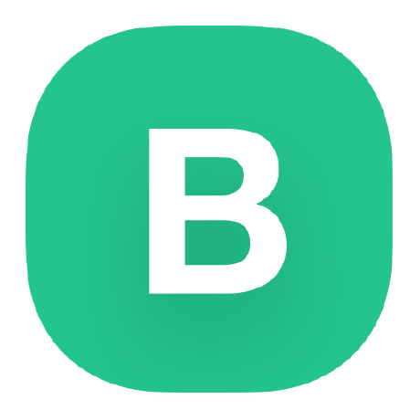

Universidad Peruana de Ciencias Aplicadas

Carrera: Ingeniería de Software

Ciclo: 2025-20

Desarrollo de Soluciones IOT - 3475

Profesor: Marco Antonio Leon Baca

Informe del Trabajo Final  - TB1

Startup: **No definido**

Producto: AgroControl

### Team Members:

| Member                             | Code        |
|------------------------------------|-------------|
| Barrionuevo Reto, Jean Franco Joel | U202219284  |
| Barrutia Vaez, Ricardo Andree      | U201714765  |
| Espinoza Inoñan, Fabiola Ximena    | U202214784  |
| Mayta Lopez, Harold Jaime          | U202114851  |
| Rodriguez Santos, David Bryan      | U202212236  |

**Septimebre del 2025**

---  
# Registro de Versiones del Informe

| Versión | Fecha | Autor   | Descripción de modificaciones         |
|-------|------|---------|---------------------------------------|
|      |  |       |
|     |  | |      |

---  
# Project Report Collaboration Insights

---  
# Student Outcome
El curso contribuye al cumplimiento del Student Outcome ABET: **ABET – EAC - Student Outcome 5**   Criterio: *La capacidad de funcionar efectivamente en un equipo cuyos miembros juntos proporcionan liderazgo, crean un entorno de colaboración e inclusivo, establecen objetivos, planifican tareas y cumplen objetivos.*

En el siguiente cuadro se describe las acciones realizadas y enunciados de conclusiones por parte del grupo, que permiten sustentar el haber alcanzado el logro del ABET – EAC - Student Outcome 5.

| Criterio específico                                                                            | Acciones realizadas                                                                                                                                                                                                                                                                                                                                                                                                                                                                                                                                                                                                                                                                                                                                                                                                                                                                                                                                                                                                                                                                                                                                                                                                                                                                                                                                                                                                                                                                                                                                                                                                                                                                                                                                                                                                                                                                                                                                                                                                                                                                                                                                                                                                                                                                                                                                                                                                                                                                                                                                                                                                                                                                                                                                                                                                                                                                                                                                                                                                                                                                                                                                                                                                                                                                                                                                                                                                                                                                                                                                                                                                                               | Conclusiones |  
|------------------------------------------------------------------------------------------------|---------------------------------------------------------------------------------------------------------------------------------------------------------------------------------------------------------------------------------------------------------------------------------------------------------------------------------------------------------------------------------------------------------------------------------------------------------------------------------------------------------------------------------------------------------------------------------------------------------------------------------------------------------------------------------------------------------------------------------------------------------------------------------------------------------------------------------------------------------------------------------------------------------------------------------------------------------------------------------------------------------------------------------------------------------------------------------------------------------------------------------------------------------------------------------------------------------------------------------------------------------------------------------------------------------------------------------------------------------------------------------------------------------------------------------------------------------------------------------------------------------------------------------------------------------------------------------------------------------------------------------------------------------------------------------------------------------------------------------------------------------------------------------------------------------------------------------------------------------------------------------------------------------------------------------------------------------------------------------------------------------------------------------------------------------------------------------------------------------------------------------------------------------------------------------------------------------------------------------------------------------------------------------------------------------------------------------------------------------------------------------------------------------------------------------------------------------------------------------------------------------------------------------------------------------------------------------------------------------------------------------------------------------------------------------------------------------------------------------------------------------------------------------------------------------------------------------------------------------------------------------------------------------------------------------------------------------------------------------------------------------------------------------------------------------------------------------------------------------------------------------------------------------------------------------------------------------------------------------------------------------------------------------------------------------------------------------------------------------------------------------------------------------------------------------------------------------------------------------------------------------------------------------------------------------------------------------------------------------------------------------------------------| - |  
| Trabaja en equipo para proporcionar liderazgo en forma conjunta                                | |
| Crea un entorno colaborativo e inclusivo, establece metas, planifica tareas y cumple objetivos | |
---  
# Contenido
## Tabla de contenidos

### [Capítulo I: Introducción](https://github.com/G2-UPC-PRE-202402-SI730-WX53-DevDynasty/GastroGo-Report#cap%C3%ADtulo-i-introducci%C3%B3n-1)
- [1.1. Startup Profile](https://github.com/G2-UPC-PRE-202402-SI730-WX53-DevDynasty/GastroGo-Report#11-startup-profile)
    - [1.1.1 Descripción de la Startup](https://github.com/G2-UPC-PRE-202402-SI730-WX53-DevDynasty/GastroGo-Report#111-descripci%C3%B3n-de-la-startup)
    - [1.1.2 Perfiles de integrantes del equipo](https://github.com/G2-UPC-PRE-202402-SI730-WX53-DevDynasty/GastroGo-Report#112-perfiles-de-integrantes-del-equipo)
- [1.2 Solution Profile](https://github.com/G2-UPC-PRE-202402-SI730-WX53-DevDynasty/GastroGo-Report#12-solution-profile)
    - [1.2.1 Antecedentes y problemática](https://github.com/G2-UPC-PRE-202402-SI730-WX53-DevDynasty/GastroGo-Report#121-antecedentes-y-problem%C3%A1tica)
    - [1.2.2 Lean UX Process](https://github.com/G2-UPC-PRE-202402-SI730-WX53-DevDynasty/GastroGo-Report#122-lean-ux-process)
        - [1.2.2.1. Lean UX Problem Statements](https://github.com/G2-UPC-PRE-202402-SI730-WX53-DevDynasty/GastroGo-Report#1221-lean-ux-problem-statements)
        - [1.2.2.2. Lean UX Assumptions](https://github.com/G2-UPC-PRE-202402-SI730-WX53-DevDynasty/GastroGo-Report#1222-lean-ux-assumptions)
        - [1.2.2.3. Lean UX Hypothesis Statements](https://github.com/G2-UPC-PRE-202402-SI730-WX53-DevDynasty/GastroGo-Report#1223-lean-ux-hypothesis-statements)
        - [1.2.2.4. Lean UX Canvas](https://github.com/G2-UPC-PRE-202402-SI730-WX53-DevDynasty/GastroGo-Report#1224-lean-ux-canvas)
- [1.3. Segmentos objetivo](https://github.com/G2-UPC-PRE-202402-SI730-WX53-DevDynasty/GastroGo-Report#13-segmentos-objetivo)

### [Capítulo II: Requirements Elicitation & Analysis]()
- [2.1. Competidores]()
    - [2.1.1. Análisis competitivo]()
    - [2.1.2. Estrategias y tácticas frente a competidores]()
- [2.2. Entrevistas]()
    - [2.2.1. Diseño de entrevistas]()
    - [2.2.2. Registro de entrevistas]()
    - [2.2.3. Análisis de entrevistas]()
- [2.3. Needfinding]()
    - [2.3.1. User Personas]()
    - [2.3.2. User Task Matrix]()
    - [2.3.3. User Journey Mapping]()
    - [2.3.4. Empathy Mapping]()
    - [2.3.5. As-is Scenario Mapping]()
- [2.4. Big Picture EventStorming]()
- [2.5. Ubiquitous Language]()

### [Capítulo III: Requirements Specification]()
- [3.1. User Stories]()
- [3.2. Impact Mapping]()
- [3.3. Product Backlog]()

### [Capítulo IV: Solution Software Design]()
- [4.1. Strategic-Level Domain-Driven Design]()
  - [4.1.1. Design-Level EventStorming]()
    - [4.1.1.1. Candidate Context Discovery]()
    - [4.1.1.2. Domain Message Flows Modeling]()
    - [4.1.1.3. Bounded Context Canvases]()
  - [4.1.2. Context Mapping]()
  - [4.1.3. Software Architecture]()
    - [4.1.3.1. Software Architecture System Landscape Diagram]()
    - [4.1.3.2. Software Architecture Context Level Diagrams]()
    - [4.1.3.3. Software Architecture Container Level Diagrams]()
    - [4.1.3.4. Software Architecture Deployment Diagrams]()
- [4.2. Tactical-Level Domain-Driven Design]()
  - [4.2.1. Bounded Context: <Bounded Context Name>]()
    - [4.2.1.1. Domain Layer]()
    - [4.2.1.2. Interface Layer]()
    - [4.2.1.3. Application Layer]()
    - [4.2.1.4. Infrastructure Layer]()
    - [4.2.1.5. Bounded Context Software Architecture Component Level Diagrams]()
    - [4.2.1.6. Bounded Context Software Architecture Code Level Diagrams]()
      - [4.2.1.6.1. Bounded Context Domain Layer Class Diagrams]()
      - [4.2.1.6.2. Bounded Context Database Design Diagram]()

---

# Capítulo I: Introducción
## 1.1. Startup Profile
### 1.1.1 Descripción de la Startup
Nuestra startup está enfocada en transformar el ciclo agrícola mediante el uso de tecnologías IoT, con el objetivo de facilitar y optimizar el trabajo de productores agrícolas y distribuidores. A través de una plataforma digital conectada a sensores y dispositivos inteligentes, ofrecemos información en tiempo real sobre el estado de los cultivos y las condiciones del campo, permitiendo automatizar procesos como el riego y generar alertas tempranas.

Este sistema busca mejorar la comunicación y coordinación entre productores y distribuidores, brindando datos confiables y actualizados que apoyen la planificación, reduzcan imprevistos y aumenten la eficiencia en la producción y distribución agrícola. El enfoque de la startup es proporcionar una solución práctica y accesible que impulse la productividad, la sostenibilidad y la toma de decisiones informadas dentro de la cadena agrícola.

**Misión**:

Nuestra misión es transformar el sector agrícola mediante soluciones tecnológicas basadas en IoT que sean accesibles y fáciles de usar. Buscamos empoderar a productores y distribuidores con datos en tiempo real y herramientas de automatización, ayudándoles a tomar mejores decisiones, optimizar recursos como el agua y mejorar la sostenibilidad y rentabilidad de sus operaciones.

**Visión**:

Ser la plataforma líder en innovación agrícola con IoT, reconocida por conectar a productores y distribuidores a través de información confiable y procesos automatizados. Aspiramos a fomentar una agricultura más eficiente, productiva y sostenible, accesible para todos los actores de la cadena agrícola, sin importar su escala.

### 1.1.2 Perfiles de integrantes del equipo

| Información                                                                                                                                                                                                                                                                                                                                                                                                                                                                                       | Foto                                                         |
|:--------------------------------------------------------------------------------------------------------------------------------------------------------------------------------------------------------------------------------------------------------------------------------------------------------------------------------------------------------------------------------------------------------------------------------------------------------------------------------------------------| :----------------------------------------------------------- |
| **Ricardo Andree Barrutia**  Código: U201714765  Conocimientos y Habilidades:    Como estudiante de ingeniería de software he adquirido conocimientos de C++, Java y de Ionic. Con respecto a las habilidades más destacables de mi persona, considero que el trabajo en equipo es una de ellas. Además de la capacidad resolutiva a la par que adaptativa ante diversas situaciones.                                                                                        |  |
| **Jean Franco Joel Barrionuevo Reto**  Código: U202219284  Conocimientos y Habilidades: Texto                                                                                                                                                                                                                                                                                                                                                                                   |              |
| **Fabiola Ximena Espinoza Inoñan**  Código: u202214784  Conocimientos y Habilidades:   Mi nombre es Fabiola Espinoza, tengo 21 años y estudio Ingeniería de Software en la Universidad Peruana de Ciencias Aplicadas. Me considero una persona responsable, creativa y empática, con habilidades destacadas en el trabajo en equipo y la convivencia con otras personas. He participado en el programa Coder Bloom, 28h y más. Y actualmente soy coordinadora de ACM Women UPC. |  |
| **Harold Jaime Mayta Lopez  **  Código: U202114851  Conocimientos y Habilidades:       Texto                                                                                                                                                                                                                                                                                                                                                                                    |              |
| **David Bryan Rodriguez Santos**  Código: U202212236  Conocimientos y Habilidades:    Texto                                                                                                                                                                                                                                                                                                                                                                                     |      |

## 1.2 Solution Profile
### 1.2.1 Antecedentes y problemática
La agricultura sigue siendo una de las principales actividades económicas a nivel global, desempeñando un papel clave en la seguridad alimentaria, el desarrollo rural y la economía de numerosos países. Sin embargo, muchos productores agrícolas, especialmente pequeños y medianos, enfrentan grandes desafíos para gestionar de forma eficiente sus cultivos y coordinar su producción con los distribuidores.

La mayoría cuenta con recursos limitados y escaso acceso a tecnologías que permitan monitorear sus cultivos en tiempo real, automatizar procesos como el riego o recibir alertas tempranas sobre condiciones climáticas adversas. Esto los obliga a depender de métodos manuales e intuitivos que no siempre son precisos, lo que genera pérdidas de agua, insumos y productividad.

Por otro lado, los distribuidores se ven afectados por la falta de visibilidad sobre el estado de los cultivos y la disponibilidad real de los productos. La ausencia de información actualizada genera retrasos, baja trazabilidad y dificultades para planificar pedidos y entregas. Esto afecta tanto la eficiencia de la cadena de suministro como la calidad de los productos que llegan al consumidor final.

Ante este panorama, surge la necesidad de soluciones tecnológicas accesibles y adaptadas al contexto agrícola, que permitan a productores y distribuidores obtener datos confiables en tiempo real, optimizar recursos y fortalecer la sostenibilidad del sistema agrícola en su conjunto.

**What**

¿Cuál es el problema?

Los productores agrícolas y distribuidores enfrentan dificultades para acceder a información confiable y oportuna sobre el estado de los cultivos. Esto provoca decisiones poco eficientes en el riego, la planificación de cosechas y la coordinación de entregas, generando pérdidas económicas y de productividad.

**Where**

¿Dónde surge el problema?

El problema surge en los campos de cultivo y en la cadena de distribución agrícola, donde, si bien existen tecnologías de monitoreo y automatización, estas no siempre son accesibles para pequeños y medianos productores debido a sus altos costos, complejidad de uso o falta de adaptación al contexto local. Esta brecha tecnológica se traduce en falta de información oportuna para productores y baja visibilidad para distribuidores.

Para la elaboración de la descripción de los antecedentes y problemática, hemos aplicado la técnica de The 5 ’W’s y 2 ’H’s:

Problemática (5Ws y 2Hs)

**Why**

**¿Cuál es la causa del problema?**

Aunque hay soluciones tecnológicas disponibles en el mercado, su acceso es limitado. La mayoría de los productores carece de herramientas asequibles y fáciles de usar que les permitan monitorear sus cultivos en tiempo real y compartir esa información con distribuidores. Esta falta de accesibilidad genera ineficiencias en el uso de recursos (agua, insumos, tiempo), poca trazabilidad en la cadena y dificultades para planificar de manera coordinada la producción y distribución.

**When**

**¿Cuándo sucede el problema?**

Durante todas las etapas del ciclo agrícola: desde el riego y crecimiento de los cultivos hasta la cosecha y distribución, impactando de forma continua la producción y la cadena de suministro.

**Who**

**¿Quiénes están involucrados?**

Productores agrícolas que necesitan optimizar sus recursos y automatizar procesos.

Distribuidores que requieren información confiable sobre disponibilidad y estado de los productos para planificar sus operaciones.

**How**

**¿Cómo nos conocieron los usuarios?**

Principalmente a través de recomendaciones de agricultores y distribuidores que han visto mejoras en eficiencia gracias al uso de sensores y automatización, además de estrategias de difusión en redes sociales mostrando casos de éxito en el uso de IoT agrícola.

**¿Cómo prefieren los usuarios acceder a nuestro servicio?**

A través de una aplicación móvil y web sencilla, que permita consultar datos en tiempo real desde cualquier dispositivo y recibir notificaciones automáticas sobre el estado de los cultivos.

**How much**

La falta de adopción de tecnologías modernas de riego limita el rendimiento y los ingresos de los agricultores. Estudios del IFC en Burkina Faso y Zambia demuestran que la implementación de sistemas de riego por goteo con bombas puede aumentar los márgenes brutos hasta en un 395 % anual, lo que se traduce en un incremento de USD 9,158/año para pequeños agricultores (IFC, 2019).

### 1.2.2 Lean UX Process
Los procesos Lean UX son fundamentales para definir con precisión nuestras ideas y establecer un plan de acción enfocado en responder preguntas clave a través del **Needfinding**.

#### 1.2.2.1. Lean UX Problem Statements
Los productores agrícolas y distribuidores carecen de información confiable y accesible en tiempo real sobre el estado de los cultivos. Aunque existen tecnologías IoT en el mercado, estas no siempre son asequibles ni fáciles de usar para pequeños y medianos productores, lo que genera brechas tecnológicas y afecta la coordinación con los distribuidores.

Pregunta clave:
¿Cómo podemos ofrecer una solución accesible basada en IoT que permita a los productores optimizar recursos como el agua y a los distribuidores mejorar la planificación de entregas, reduciendo pérdidas y aumentando la sostenibilidad?

#### 1.2.2.2. Lean UX Assumptions

**Business Assumptions**

**Creo que mis usuarios necesitan** una plataforma que les permita monitorear cultivos en tiempo real y coordinar entregas con distribuidores de manera eficiente, optimizando recursos como el agua y reduciendo pérdidas en la producción.

**Estas necesidades se pueden resolver** mediante el desarrollo de una plataforma IoT especializada en agricultura, que conecte sensores de humedad, temperatura y clima con una aplicación móvil y web. Para los agricultores, esta plataforma debe automatizar procesos críticos como el riego y emitir alertas tempranas; para los distribuidores, debe proveer información confiable sobre disponibilidad de productos.

**Mis clientes iniciales son** pequeños y medianos productores agrícolas del Perú, así como distribuidores locales y regionales que dependen de datos precisos para planificar la cadena de suministro. Estos clientes valorarán la simplicidad, accesibilidad económica y confiabilidad de la solución.

**El valor #1 que un cliente requiere de mi servicio** es la eficiencia en el uso de recursos (agua, insumos, tiempo) y la reducción de incertidumbre en la planificación agrícola.

**El cliente también puede obtener estos beneficios adicionales:**

- Mayor sostenibilidad y productividad agrícola.

- Mejor relación comercial entre agricultores y distribuidores gracias a la trazabilidad de datos.

- Reducción de pérdidas económicas por sobreuso de agua, retrasos o falta de información.

**Voy a adquirir a mis clientes a través de** una estrategia combinada:

- Marketing digital segmentado en redes sociales dirigidas al sector agro.

- Alianzas con cooperativas agrícolas y distribuidores que permitan pruebas piloto.

- Ferias y eventos agrícolas para mostrar la solución en campo con casos de éxito.

**Haré dinero a través de** un modelo de suscripción mensual o anual, con planes escalables según el número de sensores y usuarios por cuenta.

**Mi competencia de mercado seran** sistemas de monitoreo agrícola tradicionales, así como aplicaciones de gestión de cultivos ofrecidas por grandes proveedores internacionales.

**Los venceremos debido que** nuestra propuesta ofrece una solución más asequible, sencilla y adaptada al contexto local, donde la mayoría de competidores no logra penetrar debido a la complejidad técnica o los costos elevados.

**Mis mayores riesgos de producto son** la resistencia de los agricultores a adoptar tecnologías nuevas, el alto costo inicial de los sensores IoT y la posible preferencia por métodos manuales o tradicionales.

**Resolveremos esto mediante** un proceso de diseño participativo, incluyendo entrevistas y pruebas piloto en campo, para asegurar que la solución sea realmente útil, simple y adaptable a la rutina agrícola.

**Sabremos que hemos tenido éxito cuando:**

- Observemos un aumento en la productividad agrícola (ej. más toneladas por hectárea con menor gasto de agua).

- Notemos una reducción en retrasos logísticos y mayor trazabilidad en la distribución.

- Los agricultores y distribuidores usen la plataforma de manera recurrente para tomar decisiones clave en la producción.

**Qué otras suposiciones tenemos que, de probarse falsas, pueden causar que nuestro proyecto fracase:**

- Que los agricultores y distribuidores estén dispuestos a pagar una suscripción.

- Que exista confianza suficiente para adoptar soluciones IoT en contextos rurales.

- Que el mercado esté listo para migrar de prácticas tradicionales a herramientas tecnológicas accesibles.

**User Assumptions**

**¿Quiénes serán nuestros usuarios?**

Productores agrícolas pequeños y medianos que necesitan optimizar el riego y mejorar la sostenibilidad de sus cultivos.

Distribuidores que buscan información confiable y en tiempo real sobre disponibilidad y calidad de los productos.

**¿Dónde encaja nuestro producto en su vida o trabajo?**

Para los productores: la plataforma encaja en sus rutinas diarias de supervisión del campo, ayudándoles a regar de manera precisa y recibir alertas que eviten pérdidas.

Para los distribuidores: encaja en la planificación de pedidos y coordinación logística, permitiendo tomar decisiones con base en datos en lugar de suposiciones.

**¿Qué problemas tiene nuestro producto y cómo se pueden resolver?**

Agricultores podrían percibir la tecnología como costosa o difícil de usar → solución: interfaz intuitiva + pruebas gratuitas en campo.

Distribuidores podrían dudar de la confiabilidad de los datos → solución: reportes automatizados y certificación de calidad de la información.

Usuarios podrían no ver valor inmediato → solución: mostrar métricas claras de ahorro de agua, tiempo y reducción de retrasos.

**¿Cómo y cuándo es usado nuestro producto?**

Agricultores lo usan diariamente para monitorear humedad, temperatura y activar riego.

Distribuidores lo usan semanalmente para planificar entregas y verificar disponibilidad de productos.

**¿Qué características son importantes?**

- Interfaz intuitiva (app móvil + web).

- Alertas en tiempo real sobre condiciones críticas.

- Visualización clara de datos de cultivos y disponibilidad.

- Escalabilidad para integrar más sensores y usuarios.

**¿Cómo debe verse y comportarse nuestro producto?**

Diseño simple, visual y accesible, adaptable a usuarios con bajo nivel tecnológico.

Experiencia de usuario fluida: consultar datos y recibir alertas en segundos.

Comportamiento confiable y estable en zonas rurales con conectividad limitada.

**Features:**

Rol Productor: gestión de sensores, visualización de datos, alertas y control de riego.

Rol Distribuidor: acceso a reportes de disponibilidad, planificación de entregas y comunicación directa con productores.

Notificaciones en tiempo real sobre cambios críticos (ej. sequía, exceso de riego, disponibilidad de cosecha).

#### 1.2.2.3. Lean UX Hypothesis Statements

**Creemos que** al implementar sensores de humedad conectados a riego automático, los agricultores reducirán desperdicio de agua.
**Sabremos que** estamos en lo correcto cuando observemos una reducción del 30% en consumo hídrico en tres meses.

**Creemos que** al recibir notificaciones sobre sequías o exceso de riego, los productores reaccionarán más rápido.
**Sabremos que** estamos en lo correcto cuando al menos el 50% de los agricultores actúe ante las alertas recibidas.

**Creemos que** al ofrecer reportes de disponibilidad de cultivos en tiempo real, los distribuidores mejorarán su logística.
**Sabremos que** estamos en lo correcto cuando se reduzcan en un 20% los retrasos en entregas en seis meses.

**Creemos que** al diseñar una app simple, intuitiva y en español, agricultores y distribuidores estarán dispuestos a usarla regularmente.
**Sabremos que** estamos en lo correcto cuando al menos el 40% de los registrados accedan semanalmente en el primer trimestre.

**Creemos que** al mostrar métricas de ahorro (agua, costos, tiempo), los usuarios valorarán más la solución.
**Sabremos que** estamos en lo correcto cuando el 60% de usuarios consulten estas métricas al menos una vez por semana.

**Creemos que** al permitir planes escalables (más sensores, más usuarios por cuenta), aumentaremos ingresos.
**Sabremos que** estamos en lo correcto cuando al menos el 10% de usuarios cambien a un plan superior en seis meses.

---

**Lo más importante que debemos aprender**

Para el éxito de nuestro proyecto, es fundamental identificar si los productores y distribuidores realmente valoran la propuesta de contar con una plataforma IoT accesible y fácil de usar.

Aunque existen soluciones similares en el mercado, necesitamos confirmar si nuestra propuesta:

- Es viable en el contexto de pequeños y medianos agricultores.

- Responde a las necesidades de información en tiempo real y coordinación con distribuidores.

- Ofrece beneficios tangibles como ahorro de agua, reducción de retrasos y mejor planificación.

**Minimum Viable Product (MVP):**

Nuestro MVP estará enfocado en obtener aprendizajes rápidos. La pregunta clave será:

**¿Qué es lo más importante que necesitamos aprender primero?**

- Validar si existe demanda real por parte de agricultores y distribuidores.

- Confirmar que el producto resuelve una necesidad concreta y no un “nice to have”.

**Acciones para validar el MVP:**

- Realizar entrevistas con agricultores y distribuidores para conocer su disposición a pagar y adoptar la tecnología.

- Desarrollar una landing page con la propuesta de valor y formulario de interés para captar potenciales clientes.

- Implementar un piloto con sensores IoT en campos pequeños para medir el impacto en ahorro de agua y planificación.

- Usar métricas iniciales (ej. % de agricultores que activan alertas, frecuencia de uso de la app, intención de pago) para validar hipótesis.

#### 1.2.2.4. Lean UX Canvas

## 1.3. Segmentos objetivo

Productores agrícolas (pequeños y medianos):

Son agricultores que necesitan optimizar sus recursos y mejorar la productividad de sus cultivos. Requieren soluciones accesibles que les permitan monitorear en tiempo real el estado del campo, automatizar procesos como el riego y recibir alertas tempranas frente a condiciones climáticas adversas. Este segmento busca reducir pérdidas de agua e insumos, tomar decisiones más informadas y asegurar una mayor rentabilidad y sostenibilidad en sus operaciones.

Distribuidores agrícolas:

Son los encargados de conectar la producción con el mercado. Necesitan mayor visibilidad sobre la disponibilidad y calidad de los cultivos para planificar sus compras y entregas con eficiencia. Requieren información confiable y actualizada que les permita anticipar retrasos o variaciones en la producción, mejorar la coordinación con los productores y garantizar la trazabilidad y puntualidad en la cadena de suministro.

# Capítulo II: Requirements Elicitation & Analysis
## 2.1 Competidores

Después de realizar una investigación de mercado, hemos identificado tres plataformas que integran **IoT y aplicaciones móviles/web** para la gestión agrícola, con funcionalidades similares a las que busca ofrecer **AgroControl IoT**:

---

1. **Blynk IoT**  
Blynk es una plataforma IoT que permite crear aplicaciones móviles y web personalizadas para conectar y controlar sensores, dispositivos y sistemas en tiempo real. En agricultura, es utilizada para implementar soluciones de **riego automatizado**, monitoreo de humedad del suelo, clima y control de energía. Su fortaleza está en la facilidad para crear dashboards intuitivos y accesibles sin necesidad de desarrollar todo desde cero.  

    

---

2. **CropX**  
CropX es una plataforma agrícola basada en IoT que combina sensores de suelo con análisis avanzados en la nube. Ofrece información en tiempo real sobre humedad, temperatura y nutrientes del suelo, optimizando el riego y la fertilización. Su aplicación móvil permite a los agricultores recibir alertas y recomendaciones para mejorar la **eficiencia en el uso de recursos** y aumentar la productividad.  

    

---

3. **Netafim – Digital Farming**  
Netafim, líder en riego por goteo, ha desarrollado una plataforma digital de agricultura inteligente que conecta sensores IoT, válvulas automatizadas y estaciones meteorológicas. Su aplicación móvil y web permite controlar riego en tiempo real, recibir **alertas tempranas sobre sequías o exceso de riego**, y generar reportes de sostenibilidad. Está enfocada en la **eficiencia hídrica** y es utilizada globalmente por productores de distintas escalas.  

    

---

### Conclusión Comparativa
Las tres plataformas analizadas muestran cómo la **agricultura con IoT** está transformando la gestión de cultivos y recursos. Sin embargo, presentan limitaciones:  
- **Blynk**: Flexible y accesible, pero requiere configuración técnica por parte del usuario.  
- **CropX**: Potente en análisis de suelo, aunque más costosa y orientada a grandes productores.  
- **Netafim**: Enfocada en riego de precisión, pero menos adaptable a productores pequeños que buscan una solución integral.  

**AgroControl IoT** se posiciona como una alternativa **accesible y adaptada al contexto local**, ofreciendo integración de sensores, alertas en tiempo real y comunicación entre productores y distribuidores en una plataforma simple y económica.

### 2.1.1. Análisis competitivo

<table>
  <tr>
    <th colspan="7" valign="top"><b>Competitive Analysis Landscape</b></th>
  </tr>
  <tr>
    <td colspan="2" rowspan="2">¿Por qué llevar a cabo este análisis?</td>
    <td colspan="5">Identificar a nuestros competidores en el ámbito de la agricultura con IoT y establecer estrategias para diferenciarnos, enfocándonos en accesibilidad y adaptación al contexto local.</td>
  </tr>
  <tr>
    <td colspan="5">Este análisis se realizó con la finalidad de evaluar las fortalezas de plataformas IoT existentes y resaltar cómo AgroControl IoT puede posicionarse como una alternativa accesible para pequeños y medianos productores agrícolas.</td>
  </tr>
  <tr>
    <td colspan="3">(En la cabecera colocar por cada competidor nombre y logo)</td>
    <td colspan="1" valign="top" style="font-weight: bold;">
        AgroControl
         
        

          
        

    </td>
    <td colspan="1" valign="top" style="font-weight: bold;">
        Blynk IoT
        

          
        

    </td>
    <td colspan="1" valign="top" style="font-weight: bold;">
        CropX
        

          
        

    </td>
    <td colspan="1" valign="top" style="font-weight: bold;">
        Netafim Digital Farming
        

          
        

    </td>
  </tr>
  <tr>
    <td colspan="1" rowspan="2">
Perfil
</td>
    <td colspan="2">Overview</td>
    <td colspan="1" valign="top">Plataforma IoT agrícola integral que conecta sensores para monitoreo de cultivos, automatización de riego, alertas tempranas y coordinación con distribuidores.</td>
    <td colspan="1" valign="top">Plataforma IoT flexible que permite crear dashboards y apps para monitorear y controlar sensores en tiempo real, aplicable en agricultura para riego y clima.</td>
    <td colspan="1" valign="top">Plataforma agrícola basada en sensores de suelo conectados a la nube, que ofrece datos de humedad, temperatura y nutrientes para optimizar cultivos.</td>
    <td colspan="1" valign="top">Plataforma de agricultura digital enfocada en riego de precisión, conectando válvulas, estaciones meteorológicas y sensores IoT.</td>
  </tr>
  <tr>
    <td colspan="2">Ventaja competitiva</td>
    <td colspan="1" valign="top">Accesibilidad económica y simplicidad de uso para pequeños y medianos productores. Integra productor y distribuidor en una misma plataforma.</td>
    <td colspan="1" valign="top">Alta flexibilidad para personalizar dashboards y soluciones IoT sin necesidad de desarrollo complejo.</td>
    <td colspan="1" valign="top">Analítica avanzada de suelos y recomendaciones basadas en datos precisos para maximizar la productividad.</td>
    <td colspan="1" valign="top">Liderazgo global en riego inteligente y eficiencia hídrica, con soporte a gran escala.</td>
  </tr>
  <tr>
    <td colspan="1" rowspan="2">
Perfil de Marketing
</td>
    <td colspan="2">Mercado objetivo</td>
    <td colspan="1" valign="top">Productores pequeños y medianos, y distribuidores agrícolas que requieren trazabilidad y optimización de recursos.</td>
    <td colspan="1" valign="top">Usuarios técnicos y agricultores que buscan crear soluciones IoT personalizadas para monitoreo agrícola.</td>
    <td colspan="1" valign="top">Grandes productores y agroindustrias con capacidad de inversión en IoT avanzado.</td>
    <td colspan="1" valign="top">Productores medianos y grandes interesados en maximizar la eficiencia en el uso del agua.</td>
  </tr>
  <tr>
    <td colspan="2">Estrategias de marketing</td>
    <td colspan="1" valign="top">Campañas digitales segmentadas, pilotos con cooperativas agrícolas y ferias agro-tecnológicas.</td>
    <td colspan="1" valign="top">Enfoque en comunidad global IoT, tutoriales y adopción en múltiples industrias.</td>
    <td colspan="1" valign="top">Alianzas B2B, integración con maquinaria agrícola y marketing especializado.</td>
    <td colspan="1" valign="top">Casos de éxito globales, alianzas con gobiernos y ONGs.</td>
  </tr>
  <tr>
    <td colspan="1" rowspan="3">
Perfil de Producto
</td>
    <td colspan="2">Productos & Servicios</td>
    <td colspan="1" valign="top">Monitoreo de cultivos, riego automatizado, alertas tempranas, dashboards móviles/web y trazabilidad.</td>
    <td colspan="1" valign="top">Dashboards IoT personalizables, monitoreo remoto y notificaciones en tiempo real.</td>
    <td colspan="1" valign="top">Sensores de suelo + app web/móvil con analítica predictiva y recomendaciones de riego/fertilización.</td>
    <td colspan="1" valign="top">Riego inteligente por goteo, estaciones climáticas conectadas y control remoto de válvulas.</td>
  </tr>
 <tr>
    <td colspan="2">Precios & Costos</td>
    <td colspan="1" valign="top"><strong>Plan Básico:</strong> $20/mes (1 campo). <strong>Plan Premium:</strong> $90/mes (múltiples campos y distribuidores). <strong>Distribuidores:</strong> $100/mes con trazabilidad avanzada.</td>
    <td colspan="1" valign="top"><strong>Plan Gratuito:</strong> limitado. <strong>Suscripción:</strong> desde $7/mes (según dispositivos conectados).</td>
    <td colspan="1" valign="top"><strong>Suscripción anual:</strong> $300 – $1000, según sensores y hectáreas.</td>
    <td colspan="1" valign="top"><strong>Soluciones personalizadas:</strong> desde $500 (sistemas de riego inteligente con IoT).</td>
  </tr>
  <tr>
    <td colspan="2">Canales de distribución (Web y/o Móvil)</td>
    <td colspan="1" valign="top">Aplicación Web y móvil.</td>
    <td colspan="1" valign="top">Disponible en Web y apps móviles (iOS/Android).</td>
    <td colspan="1" valign="top">Aplicación Web y móvil.</td>
    <td colspan="1" valign="top">Aplicación Web, móvil y dispositivos físicos conectados.</td>
  </tr>
</table>

### 2.1.2. Estrategias y tácticas frente a competidores

<table>
  <tr>
    <td colspan="1" rowspan="5">
<b>Análisis SWOT</b>
</td>
    <td colspan="6">Este análisis se realizó para nuestra startup AgroControl IoT y tres competidores relevantes en agricultura con IoT (Blynk IoT, CropX y Netafim). El objetivo es identificar fortalezas, debilidades, oportunidades y amenazas, apoyando la definición de nuestra ventaja competitiva.</td>
  </tr>
  <tr>
    <td colspan="2"><b>Fortalezas</b></td>
    <td colspan="1" valign="top">AgroControl ofrece accesibilidad económica, simplicidad de uso y adaptación al contexto local. Integra en una sola plataforma el monitoreo de cultivos, riego automatizado, alertas tempranas y coordinación con distribuidores.</td>
    <td colspan="1" valign="top">Blynk IoT destaca por su flexibilidad y personalización de dashboards y aplicaciones móviles/web, lo que permite implementar soluciones IoT sin necesidad de desarrollos complejos.</td>
    <td colspan="1" valign="top">CropX es fuerte en analítica avanzada de suelos, ofreciendo datos precisos sobre humedad, temperatura y nutrientes, lo que mejora la productividad y optimiza el riego.</td>
    <td colspan="1" valign="top">Netafim Digital Farming lidera globalmente en riego de precisión y eficiencia hídrica, con soluciones escalables y probadas en grandes cultivos.</td>
  </tr>
  <tr>
    <td colspan="2"><b>Debilidades</b></td>
    <td colspan="1" valign="top">AgroControl carece aún de integración con maquinaria agrícola avanzada y podría enfrentar retos de escalabilidad con grandes productores o distribuidores.</td>
    <td colspan="1" valign="top">Blynk IoT no está diseñado específicamente para agricultura, lo que requiere configuración técnica adicional por parte del usuario.</td>
    <td colspan="1" valign="top">CropX es costoso para pequeños productores y requiere infraestructura avanzada para aprovechar su potencial al máximo.</td>
    <td colspan="1" valign="top">Netafim puede ser inaccesible para pequeños agricultores debido a sus altos costos iniciales y enfoque en grandes operaciones.</td>
  </tr>
  <tr>
    <td colspan="2"><b>Oportunidades</b></td>
    <td colspan="1" valign="top">AgroControl tiene la oportunidad de posicionarse en mercados emergentes ofreciendo soluciones adaptadas al contexto local, integrando IoT con Big Data y expandiéndose hacia la trazabilidad completa de la cadena de suministro.</td>
    <td colspan="1" valign="top">Blynk IoT puede aprovechar su comunidad global de desarrolladores para expandir casos de uso en agricultura y asociarse con proveedores de sensores agrícolas.</td>
    <td colspan="1" valign="top">CropX puede consolidar su liderazgo ampliando su red de clientes en Latinoamérica y África, donde la gestión del agua es crítica.</td>
    <td colspan="1" valign="top">Netafim puede expandir sus soluciones digitales combinando IoT con inteligencia artificial para mejorar la eficiencia de sus sistemas de riego.</td>
  </tr>
  <tr>
    <td colspan="2"><b>Amenazas</b></td>
    <td colspan="1" valign="top">AgroControl enfrenta la amenaza de la rápida evolución tecnológica y la competencia de plataformas internacionales más establecidas. Además, la adopción lenta de tecnologías IoT en zonas rurales podría limitar su crecimiento inicial.</td>
    <td colspan="1" valign="top">Blynk IoT podría perder relevancia en agricultura si no adapta mejor su plataforma al sector agro. La competencia de plataformas agrícolas específicas es un riesgo.</td>
    <td colspan="1" valign="top">CropX enfrenta el riesgo de ser percibido como inaccesible en mercados emergentes debido a su costo, además de la presión por mantenerse innovador frente a nuevos entrantes.</td>
    <td colspan="1" valign="top">Netafim puede enfrentar competencia de nuevas startups más flexibles y accesibles, además de riesgos asociados a la dependencia de grandes productores.</td>
  </tr>
</table>

## 2.2. Entrevistas
### 2.2.1. Diseño de entrevistas

En esta sección se han definido una serie de preguntas para nuestros segmentos objetivos, con la finalidad de obtener información cualitativa como opiniones y descripciones. Esta información será de gran ayuda en el desarrollo de nuestra solución.

Preguntas generales:

¿Cuál es tu nombre?
¿Qué edad tienes?
¿Dónde vives actualmente?
¿A qué te dedicas?
¿Cual es el navegador (browser) que más usas?
¿Cual es el dispositivo que más usas?
**Preguntas Segmento 1: Productores Agricolas**

1. ¿Cuáles son los principales desafíos que enfrentas en la gestión de tus campos de cultivo?
2. ¿Qué herramientas utilizas actualmente para la gestión de tus operaciones agrícolas?
3. ¿Qué funcionalidades consideras más importantes en una aplicación de gestión agrícola?
4. ¿Qué aspectos te gustaría mejorar en las herramientas actuales que usas?
5. ¿Con qué frecuencia utilizas tecnología para la gestión de tus cultivos?
6. ¿Qué tipo de datos o información te gustaría que te proporcionara una aplicación de gestión agrícola?
7. ¿Cómo manejas actualmente el seguimiento de tus gastos e ingresos relacionados con la agricultura?
8. ¿Qué tipo de análisis o reportes serían útiles para ti en una plataforma de gestión agrícola?
9. ¿Cómo te gustaría que una aplicación te ayude en la toma de decisiones para la gestión de tus campos?

Preguntas complementarias productores:

- ¿Cuáles son los principales problemas que enfrentas en el riego (falta de agua, exceso de riego, distribución desigual, etc.)?
- ¿Con qué frecuencia revisas el estado de tus cultivos (a diario, semanal, solo cuando hay problemas)?
- ¿Qué variables ambientales (ej. humedad del suelo, temperatura, radiación solar, pH) consideras más importantes monitorear en tus cultivos?
- ¿Te gustaría que el sistema active automáticamente el riego según los datos de los sensores o prefieres solo recibir alertas para decidir manualmente?
- ¿Qué nivel de precisión consideras suficiente para los sensores de humedad o temperatura (ej. ±2%)?
- ¿Te gustaría que el sistema incluya recomendaciones de riego basadas en los datos recopilados (ej. sugerir cuántos litros regar)?
- ¿Qué tan dispuesto estás a invertir en hardware adicional (sensores, válvulas automáticas, bombas) para integrar con el sistema?

**Preguntas Segmento 2: Distribuidores**

1. ¿Cuáles son las principales dificultades que enfrentas al relacionarte con agricultores en tu trabajo diario?
2. ¿Qué tan fácil o difícil es para ti coordinar pedidos y entregas con distintos productores?
3. ¿Qué medios usas actualmente para comunicarte con los agricultores (llamadas, WhatsApp, reuniones presenciales, otros)?
4. ¿Qué tipo de información te gustaría tener a la mano para organizar mejor tus pedidos antes de contactar a los agricultores?
5. ¿Con qué frecuencia recibes cambios de último momento en la producción o en las entregas?
6. ¿Qué impacto tienen estos cambios en tu trabajo como distribuidor?
7. ¿Qué tan dispuesto estarías a usar una herramienta digital que te conecte en tiempo real con los agricultores?
8. ¿Qué esperas que te ofrezca una aplicación para mejorar tu relación con los productores agrícolas?
9. ¿Qué tan importante sería para ti que la información de los agricultores sea confiable y fácil de entender?
10. ¿Qué expectativas tendrías de una herramienta digital que centralice la comunicación entre productores y distribuidores?

Preguntas complementarias distribuidores:

- ¿Qué problemas se repiten más seguido en tu trabajo (falta de stock, retrasos, calidad del producto)?
- ¿Cómo manejas los casos en que un productor no entrega lo acordado en cantidad o tiempo?
- ¿Qué tan útil sería que la aplicación te muestre proyecciones de disponibilidad de producto según datos de campo?
- ¿Consideras valioso recibir alertas de posibles retrasos en cosechas por sequías o lluvias excesivas?
- ¿Qué tan necesario es que el sistema se integre con tu software actual de inventario o facturación?

### 2.2.2. Registro de entrevistas
### 2.2.3. Análisis de entrevistas
## 2.3. Needfinding
### 2.3.1. User Personas

En esta sección se presentarán las fichas de User Persona, las cuales son representaciones ficticias de los usuarios basadas en los hallazgos obtenidos a partir de las entrevistas realizadas. Estas fichas se centran en los segmentos objetivos identificados, incluyendo productores agrícolas y distribuidores. La elaboración de estas User Personas se fundamenta en el análisis de las características comunes y necesidades detectadas en las entrevistas, así como en la observación de la competencia. Al comprender mejor a nuestros usuarios, podremos diseñar soluciones más efectivas y alineadas con sus expectativas y desafíos, lo que resulta fundamental para el desarrollo de nuestra aplicación. Cada ficha incluirá detalles sobre las características demográficas, motivaciones, frustraciones y necesidades específicas de cada arquetipo, asegurando que nuestras decisiones de diseño se basen en información relevante y real.

Segmento Productor Agricola:

Las User Personas desarrolladas para AgroControl representan los perfiles más relevantes de los usuarios identificados a partir de un exhaustivo análisis de entrevistas y estudios de la competencia. Estas personas capturan las motivaciones, desafíos, y comportamientos de los productores agrícolas y distribuidores, quienes son los usuarios principales de la plataforma.

Segmento Distribuidores Agrícolas:

El perfil de Carlos Ramírez, un distribuidor agrícola, refleja la necesidad de contar con información confiable y actualizada sobre la disponibilidad y calidad de los cultivos, con el fin de planificar compras y entregas de manera más eficiente. Su motivación principal es anticipar retrasos o variaciones en la producción para mejorar la coordinación con los productores, garantizar la trazabilidad de los productos y cumplir con la puntualidad exigida por el mercado. Este perfil fue construido para orientar el diseño del sistema, asegurando que la plataforma AgroControl brinde visibilidad en tiempo real y soporte a las decisiones estratégicas de los distribuidores dentro de la cadena de suministro.

### 2.3.2. User Task Matrix
### 2.3.3. User Journey Mapping
### 2.3.4. Empathy Mapping
## 2.4. Big Picture EventStorming
## 2.5. Ubiquitous Language

En esta sección se presenta un glosario completo de términos relevantes para el dominio agrícola con IoT. El objetivo es eliminar ambigüedades, facilitar la comunicación y asegurar que todos los involucrados en el proyecto comprendan los conceptos técnicos y de negocio de la misma manera.  

| **Term (English)**        | **Término (Español)**          | **Definition (Definición en Español)**                                                                                     |
|---------------------------|--------------------------------|----------------------------------------------------------------------------------------------------------------------------|
| **IoT Sensors**           | **Sensores IoT**               | Dispositivos que capturan variables como humedad del suelo, temperatura, radiación solar, entre otros, transmitiendo datos en tiempo real. |
| **Real-Time Data**        | **Datos en Tiempo Real**       | Información procesada y enviada al instante por sensores y dispositivos IoT, útil para tomar decisiones inmediatas.         |
| **Early Alerts**          | **Alertas Tempranas**          | Notificaciones automáticas que advierten sobre condiciones críticas como sequías, heladas, plagas o exceso de riego.       |
| **Automated Irrigation**  | **Riego Automatizado**         | Sistema controlado por IoT que activa o detiene el riego según la humedad del suelo o condiciones climáticas.              |
| **Crop Management**       | **Gestión de Cultivos**        | Conjunto de prácticas apoyadas por tecnología para mejorar el crecimiento, riego, protección y cosecha de los cultivos.    |
| **Soil Monitoring**       | **Monitoreo de Suelo**         | Medición de humedad, nutrientes y pH del suelo con sensores para optimizar fertilización y riego.                          |
| **Climate Monitoring**    | **Monitoreo Climático**        | Seguimiento de temperatura, lluvias, radiación y viento para anticipar riesgos y planificar la producción.                  |
| **Resource Optimization** | **Optimización de Recursos**   | Uso eficiente de agua, fertilizantes y energía mediante datos de IoT y algoritmos de decisión.                              |
| **Sustainability**        | **Sostenibilidad**             | Prácticas que promueven un uso responsable de recursos naturales, minimizando el impacto ambiental y asegurando la viabilidad a largo plazo. |
| **Yield Analysis**        | **Análisis de Rendimiento**    | Evaluación del volumen de producción para identificar patrones, pérdidas y oportunidades de mejora.                         |
| **Traceability**          | **Trazabilidad**               | Capacidad de seguir el recorrido de un producto agrícola desde el campo hasta el consumidor final, usando datos digitales.  |
| **Logistics Planning**    | **Planificación Logística**    | Organización y optimización de entregas agrícolas en base a datos de disponibilidad y demanda.                              |
| **Supply Chain Visibility** | **Visibilidad de la Cadena** | Acceso a información compartida en tiempo real entre productores y distribuidores para reducir incertidumbre.               |
| **Predictive Analytics**  | **Analítica Predictiva**       | Uso de datos históricos y actuales para anticipar riesgos como sequías, enfermedades o fluctuaciones en la producción.     |
| **Adoption Rate**         | **Tasa de Adopción**           | Porcentaje de usuarios que empiezan a usar la plataforma en un periodo determinado.                                         |
| **Retention Rate**        | **Tasa de Retención**          | Porcentaje de usuarios que continúan usando la plataforma después de cierto tiempo.                                         |
| **Onboarding**            | **Incorporación de Usuarios**  | Proceso de introducción que guía a los usuarios en sus primeros pasos dentro de la aplicación.                             |
| **Pilot Test**            | **Prueba Piloto**              | Implementación de la solución en un entorno agrícola controlado para validar su utilidad y efectividad.                     |
| **Data Dashboard**        | **Tablero de Datos**           | Visualización gráfica de métricas clave como humedad, riego, disponibilidad de cultivos y alertas.                         |
| **Interoperability**      | **Interoperabilidad**          | Capacidad de la plataforma IoT para integrarse con otros sistemas de gestión agrícola o logísticos.                         |
| **Data Reliability**      | **Confiabilidad de Datos**     | Grado en que los datos obtenidos de sensores son precisos, consistentes y útiles para la toma de decisiones.               |
| **Energy Efficiency**     | **Eficiencia Energética**      | Uso optimizado de energía en los dispositivos IoT para prolongar su vida útil en entornos rurales.                         |

# Capítulo III: Requirements Specification
## 3.1. User Stories
## 3.2. Impact Mapping
## 3.3. Product Backlog
# Capítulo IV: Solution Software Design
## 4.1. Strategic-Level Domain-Driven Design
### 4.1.1. Design-Level EventStorming
#### 4.1.1.1. Candidate Context Discovery
#### 4.1.1.2. Domain Message Flows Modeling
#### 4.1.1.3. Bounded Context Canvases
### 4.1.2. Context Mapping
### 4.1.3. Software Architecture
#### 4.1.3.1. Software Architecture System Landscape Diagram
#### 4.1.3.2. Software Architecture Context Level Diagrams
#### 4.1.3.3. Software Architecture Container Level Diagrams
#### 4.1.3.4. Software Architecture Deployment Diagrams
## 4.2. Tactical-Level Domain-Driven Design
### 4.2.X. Bounded Context: <Bounded Context Name>
#### 4.2.X.1. Domain Layer
#### 4.2.X.2. Interface Layer
#### 4.2.X.3. Application Layer
#### 4.2.X.4. Infrastructure Layer
#### 4.2.X.5. Bounded Context Software Architecture Component Level Diagrams
#### 4.2.X.6. Bounded Context Software Architecture Code Level Diagrams
##### 4.2.X.6.1. Bounded Context Domain Layer Class Diagrams
##### 4.2.X.6.2. Bounded Context Database Design Diagram

# Conclusiones
### Conclusiones y recomendaciones
### Video About-the-Team
  
---  
